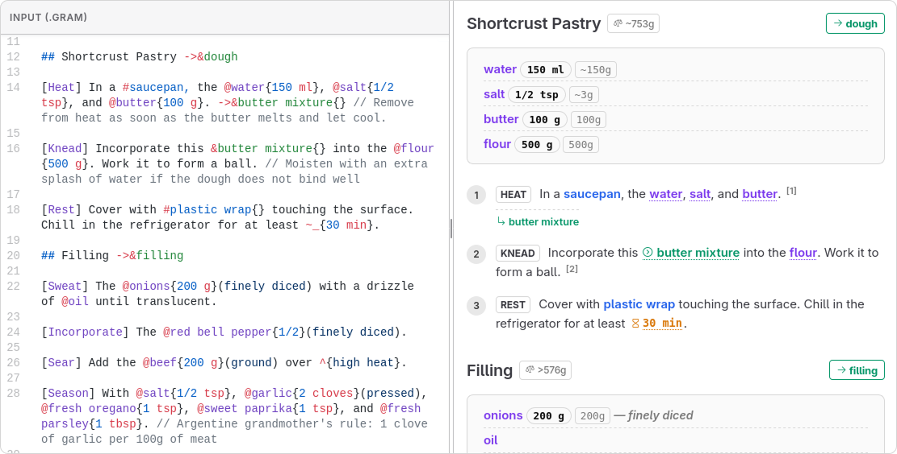

<div align="left">
  
  <h1>Gram</h1>
  <p><strong>A smart, data-driven recipe markup language for developers.</strong></p>
  <p>
    
    <a href="https://git.gram-lang.org/gram-lang/gram/actions"></a>
    <a href="https://www.npmjs.com/package/@gram-lang/cli"></a>
    <a href="https://marketplace.visualstudio.com/items?itemName=gram-lang.gram-lang"></a>
    
    
    
  </p>
</div>
<br clear="left"/>

Gram is designed to write structured, machine-readable recipes that still read like a normal, human-friendly recipe. 

Because it treats your recipes as code, Gram unlocks features that are impossible with plain text: precise physical analysis, dynamic scaling, semantic diffs, and interactive cooking.

[Playground](https://play.gram-lang.org) • [Documentation](https://gram-lang.org/)

<br/>
<div align="center">
  
</div>
<br/>

> **Project Status: Beta (v1.0.0-beta)**
> Gram has officially entered its Beta phase! The language syntax has stabilized, and a comprehensive suite of developer tools is now available, including a CLI and a Language Server.

> [!NOTE]
> I develop **Gram** on my primary [Forgejo instance](https://git.gram-lang.org/gram-lang/gram), with automatic mirrors on [GitHub](https://github.com/gram-lang/gram) and [Codeberg](https://codeberg.org/gram-lang/gram).  
> Contributions, issues, and discussions are welcome on any of these platforms.

Please see [CONTRIBUTING.md](./CONTRIBUTING.md) for more information on how to get involved.

---

## Why Gram?

Inspired by the excellent [Cooklang](https://cooklang.org), Gram takes the concept a step further by introducing structure and programmatic logic.

While other markups focus purely on natural language, Gram cares deeply about **data integrity** to solve complex culinary problems:

1. **Clear Data Separation**: Explicitly tag ingredients (`@flour{200g}`), cookware (`#bowl`), timers (`~{30min}`), and temperatures (`^{230C}`).
2. **Explicit Actions**: Highlight the main method used in a step (e.g., `[Mix]`, `[Bake]`).
3. **Composite Ingredients (`<@`)**: Cleanly handle tricky relationships like "Zest of 1 lemon" and "Juice of 2 lemons" while ensuring your shopping list aggregates to exactly "Buy 2 Lemons".
4. **Intermediate Preparations (`->&dough`)**: Chain recipe parts together just like variables in code, and reuse them later without accidentally doubling your shopping list totals.
5. **Relative Quantities**: Define `@water{60% @&flour}` to handle dynamic baker's math effortlessly.
6. **Smart Aggregation & Mise en Place**: Automatically converts volumes to masses (e.g., `1 cup` -> `125g`) to calculate exact purchasing amounts and yield (Gross vs. Net Mass).
7. **Nutritional Estimation**: Calculates calories and macros automatically using your ingredient database.
8. **Advanced Timers & Scheduling**: Distinguish between active work (`~{10min}`) and background tasks (`~_{2h}`), and use retro-planning (`~{-2d}`) on sections to organize multi-day recipes perfectly.

---

## Quick Syntax

Gram reads like natural language but compiles like code.

*(Note: The author will provide a more comprehensive example here showcasing all capabilities of Gram)*

```gram
---
title: Artisanal Bread
size: 2 loaves
description: A simple, highly hydrated dough.
---

## Dough

[Mix] The @flour{500g}, @water{70% @&flour}, and @salt{10g} in a #large bowl{}. ->&dough

[Rest] Let the &dough rest for ~_{2h} at ^{room temperature} until doubled in size.

## Baking

[Preheat] The #oven to ^{450F}.

[Bake] The &dough for ~{35min} until the crust is deeply golden.
```

---

## The Developer Toolchain

To support the language, Gram comes with a suite of official tools that connect everything together.

### VS Code Extension & Language Server
Transform your editor into a proper recipe development environment. 
[**Available on the VS Code Marketplace**](https://marketplace.visualstudio.com/items?itemName=gram-lang.gram-lang)
- **Dynamic Live Preview & Gantt Chart**: Side-by-side recipe rendering and a real-time timeline view for precise temporal visualization of active steps, background timers, and service scheduling.
- **Smart Autocomplete**: Contextual suggestions for ingredients from your database, units, and references.
- **Real-time Diagnostics**: Instantly flags missing ingredients, unused references, or circular dependencies.

### The Official CLI (`@gram-lang/cli`)
The command-line interface acts as the keystone of the Gram workflow.
[**View on npmjs**](https://www.npmjs.com/package/@gram-lang/cli)
- **`gram check` & `gram build`**: Validate syntax and compile your `.gram` files to enriched JSON.
- **`gram cook`**: An interactive step-by-step cooking assistant right in your terminal, complete with live timers.
- **`gram scale`**: Dynamically resize your recipes (e.g., `--scale=2` or `--scale flour=300g`) with visual before/after tables.
- **`gram diff`**: A semantic "git diff" for recipes. Instantly see if quantities, timings, or temperatures changed between versions.
- **`gram shop`**: Generate aggregated shopping lists across multiple recipes.
- **`gram suggest`**: Find recipes based on your available ingredients (e.g., `--with "butter, eggs" --without "milk"`).
- **`gram import`**: Scrape a recipe from any URL and let AI automatically translate and convert it into native `.gram` syntax.

### Smart Database Management (`gram db`)
Manage your `ingredients.yaml` effortlessly with AI-assisted commands.
- **`gram db sync`**: Scan your recipes and automatically track new ingredients.
- **`gram db enrich`**: Missing density or nutrition data? Let the AI automatically fill in the gaps.
- **`gram db lint`**: Track down semantic duplicates (e.g., `scallion` vs `green onion`) and plural mistakes to keep your database pristine.

---

## Documentation

The full technical documentation is available online:
[**https://gram-lang.org/**](https://gram-lang.org/)

The source code for the VitePress documentation can be found locally in `packages/docs/`.

---

## Project Structure

This monorepo is divided into specialized packages under `packages/`:

| Package | Version | Description |
|---|---|---|
| [**`@gram-lang/parser`**](./packages/parser/README.md) | [](https://www.npmjs.com/package/@gram-lang/parser) | The core parser using Ohm.js to generate the AST. |
| [**`@gram-lang/kitchen`**](./packages/kitchen/README.md) | [](https://www.npmjs.com/package/@gram-lang/kitchen) | The compiler logic, transforming the AST into final JSON structures. |
| [**`@gram-lang/format`**](./packages/format/README.md) | [](https://www.npmjs.com/package/@gram-lang/format) | Canonical `.gram` source code formatter. |
| [**`@gram-lang/analyzer`**](./packages/analyzer/README.md) | [](https://www.npmjs.com/package/@gram-lang/analyzer) | The physical resolver for mass normalization, yield, and nutrition. |
| [**`@gram-lang/renderer`**](./packages/renderer/README.md) | [](https://www.npmjs.com/package/@gram-lang/renderer) | The display layer converting JSON into HTML, Markdown, or Gantt Charts. |
| [**`@gram-lang/cli`**](./packages/cli/README.md) | [](https://www.npmjs.com/package/@gram-lang/cli) | The official command-line interface. |
| [**`@gram-lang/i18n`**](./packages/i18n/README.md) | [](https://www.npmjs.com/package/@gram-lang/i18n) | Localization layer for units, categories, and AI prompts. |
| [**`vscode-extension`**](./packages/vscode-extension/README.md) | [](https://marketplace.visualstudio.com/items?itemName=gram-lang.gram-lang) | The Visual Studio Code extension. |
| [**`@gram-lang/language-server`**](./packages/language-server/README.md) | [](https://www.npmjs.com/package/@gram-lang/language-server) | The LSP providing autocomplete and diagnostics. |
| **`docs`** | - | The documentation website, which includes the web-based Playground IDE. |

---

## Development & CI

Gram uses **Forgejo Actions** to maintain the stability of the language and its tooling.
On every push and pull request, the CI pipeline automatically runs:
- **Linting & Formatting**: Enforced by Biome (`bun run lint`).
- **Typechecking**: Across the entire TypeScript monorepo (`bun run typecheck`).
- **Unit Tests**: For isolated component logic (`bun test`).
- **Conformance Tests**: A custom suite of golden tests (`bun run conformance`) that ensures the parser and compiler produce stable, byte-for-byte identical AST and JSON outputs for any given `.gram` input.

---

## Try it out

### 1. Start a CLI Project
Get started with Gram directly in your terminal:
```bash
npm install -g @gram-lang/cli
gram init
# or, with Bun
bun add -g @gram-lang/cli
gram init
```
The CLI runs on both Node.js (>=20) and Bun — pick whichever you already have installed.

### 2. Run the Docs & Playground locally

**Note**: contributing to this monorepo (building every package, running the test suite, the docs dev server) requires `Bun` — see [CONTRIBUTING.md](./CONTRIBUTING.md).

```bash
# Install dependencies for all packages
bun install

# Build packages and start the docs dev server
bun run dev
```

### 3. Use the Parser in your App
```javascript
import { getAST } from '@gram-lang/parser';
import { compile } from '@gram-lang/kitchen';

const ast = getAST("[Mix] @flour{200g} and @water{100g}.");
const result = compile(ast);

console.log(result.shopping_list);
```

---

## Acknowledgments

Gram stands on the shoulders of giants.
* **[Cooklang](https://cooklang.org)**: For pioneering the concept of a recipe markup language. Gram was heavily inspired by their concise syntax.
* **[Ohm.js](https://ohmjs.org)**: For making parsing accessible and incredibly robust.
* **LLM Assistance**: This project was developed with the assistance of AI for rapid prototyping, refactoring, and generating test cases. All logic and architecture were strictly verified by humans.

## License

Distributed under the GPL-3.0 License.