# ALAP Scheduling

Gram doesn't just read recipes from top to bottom; it actively reschedules them to save you time. 

It does this using an algorithm called **ALAP (As Late As Possible)** scheduling. This ensures that every ingredient is prepared exactly when it is needed, preventing components from sitting idle on the kitchen counter for too long.

## The Problem: Forward Scheduling

Imagine a recipe that asks you to make a dough and let it rest for 1 hour, and then make a quick sauce that takes 10 minutes, before finally baking the dish.

```gram
[Knead] The @flour with the @water and let it rest ~_{1h}. ->&dough

[Mix] The sauce ingredients ~{10min}. ->&sauce

[Bake] The &dough with the &sauce for ~_{30min}.
```

If we use a naive top-to-bottom schedule (called *Forward Scheduling*), the timeline would look like this:

```mermaid
gantt
    title Naive Forward Schedule (50 min Wasted Idle Time)
    dateFormat  m
    axisFormat %M
    
    section Dough
    Knead (Active)                 : active, a1, 0, 2m
    Rest Dough (Passive Rest)      : a2, after a1, 60m
    
    section Sauce
    Mix (Active)                   : active, a3, after a1, 10m
    Sauce Sitting Idle (50m Wasted): crit, a4, after a3, 50m
    
    section Bake
    Bake (Passive Cooking)         : a5, after a2, 30m
```



The problem is obvious: you finish the sauce at minute 12, but the dough doesn't finish resting until minute 62. The sauce sits on the counter getting cold (or spoiling) for 50 minutes! 

## The Solution: ALAP Scheduling

Instead of scheduling steps as soon as possible, Gram's compiler schedules them **As Late As Possible**. 

The engine works backward from the end of the recipe. When it sees that `[Bake]` requires `&dough`, it sets a hard deadline for when the `&dough` must be ready. It then pushes the `[Knead]` step back as far as possible so that the 1 hour resting timer finishes *exactly* when the baking step begins.

Here is the actual timeline Gram generates:

```mermaid
gantt
    title ALAP Schedule (Gram Optimized Interleaving)
    dateFormat  m
    axisFormat %M
    
    section Sauce
    Mix (Active)                   : active, b1, 0, 10m
    
    section Dough
    Knead (Active)                 : active, b2, after b1, 2m
    Rest Dough (Passive Rest)      : b3, after b2, 60m
    
    section Bake
    Bake (Passive Cooking)         : b4, after b3, 30m
```



*(Note: The active time for the dough step falls back to the default 2 minutes since it only specifies a passive timer).*

By pushing the `&dough` generation step backward, Gram automatically interleaves the `Mix` step *before* the dough preparation. You are kept efficiently busy, and no ingredient sits idle.

## Named Tracks

This "push-backward" mechanism natively powers Gram's `Named Tracks` (sequential passive timers). When you assign multiple passive timers the same name (e.g., `~_oven{20min}` and `~_oven{30min}`), Gram forces them to execute sequentially in the background because they share a single constrained resource (the oven).

Thanks to the ALAP algorithm, this sequential requirement gracefully ripples backward through the timeline. Their respective preparation steps are pushed back to exactly the right moments to guarantee a continuous background workflow without blocking your active hands:

```mermaid
gantt
    title Named Tracks Sequential Execution (~_oven)
    dateFormat  m
    axisFormat %M
    
    section Pie Track
    Prep Pie (Active)            : active, p1, 0, 5m
    Bake Pie (~_oven)            : p2, after p1, 20m
    
    section Bread Track (ALAP Interleaved)
    Prep Bread (Active)          : active, b1, 15, 5m
    Bake Bread (~_oven)          : b2, after p2, 30m
```



Notice how `Prep Bread` is automatically scheduled during Pie's baking time (15m–20m), ensuring Bread is ready to enter `~_oven` the exact minute Pie comes out at minute 25.

## Best Practices for a Coherent Timeline

To make the most of Gram's ALAP scheduling and ensure your generated timeline is both realistic and useful, follow these best practices:

1. **Use Passive Timers (`~_`) for Background Tasks**
   If a step involves waiting (baking, resting, simmering unattended), *always* use a passive timer. If you accidentally use an active timer (`~{1h}` instead of `~_{1h}`), Gram assumes your hands are busy for the entire hour. This blocks the timeline and prevents ALAP from interleaving other tasks!

2. **Declare Early, Consume Late**
   For ALAP to work its magic, you need to clearly demarcate when an ingredient is produced and when it is consumed. Declare an intermediate (`->&name`) as soon as the active preparation is done, and reference it (`&name`) *only* in the exact step where it is finally used. Gram will automatically stretch the gap between them.

3. **Use Named Tracks for Constrained Resources**
   If you have a single oven and need to bake two different things, use Named Tracks (e.g. `~_oven{10min}` and `~_oven{30min}`). If you just use anonymous passive timers (`~_{10min}`), Gram assumes you have infinite ovens and will schedule them in parallel.

4. **Keep Active Steps Granular but Realistic**
   Steps without timers default to adding 2 minutes of active time. Do not break a single fluid motion into 10 micro-steps, or you will artificially inflate the timeline by 20 minutes. Keep steps logical to the workflow.

## Use Case: Data Visualization

Because Gram's ALAP scheduling automatically calculates the absolute `start` and `end` times for every step (down to the minute) and pushes them into the final JSON output, front-end interfaces do not need to perform complex date math. They can simply render the data.

The most powerful way to visualize this compiled timeline is through a Gantt chart. It instantly demonstrates how passive tasks overlap and how the ALAP algorithm optimizes your time in the kitchen. 

You can explore a live implementation of a Gantt chart powered by Gram's scheduling engine in the **[Official Playground](https://gram-lang.com/playground)**. Simply write a recipe and toggle the "Gantt" view to see the timeline data visually rendered in real-time.
