import Since from '../../../../components/Since.astro';
import { Steps, LinkCard, CardGrid } from '@astrojs/starlight/components';

Gram does not simply read recipes from top to bottom: it actively computes their optimal schedule to save valuable kitchen time.

To achieve this, the engine relies on a reverse planning algorithm called **ALAP (*As Late As Possible*)**. This ensures every ingredient or intermediate preparation finishes exactly when the subsequent step requires it, preventing components from lingering and deteriorating on the kitchen counter.

## The problem: forward scheduling

Consider a classic recipe combining a dough that requires 1 hour of rising, a quick sauce taking 10 minutes of active preparation, and a final oven bake:

```gram
[Knead] The @flour with the @water and let it rise ~_{1h}. ->&dough

[Mix] The sauce ingredients ~{10min}. ->&sauce

[Bake] The &dough with the &sauce in the oven for ~_{30min}.
```

With naive top-to-bottom forward scheduling (*Forward Scheduling*), the timeline produces significant idle delays:

```mermaid
gantt
    title Forward schedule (50 min of wasted idle time)
    dateFormat  m
    axisFormat %M
    
    section Dough
    Knead (active work)                 : active, a1, 0, 2m
    Dough rise (passive timer)          : a2, after a1, 60m
    
    section Sauce
    Mix (active work)                   : active, a3, after a1, 10m
    Sauce sitting idle (50 min wasted)  : crit, a4, after a3, 50m
    
    section Bake
    Oven baking (passive timer)         : a5, after a2, 30m
```



The flaw is obvious: the sauce finishes at minute 12, whereas dough rising completes only at minute 62. The sauce sits on the counter for 50 minutes cooling or breaking before it is finally baked!

## The solution: ALAP reverse scheduling

Instead of scheduling steps as early as possible, Gram's compiler works **backwards** starting from the recipe's target completion deadline.

When the engine detects that the final `[Bake]` step requires both `&dough` and `&sauce`, it sets a strict deadline for both. It then shifts sauce preparation to the latest possible start time, ensuring it finishes *exactly* as the dough completes its rise and enters the oven.

Here is the optimized timeline generated by Gram:

```mermaid
gantt
    title ALAP schedule (Gram — Optimized masked time)
    dateFormat  m
    axisFormat %M
    
    section Dough
    Knead (active work)                 : active, b1, 0, 2m
    Dough rise (passive timer)          : b2, after b1, 60m
    
    section Sauce
    Mix (active work)                   : active, b3, 52, 10m
    
    section Bake
    Oven baking (passive timer)         : b4, after b2, 30m
```



*(Note: In the absence of an explicit active timer, Gram automatically assigns 2 minutes of active work to kneading).*

By aligning sauce preparation with the end of the rise, Gram schedules this active work **during** the dough's passive time. Your workflow remains continuous, total duration is optimized, and ingredients preserve maximum freshness.

## Scheduling the mise en place
<Since v="1.4.0" />

Section mise en place (gathering and measuring ingredients, setting out cookware) is scheduled as a dedicated task at the start of that section. Consider a dough followed by a cooked filling:

```gram
## Dough ->&dough

[Mix] @flour{500g} and @water{300ml} in a #bowl.

[Rise] Let the dough rise ~_{2h}.

## Filling ->&filling

[Sauté] Sauté @onions{200g}(sliced) in a #pan.

## Assembly

[Spread] Spread &filling over &dough.

[Bake] In the #oven for ~{25min}.
```

Scheduled **by section** (the default mode), each preparation takes place right before execution. Filling and assembly preparations slide into the dough's 2-hour rise in masked time:

```mermaid
gantt
    title Mise en place by section (2 h 32)
    dateFormat  HH:mm
    axisFormat %H:%M
    todayMarker off
    section Dough
    Mise en place                     : p1, 00:00, 3m
    Mix                               : active, a1, 00:03, 2m
    Rise (passive)                    : r1, 00:05, 120m
    section Filling
    Mise en place                     : p2, 01:56, 4m
    Sauté                             : active, a2, 02:00, 2m
    section Assembly
    Mise en place                     : p3, 02:02, 3m
    Spread                            : active, a3, 02:05, 2m
    Bake                              : active, a4, 02:07, 25m
```



Scheduled **all at the start**, raw ingredient preparation is grouped upfront before any cooking begins:

```mermaid
gantt
    title Mise en place all at the start (2 h 39)
    dateFormat  HH:mm
    axisFormat %H:%M
    todayMarker off
    section Mise en place
    Dough                             : p1, 00:00, 3m
    Filling                           : p2, 00:03, 4m
    Assembly                          : p3, 00:07, 3m
    section Dough
    Mix                               : active, a1, 00:10, 2m
    Rise (passive)                    : r1, 00:12, 120m
    section Filling
    Sauté                             : active, a2, 02:10, 2m
    section Assembly
    Spread                            : active, a3, 02:12, 2m
    Bake                              : active, a4, 02:14, 25m
```



Both schedules accurately represent the same recipe. Total duration differs by only 7 minutes (4 min filling prep + 3 min assembly prep) that are no longer absorbed in masked time during the rise. While "by section" optimizes total elapsed time, "all at the start" suits cooks who prefer clearing their preparation counter before turning on the heat.

:::note[Intermediate ingredient handling]
An intermediate ingredient (`&dough`) requires approximately 1 minute of handling. This preparation cost is allocated to the section that **consumes** it (here, assembly), rather than the section producing it.
:::

## Dedicated equipment tracks (named tracks)

Gram's ALAP engine natively manages shared physical resources through **named tracks**. When you assign the same track identifier to multiple passive timers (e.g. `~_oven{20min}` and `~_oven{30min}`), Gram enforces sequential execution on that specific piece of equipment.

This constraint ripples backwards through the timeline: upstream active preparation tasks are scheduled so that the oven remains continuously utilized without idle gaps:

```mermaid
gantt
    title Sequential execution on named equipment track (~_oven)
    dateFormat  m
    axisFormat %M
    
    section Tart Track
    Prep tart (active)                : active, p1, 0, 5m
    Bake tart (~_oven)                : p2, after p1, 20m
    
    section Bread Track (interleaved by ALAP)
    Prep bread (active)               : active, b1, 20, 5m
    Bake bread (~_oven)               : b2, after p2, 30m
```



`Prep bread` is automatically scheduled during tart baking (minutes 20 to 25): bread is ready to bake the exact moment the tart leaves the oven at minute 25.

## Time anchors, working days, and dependencies

A section's retro-planning anchor (`~{-2d}`) defines a **strict completion deadline** relative to final serving time. Between anchored sections, intermediate steps align backwards automatically through dependency chaining.

Key guidelines for multi-day recipes:

- **Anchor using calendar days (`~{-Nd}`)**: working day segmentation relies exclusively on day anchors (`~{-1d}`, `~{-2d}`). Unanchored sections inherit the day of the furthest downstream day anchor.
- **Long passive timers do not create working days**: a step with `~_{48h}` shifts steps backwards on the Gantt chart, but does not initiate a D-2 session without an explicit section day anchor (`## Cream ~{-2d}`).
- **Hour anchors (`~{-Nh}`) do not create working days**: values like `~{-18h}` or `~{-36h}` establish intra-day deadlines without opening a separate daily session. To initiate the previous day's session, use `~{-1d}`.
- **Successive sections on the same day**: anchor only the final section (`## Tart ~{-1d}`) and leave preceding sections unanchored. Assigning the same anchor to interdependent sections triggers a time paradox warning.

## Modular anchoring (`@use ... ~{-1d}`)

When assembling modular recipes with `@gram-lang/modules`, you can attach a retro-planning offset directly to an import directive:

```gram
@use "@/components/bases/sourdough-starter.gram" as &starter ~{-2d}
```

ALAP scheduling propagates this anchor backwards across the entire imported recipe graph:
- The section producing `&starter` is pinned to finish **2 days before** main assembly.
- All upstream steps within the starter module (refreshing, fermenting) are scheduled earlier accordingly.
- During final compilation, the global timeline is shifted forward so that all timestamps begin at 0.

## Best practices for a fluid timeline

To maximize the efficiency of Gram's ALAP scheduling engine, follow these practical rules:

<Steps>
1. **Differentiate active work and passive timers (`~_`)**
   Whenever a step does not require hands-on attention (baking, rising, chilling, simmering unattended), always use a passive timer (`~_`). Using an active timer by mistake (`~{1h}` instead of `~_{1h}`) signals to Gram that your hands are busy for the entire hour, blocking masked-time task interleaving.

2. **Declare early, consume late**
   Declare intermediate ingredients (`->&name`) as soon as active preparation concludes, and reference them (`&name`) only in the step where they are incorporated. Gram stretches the interval between production and consumption automatically.

3. **Use named tracks for shared physical equipment**
   If you have a single oven for multiple preparations, group them under a common track (`~_oven{10min}`, `~_oven{30min}`). Without a named track, Gram assumes independent equipment and schedules them in parallel.

4. **Define realistic step boundaries**
   Steps without timers receive a default 2-minute active duration. Model coherent kitchen actions rather than micro-steps to prevent artificially inflating cumulative active time.
</Steps>

## Visualization and user interface integration

Because Gram's ALAP engine deterministically computes minute-accurate `start` and `end` bounds, client applications require zero custom date calculation: they directly consume the planned task graph.

Gantt charts provide an ideal visual representation of passive task overlap and active task interleaving. You can interact with this engine in real time using the **[Official Gram Playground](/play/)** under the timeline view.

## Related resources

<CardGrid>
  <LinkCard
    title="Planning in real time"
    description="See how ALAP schedules translate onto actual calendar hours and user availability."
    href="/docs/explanation/planning-in-real-time/"
  />
  <LinkCard
    title="Mise en place and planning"
    description="Understand how preparation work interacts with temporal planning and section day anchors."
    href="/docs/explanation/mise-en-place-and-planning/"
  />
  <LinkCard
    title="Times and durations syntax"
    description="Declare active durations, passive timers, named tracks, and day anchors."
    href="/docs/reference/syntax/times/"
  />
  <LinkCard
    title="Scheduler API reference"
    description="Complete documentation for layout(), project(), and the scheduler engine."
    href="/docs/reference/api/scheduler/"
  />
</CardGrid>
