import Since from '../../../../components/Since.astro';

Gram doesn't just read recipes from top to bottom; it actively reschedules them to save you time. 

It does this using an algorithm called **ALAP (As Late As Possible)** scheduling. This ensures that every ingredient is prepared exactly when it is needed, preventing components from sitting idle on the kitchen counter for too long.

## The problem: forward scheduling

Imagine a recipe that asks you to make a dough and let it rest for 1 hour, and then make a quick sauce that takes 10 minutes, before finally baking the dish.

```gram
[Knead] The @flour with the @water and let it rest ~_{1h}. ->&dough

[Mix] The sauce ingredients ~{10min}. ->&sauce

[Bake] The &dough with the &sauce for ~_{30min}.
```

If we use a naive top-to-bottom schedule (called *Forward Scheduling*), the timeline would look like this:

```mermaid
gantt
    title Naive Forward Schedule (50 min Wasted Idle Time)
    dateFormat  m
    axisFormat %M
    
    section Dough
    Knead (Active)                 : active, a1, 0, 2m
    Rest Dough (Passive Rest)      : a2, after a1, 60m
    
    section Sauce
    Mix (Active)                   : active, a3, after a1, 10m
    Sauce Sitting Idle (50m Wasted): crit, a4, after a3, 50m
    
    section Bake
    Bake (Passive Cooking)         : a5, after a2, 30m
```



The problem is obvious: you finish the sauce at minute 12, but the dough doesn't finish resting until minute 62. The sauce sits on the counter getting cold (or spoiling) for 50 minutes! 

## The solution: ALAP scheduling

Instead of scheduling steps as soon as possible, Gram's compiler schedules them **As Late As Possible**. 

The engine works backward from the end of the recipe. When it sees that `[Bake]` requires `&dough`, it sets a hard deadline for when the `&dough` must be ready. It then pushes the `[Knead]` step back as far as possible so that the 1 hour resting timer finishes *exactly* when the baking step begins.

Here is the actual timeline Gram generates:

```mermaid
gantt
    title ALAP Schedule (Gram Optimized Interleaving)
    dateFormat  m
    axisFormat %M
    
    section Sauce
    Mix (Active)                   : active, b1, 0, 10m
    
    section Dough
    Knead (Active)                 : active, b2, after b1, 2m
    Rest Dough (Passive Rest)      : b3, after b2, 60m
    
    section Bake
    Bake (Passive Cooking)         : b4, after b3, 30m
```



*(Note: The active time for the dough step falls back to the default 2 minutes since it only specifies a passive timer).*

By pushing the `&dough` generation step backward, Gram automatically interleaves the `Mix` step *before* the dough preparation. You are kept efficiently busy, and no ingredient sits idle.

## Scheduling the mise en place
<Since v="1.4.0" />

The mise en place of a section (gathering and preparing its ingredients and cookware) is scheduled like a step of its own, at the head of that section. Take a dough that rests for two hours, followed by a filling that needs onions sliced:

```gram
## Dough ->&dough

[Mix] @flour{500g} and @water{300ml} in a #bowl.

[Rest] Let the dough rest ~_{2h}.

## Filling ->&filling

[Cook] The @onions{200g}(finely sliced) in a #pan.

## Assembly

[Spread] The &filling over &dough.

[Bake] For ~{25min}.
```

Planned **by section** (the default), each preparation happens right before its section. The filling's and the assembly's mise en place slide into the dough's two hours of rest, when your hands are free anyway:

```mermaid
gantt
    title Mise en place by section (2h32)
    dateFormat  HH:mm
    axisFormat %H:%M
    todayMarker off
    section Dough
    Mise en place                     : p1, 00:00, 3m
    Mix                               : active, a1, 00:03, 2m
    Rest (passive)                    : r1, 00:05, 120m
    section Filling
    Mise en place                     : p2, 01:57, 4m
    Cook                              : active, a2, 02:01, 2m
    section Assembly
    Mise en place                     : p3, 02:03, 2m
    Spread                            : active, a3, 02:05, 2m
    Bake                              : active, a4, 02:07, 25m
```



Planned **all at the start**, every preparation comes first, and the cooking only begins once they are done:


The two plans describe the same recipe. Only the timeline differs, by the six minutes of preparation (the filling's four and the assembly's two) that no longer fit into the rest. That is why the default is by section, and why you might still prefer everything at the start: it is one sitting at the counter, and nothing is left to prepare while a step is running.

:::note[Intermediates are weighed where they are used]
An intermediate such as `&dough` costs one minute of mise en place, like any other ingredient: you still weigh it out. That minute is counted in the section that **uses** it (here, the assembly), not in the one that makes it.
:::

## Named tracks

This "push-backward" mechanism natively powers Gram's `Named Tracks` (sequential passive timers). When you assign multiple passive timers the same name (e.g., `~_oven{20min}` and `~_oven{30min}`), Gram forces them to execute sequentially in the background because they share a single constrained resource (the oven).

Thanks to the ALAP algorithm, this sequential requirement gracefully ripples backward through the timeline. Their respective preparation steps are pushed back to exactly the right moments to guarantee a continuous background workflow without blocking your active hands:

```mermaid
gantt
    title Named Tracks Sequential Execution (~_oven)
    dateFormat  m
    axisFormat %M
    
    section Pie Track
    Prep Pie (Active)            : active, p1, 0, 5m
    Bake Pie (~_oven)            : p2, after p1, 20m
    
    section Bread Track (ALAP Interleaved)
    Prep Bread (Active)          : active, b1, 15, 5m
    Bake Bread (~_oven)          : b2, after p2, 30m
```



Notice how `Prep Bread` is automatically scheduled during Pie's baking time (15m–20m), ensuring Bread is ready to enter `~_oven` the exact minute Pie comes out at minute 25.

## Anchors, days and sections that depend on each other

Each section's retro-planning anchor (`~{-2d}`) is a **deadline**: the section's work must be done by then, counted back from the end of the recipe. Between two anchors, the sections without one chain backward from the next section, as described above.

A few consequences when you write a recipe over several days:

- **Anchor in days.** The working days used by the "by working day" planning come from the anchors **in days** (`~{-1d}`, `~{-2d}`). A section without an anchor takes the day of the **furthest anchor in days among the sections after it**, and the sections after the last one are on the day itself: the section is placed as late as it can, which is on the day of the section that needs it.
- **A long passive timer doesn't make a day.** With `~_{48h}` in a step and no anchor on its section, ALAP moves the step two days back on the Gantt, but the working days only read section anchors, so the section stays on the day itself. Write the anchor (`## Cream ~{-2d}`).
- **An anchor in hours never opens a day.** `~{-18h}` or `~{-36h}` is a deadline inside the day the section falls on: it still places the work (ALAP honours it), but it doesn't say which day that is. To open the day before, use `~{-1d}`.
- **Sections that follow each other on the same day: anchor only the last one.** With `~{-1d}` on both a crust and the syrup made from it, the syrup's deadline is also the crust's: the crust would have to be ready before its own deadline, and you get a time paradox warning. Leave the crust without an anchor: it takes the syrup's day and is placed right before it.

## Modular anchoring (`@use ... ~{-1d}`)

When composing modular recipes with `@gram-lang/modules`, you can attach a retro-planning offset directly to an import directive:

```gram
@use "@/components/bases/sourdough-starter.gram" as &starter ~{-2d}
```

ALAP scheduling propagates this anchor backward through the imported sub-tree:
- The section producing the exported `&starter` is pinned to finish **2 days before** the main recipe's start time (T-zero).
- All upstream preparations within the sourdough module (feeding, fermenting) are scheduled *even earlier*, pulling the entire sub-timeline along with it.
- During compilation Phase 4 (Rebasing), the entire global timeline shifts forward so all start times remain positive numbers beginning at 0.

## Best practices for a coherent timeline

To make the most of Gram's ALAP scheduling and ensure your generated timeline is both realistic and useful, follow these best practices:

import { Steps } from '@astrojs/starlight/components';

<Steps>
1. **Use Passive Timers (`~_`) for Background Tasks**
    If a step involves waiting (baking, resting, simmering unattended), *always* use a passive timer. If you accidentally use an active timer (`~{1h}` instead of `~_{1h}`), Gram assumes your hands are busy for the entire hour. This blocks the timeline and prevents ALAP from interleaving other tasks!

2. **Declare Early, Consume Late**
    For ALAP to work its magic, you need to clearly demarcate when an ingredient is produced and when it is consumed. Declare an intermediate (`->&name`) as soon as the active preparation is done, and reference it (`&name`) *only* in the exact step where it is finally used. Gram will automatically stretch the gap between them.

3. **Use Named Tracks for Constrained Resources**
    If you have a single oven and need to bake two different things, use Named Tracks (e.g. `~_oven{10min}` and `~_oven{30min}`). If you just use anonymous passive timers (`~_{10min}`), Gram assumes you have infinite ovens and will schedule them in parallel.

4. **Keep Active Steps Granular but Realistic**
    Steps without timers default to adding 2 minutes of active time. Do not break a single fluid motion into 10 micro-steps, or you will artificially inflate the timeline by 20 minutes. Keep steps logical to the workflow.
</Steps>

## Use case: data visualization

Because Gram's ALAP scheduling automatically calculates the absolute `start` and `end` times for every step (down to the minute) and pushes them into the final JSON output, front-end interfaces do not need to perform complex date math. They can simply render the data.

The most powerful way to visualize this compiled timeline is through a Gantt chart. It instantly demonstrates how passive tasks overlap and how the ALAP algorithm optimizes your time in the kitchen. 

You can explore a live implementation of a Gantt chart powered by Gram's scheduling engine in the **[Official Playground](/play/)**. Simply write a recipe and toggle the "Gantt" view to see the timeline data visually rendered in real-time.
