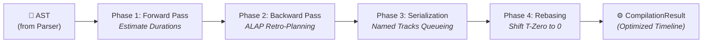

If `@gram-lang/parser` provides the vocabulary, `@gram-lang/kitchen` provides the logic.

The Kitchen package takes the AST (Abstract Syntax Tree) generated by the parser and "compiles" it. It is responsible for simulating the execution of the recipe from top to bottom, resolving variables, calculating time metrics, and generating the final shopping list.

## Core Responsibilities

The compilation process (orchestrated by `core.ts`) is split across several modules:

### 1. Structural Scoping & Processing (`processor.ts`)

The processor walks through every section and step in the AST sequentially to build the execution timeline.

- **Variable Resolution**: When it encounters an intermediate declaration (`->&dough`), it registers it in the Global Scope. When it encounters a reference (`&dough`), it links it back to the declaration.
- **Diagnostics**: It is the processor's job to catch logical errors — placing structured `Warning` objects in `CompilationResult.warnings` rather than throwing exceptions, so callers can render partial output while surfacing issues. If you reference `&dough` but never declared it, it emits an `UNDEFINED_REFERENCE` warning. Multi-hop circular references between intermediates (`&a -> &b -> &a`) are detected by a DFS traversal in `graph.ts` and surfaced as `CIRCULAR_REFERENCE` (`warn-016`). Under `gram check --strict`, warnings are promoted to fatal exit codes.
- **Timeline Generation (ALAP Scheduling)**: The engine uses an **As Late As Possible (ALAP)** scheduling algorithm (decoupled into modular phases under `src/schedule/` for unit testability) through a four-phase compilation to generate a highly optimized execution timeline.
  - **Phase 1 (Forward Pass)**: The compiler estimates durations and passive background tasks to determine the time required to produce intermediate preparations (`->&name`) within each section.
  - **Phase 2 (Backward Pass)**: It walks backward from the end of the recipe (`alap.ts`). When a step consumes an intermediate (`&name`), the engine records this dependency to find the latest possible time it must be ready. It also processes explicit section retro-planning anchors (`~{-1d}`). The step that produces the intermediate is then scheduled *just-in-time* so it finishes exactly when needed.
  - **Phase 3 (Serialization)**: The engine evaluates "Named Tracks" logic (`tracks.ts`), ensuring that sequential background timers sharing the same name (e.g., `~_oven`) do not overlap, adjusting their start times chronologically to avoid contention.
  - **Phase 4 (Positive Rebasing)**: Finally (`rebase.ts`), if any steps were pushed into negative time (e.g. starting a day before serving), the entire timeline is shifted forward by the absolute minimum start time (T-Zero). This guarantees the final timeline data (`timings`) strictly contains positive absolute times starting exactly at 0, making it easy for user interfaces to consume.

  ::: tip
  The `👉` arrow you see in rendered recipes (e.g. `👉*pastry dough*`) is a display icon added by `@gram-lang/renderer`, not Gram syntax. In `.gram` source, an intermediate is consumed with plain `&name`.
  :::

### 2. Time Metrics (`metrics.ts` / `processor.ts`)

The Kitchen calculates four time metrics, combined in `core.ts`:
- **Active Time (`activeTime`)**: The sum of all active timer durations, plus a 2-minute default for any step that declares no timer at all.
- **Cook Time (`cookTime`)**: The absolute maximum end time of the cooking timeline, taking into account any passive background tasks (like resting dough for 24 hours) that finish after the last active step.
- **Preparation Time (`preparationTime`)**: *Independent of timers.* It calculates the *mise en place* overhead by adding 1 minute for every unique ingredient/cookware item (tracked in the registry), plus an additional 2 minutes for every ingredient or cookware item that requires a preparation note (e.g. `@onion(peeled and chopped)`).
- **Total Time (`totalTime`)**: `preparationTime + cookTime` — the full, realistic time investment from gathering ingredients to the dish being ready.

### 3. Shopping List Aggregation (`shopping.ts`)

The Kitchen builds the base list of ingredients required to cook the recipe.

- **Merging**: It groups all usages of an ingredient by its raw id (a slug of the name as written) and unit. If you use `@butter{50g}` in the dough and `@butter{20g}` in the frosting, it arithmetically sums them into a single `70g` entry.
- **Composite Logic**: It implements the MAX and SUM rules for [Composite Ingredients](../../reference/syntax/composite-ingredients.md): the parent quantity required by all composite children is computed as their MAX (e.g. the larger of "zest of 2 lemons" and "juice of 3 lemons" wins), then any quantity of the parent used directly on its own is SUMMED on top.
- **Hybrid Aggregation**: It handles [Relative Quantities](../../reference/syntax/relative-quantities.md) by keeping unresolved/formula-based amounts separate (as text, flagged for review) from absolute numeric masses, so the shopping list remains mathematically accurate even if portions change.

:::tip[This is not the final list]
The Kitchen has no access to `ingredients.yaml` — it groups purely by raw id, so `@butter` and `@beurre` (an alias of the same ingredient) stay separate here, and `100g` + `1 cup` of the same ingredient stay as two entries rather than one merged mass. That further resolution — canonical-id aliasing and cross-unit merging via density — happens downstream in `@gram-lang/analyzer`, once an ingredient database is available. See [Shopping List Aggregation](../shopping-list-aggregation.md).
:::

:::tip[A second, different aggregation exists per-section]
`section.ts` provides a separate helper, `aggregateSectionIngredients`, used to build a compact display of ingredients *within a single section* (as opposed to the recipe-wide shopping list above). Its rules are deliberately different: measured quantities of the same ingredient are **not** summed arithmetically — they're kept side-by-side and joined for display (e.g. `200g + 50g`), since a per-section list is meant to show what's used at each step, not a single purchasing total.
:::

## Output

The output of `@gram-lang/kitchen` is a `CompilationResult` object (this is the "compiled recipe" referred to elsewhere in the docs). It is structurally sound and mathematically aggregated, but it is **not yet physically accurate**.

For example, the Kitchen knows you need `1 cup` of flour and `2 cups` of sugar, but it does not know how heavy a cup of flour is. That physical enrichment happens in the next stage: the **Analyzer**.

## Other Responsibilities

- **Recipe Scaling**: If a `scaleFactor` compiler option is provided, all quantities in the result are scaled proportionally — except quantities marked as fixed with `=` (e.g. `@salt{=5g}`, meant to stay constant regardless of batch size) and free-text quantities, which can't be scaled numerically.
- **Baker's Percentage Validation**: The compiler enforces that at most one ingredient in a recipe can carry the baker's-percentage modifier (`*`), throwing an error otherwise.
