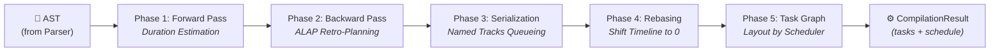

import Since from '../../../../../components/Since.astro';
import { LinkCard, CardGrid } from '@astrojs/starlight/components';

If `@gram-lang/parser` defines the language grammar and vocabulary, `@gram-lang/kitchen` provides its logical and structural engine.

The Kitchen compiler takes the Abstract Syntax Tree (AST) generated by the parser. Its role: simulate recipe execution from start to finish, resolve intermediate variable bindings, generate the task scheduling graph, and assemble the initial consolidated shopping list.

## Core responsibilities

The compilation pipeline (orchestrated by `core.ts`) delegates to several specialized sub-modules:

### 1. Structural scoping & processing (`processor.ts`)

The processor traverses every section and step within the AST sequentially to build the execution timeline.

- **Variable Resolution**: Every intermediate declaration (`->&dough`) is registered in the global symbol scope and linked to subsequent consuming steps (`&dough`).
- **Structural Diagnostics**: The processor catches logical inconsistencies. Rather than throwing uncaught exceptions, it collects structured warning objects in `CompilationResult.warnings`, allowing renderers and tooling to display usable partial output. Referencing an undeclared intermediate emits an `UNDEFINED_REFERENCE` diagnostic. Multi-hop circular dependencies (`&a -> &b -> &a`) are identified via depth-first search (`graph.ts`) and reported as `CIRCULAR_REFERENCE`. Under `gram check --strict`, these warnings become fatal build errors.
- **ALAP Reverse Scheduling**: The compiler applies **ALAP (*As Late As Possible*)** scheduling, delegated since version 1.4.0 to the dedicated `@gram-lang/scheduler` package (see [The scheduling engine](/docs/explanation/engine/scheduler/)). Multiple passes guarantee a deterministic and optimized schedule:
  - **Phase 1 (Forward Pass)**: The compiler computes active durations and passive tasks to establish production durations for intermediate variables (`->&name`) in each section.
  - **Phase 2 (Backward Pass)**: It walks backward from the end of the recipe (`alap.ts`). When an intermediate is consumed (`&name`), the engine determines its latest allowable completion deadline, honoring explicit section retro-planning anchors (`~{-1d}`). The producing step is then scheduled *just-in-time*.
  - **Phase 3 (Serialization)**: Dedicated equipment tracks (*named tracks*, `tracks.ts`) are serialized to ensure passive timers sharing a constrained hardware resource (e.g. `~_oven`) do not collide physically. Start times are adjusted sequentially without idle gaps.
  - **Phase 4 (Positive Rebasing)**: Final chronological normalization (`rebase.ts`). If any preparation steps shifted into negative time relative to serving, the entire timeline is translated forward. The final timeline strictly starts at 0 with positive timestamps, simplifying frontend consumption.
  - **Phase 5 (Task Graph and Default Schedule)** <Since v="1.4.0" /> : Kitchen encapsulates forward pass results into an agnostic **task graph** (`tasks`): preparation tasks per section (`prep`), active steps (`step`), passive timers (`passive`) with elastic ranges (`{ nominal, min, max }`), and explicit dependency links (`after`). The `@gram-lang/scheduler` engine then calculates the **default schedule** (`schedule`: mise en place by section, shortest passive durations). Any alternative timeline (upfront preparation, per working day, longer passive durations) is computed on demand from this same graph via `layout()`, without recompiling. Section working days are derived from `~{-Nd}` day anchors.

:::tip
The `👉` arrow in rendered outputs (e.g. `👉*pastry dough*`) is a visual indicator added by `@gram-lang/renderer`, not Gram source syntax. In `.gram` code, intermediates are consumed using plain `&name`.
:::

### 2. Time metrics and mise en place (`metrics.ts` / `processor.ts`)

Kitchen calculates four core time metrics, combined in `core.ts`:
- **Active Cooking Time (`activeTime`)**: Sum of all active timer durations, plus a 2-minute default for any step declaring no explicit timer.
- **Idle Time (`idleTime`)**: Total waiting duration during which the cook has no active tasks or mise en place to perform (`totalTime - activeTime - preparationTime`). This duration depends on the chosen scheduling mode and is read from `schedule`.
- **Preparation Time (`preparationTime`)**: Baseline *mise en place* allowance, independent of timers. It assigns 1 minute per unique ingredient and cookware item, plus 2 minutes for items requiring preliminary preparation notes (e.g. `@onion(peeled and chopped)`). Each ingredient is counted once in the first section using it; intermediates (`&dough`) are counted in the section that consumes them.
- **Total Time (`totalTime`)**: Sum of `preparationTime + activeTime + idleTime`. This is also read from `schedule`, as it varies depending on whether mise en place is absorbed in masked time or performed upfront.

<Since v="1.4.0" /> Preparation time is broken down by section in `miseEnPlace`, describing item categorization (gathering ingredients, gathering cookware, slicing/prepping). The sum of all entries equals `preparationTime`.

:::note[Deprecated Fields]
<Since type="deprecated" v="1.4.0" /> Legacy timing fields (`timings` and `backgroundTasks` on steps, along with `metrics.totalTime`, `idleTime`, `activeBreakdown`, `prepBreakdown`, and `totalBreakdown`) are deprecated and will be removed in version 2.0.0. Read `schedule` and `miseEnPlace` instead. See the [Kitchen API reference](/docs/reference/api/kitchen).
:::

### 3. Shopping list aggregation (`shopping.ts`)

Kitchen builds the consolidated ingredient purchasing list:

- **Syntactic Merging**: Aggregates ingredient occurrences sharing the exact same raw identifier and unit. For instance, `@butter{50g}` in the dough and `@butter{20g}` in the frosting are summed into a single `70g` entry.
- **Composite Ingredient Rules**: Evaluates MAX and SUM logic for [composite ingredients](/docs/reference/syntax/composite-ingredients). Sibling portions use the maximum quantity (e.g. the greater of "zest of 2 lemons" and "juice of 3 lemons" wins), before summing (SUM) any parent ingredient quantity used as-is.
- **Hybrid Aggregation**: Formulas for [relative quantities](/docs/reference/syntax/relative-quantities) are kept separate from absolute quantities until scaling.

:::tip[Pre-Database Shopping List]
Kitchen operates purely on text syntax, without consulting `ingredients.yaml`. As a result, `@butter` and `@beurre` are treated as distinct items, and volume measurements are not converted to mass. Canonical merging and unit standardization occur in the next pipeline stage via `@gram-lang/analyzer`. See [Shopping List Aggregation](/docs/explanation/shopping-list-aggregation).
:::

:::tip[Per-Section Ingredient Aggregation]
The `section.ts` module provides `aggregateSectionIngredients`, specifically designed for displaying ingredients *per section* (for prep stations). Its rules differ from the global shopping list: repeated occurrences of the same ingredient are not summed, but concatenated (e.g. `200g + 50g`) to clarify preparation stages.
:::

## Compilation output

Kitchen outputs the `CompilationResult` object (the compiled recipe). While structurally validated and chronologically scheduled, this JSON is **not yet physically standardized**.

For instance, Kitchen notes that `1 cup` of flour is needed, but does not know its mass in grams. Physical enrichment is handled by the next stage: the **Analyzer**.

## Other responsibilities

- **Dynamic Scaling**: When a scale factor is provided during compilation, all numeric quantities are multiplied proportionally, except fixed quantities marked with `=` (e.g. `@salt{=5g}`) and non-numeric descriptions.
- **Baker's Percentage Validation**: The compiler validates that at most one ingredient is marked as the baker's percentage reference (`*`). Multiple references throw a fatal compilation error.

## Related resources

<CardGrid>
  <LinkCard
    title="Kitchen API reference"
    description="Full API signature, compile() options, and TypeScript schemas for @gram-lang/kitchen."
    href="/docs/reference/api/kitchen/"
  />
  <LinkCard
    title="Scheduler engine"
    description="How the scheduler lays out task graphs into ALAP schedules and calendar plans."
    href="/docs/explanation/engine/scheduler/"
  />
  <LinkCard
    title="Analyzer engine"
    description="How the next compilation stage cross-references compiled JSON with ingredients.yaml."
    href="/docs/explanation/engine/analyzer/"
  />
</CardGrid>
