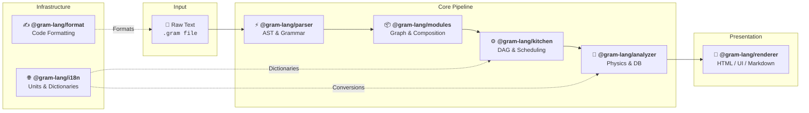

Under the hood, Gram is not a single monolith. It is composed of a series of specific packages that process a recipe step-by-step. 

Understanding this lifecycle is crucial if you want to integrate Gram deeply into your own applications or build new tools on top of it.

## The Pipeline

The compilation of a Gram recipe follows a strict, one-way pipeline:

import { Steps } from '@astrojs/starlight/components';

<Steps>

1. ### Parsing (`@gram-lang/parser`)
   The journey begins here. The Parser takes a raw string of text (your `.gram` file) and uses an OhmJS grammar to validate the syntax. 
   If the syntax is valid, it generates an **Abstract Syntax Tree (AST)**. This AST contains zero logic—it is merely a structured representation of the text.

2. ### Module Resolution & Composition (`@gram-lang/modules`)
   If the recipe contains `@use` import directives, `@gram-lang/modules` traverses the dependency graph (detecting cycles, measuring sub-recipe yields, and scoping intermediate variables) and splices the modules into a single, self-contained **composed AST**. A single-file recipe with no imports passes straight through.

3. ### Compilation (`@gram-lang/kitchen`)
   The composed AST is handed off to the Kitchen. The Kitchen is responsible for the structural logic of the recipe:
   - **Scoping & Scheduling**: Resolving intermediate variables and computing optimized execution timelines with **ALAP (As Late As Possible)** scheduling.
   - **Time Metrics**: Computing `activeTime`, `cookTime`, `preparationTime`, and `totalTime` (`preparationTime + cookTime`) by mapping all timers.
   - **Shopping List Generation**: Aggregating ingredients, summing quantities, and resolving composite ingredients (e.g., combining zest and juice into whole lemons).

   The output is a logically sound, compiled recipe — a `CompilationResult` (or `ComposedCompilationResult`) object.

4. ### Enrichment (`@gram-lang/analyzer`)
   The Analyzer takes the compiled recipe and cross-references it with your project's `ingredients.yaml` database. This is where the physical world meets the digital code:
   - **Mass Standardization**: Converts volumes (cups, tbsp) into accurate gram weights using specific ingredient densities.
   - **Yield Calculation**: Calculates purchasing weight versus edible weight.
   - **Shopping List Aggregation**: Resolves database aliases (e.g. `beurre`/`butter`) and merges cross-unit quantities into a single gram total when possible, so Kitchen's raw per-unit grouping becomes the final, deduplicated list.
   - **Nutritional Estimation**: Computes calories and macronutrients based on the standardized masses.
   - **Baker's Percentages**: Expresses every ingredient's mass as a percentage of a reference ingredient (typically flour).

   Each of these feature sets can be individually enabled or disabled by the host application.

5. ### Presentation (`@gram-lang/renderer` or custom)
   Finally, the fully enriched recipe is ready to be displayed. You can use the official `@gram-lang/renderer` to generate Markdown, a standard web view, or a self-contained print-ready HTML document — or you can consume the JSON directly in your own React, Vue, or Mobile frontend.
</Steps>

### Supporting Infrastructure (`@gram-lang/i18n` & `@gram-lang/format`)
- **`@gram-lang/i18n`**: Serves as the single source of truth for unit and time normalization dictionaries, unit conversion tables (`UNIT_CONVERSIONS`), duration multipliers (`TIME_TO_MINUTES`), and stable category keys (`CATEGORY_KEYS`).
- **`@gram-lang/format`**: Provides the canonical code formatting engine (13 deterministic rules) shared across the CLI and Language Server.

## Package Architecture

This separation of concerns ensures that each package is highly focused and reusable. For example, if you are building an editor extension that only needs to highlight syntax, you only need to import `@gram-lang/parser`.

