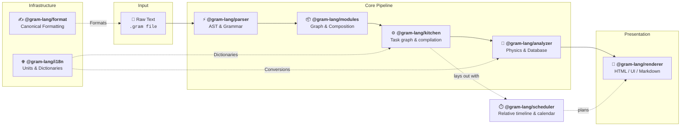

import Since from '../../../../../components/Since.astro';
import { Steps, LinkCard, CardGrid } from '@astrojs/starlight/components';

Far from being a monolith, Gram's architecture is built on a suite of highly focused packages working along a strict, unidirectional pipeline.

Understanding this lifecycle is essential whether you intend to embed Gram within application code or build custom tooling on top of it.

## The compilation pipeline

Compiling a Gram recipe flows through a deterministic, one-way pipeline:

<Steps>

1. ### Parsing (`@gram-lang/parser`)
   The process begins here. The Parser accepts raw source text (a `.gram` file) and uses an Ohm.js grammar to validate syntax.
   If valid, it produces an **Abstract Syntax Tree (AST)**. This AST contains zero domain logic—it is purely a structured syntactic representation of the recipe document.

2. ### Module resolution and composition (`@gram-lang/modules`)
   When a recipe includes `@use` import directives, `@gram-lang/modules` traverses the dependency graph, resolves cyclic references, tracks sub-recipe yields, and scopes variables to merge all components into a single, self-contained **composed AST**. A single-file recipe with no imports passes straight through without alteration.

3. ### Structural compilation (`@gram-lang/kitchen`)
   The composed AST is passed to the Kitchen compiler, which owns the structural domain logic of the recipe:
   - **Variables and dependencies**: Registers intermediate declarations (`->&name`) and resolves downstream references (`&name`).
   - **Core time metrics**: Computes active cooking time (`activeTime`), baseline mise en place (`preparationTime`), and section-level allocation (`miseEnPlace`).
   - **Agnostic task graph**: Formalizes each task (`prep`, `step`, `passive`), its nominal durations and elasticity bounds, and its scheduling dependencies (`tasks`).
   - **Default schedule**: Calculates the reference timeline via `@gram-lang/scheduler` (`schedule`: mise en place by section, shortest passive durations). Alternative schedules (upfront prep, per working day, longer passive durations) are evaluated on demand from this same graph without recompilation.
   - **Initial shopping list**: Aggregates ingredients by raw text identifier and resolves composite ingredient relationships.

   The stage produces a `CompilationResult` (or `ComposedCompilationResult`) object.

4. ### Physical enrichment (`@gram-lang/analyzer`)
   The Analyzer receives the compiled recipe and cross-references it with your `ingredients.yaml` database. This is where physical realities enrich the data model:
   - **Mass standardization**: Converts volumetric measurements (cups, tablespoons) into accurate gram weights using specific ingredient densities.
   - **Yield calculations**: Computes gross purchasing mass based on edible net mass.
   - **Consolidated shopping list**: Resolves canonical aliases (e.g. `beurre` = `butter`) and merges cross-unit amounts into unified gram totals.
   - **Nutritional estimation**: Calculates caloric values and macronutrient distributions from standardized masses.
   - **Baker's percentages**: Computes ingredient ratios relative to the reference base (typically flour).

   Every feature in this pass can be enabled or disabled individually by the host application.

5. ### Presentation and rendering (`@gram-lang/renderer` or custom UI)
   The enriched recipe is ready for presentation. You can use `@gram-lang/renderer` to generate Markdown, an interactive web view, or a print-optimized HTML layout—or consume the structured JSON directly within your own frontend application (React, Vue, or mobile).

</Steps>

### The scheduling engine (`@gram-lang/scheduler`)
<Since v="1.4.0" />

`@gram-lang/scheduler` sits beneath the Kitchen: Kitchen depends on it, never the reverse. The scheduler operates without knowledge of the AST or `.gram` syntax, processing only an agnostic task graph. It fulfills two primary roles:
- **`layout()`** arranges the task graph along a relative timeline, tailored to chosen mise en place placement and passive duration elasticity.
- **`project()`** projects this schedule onto the real calendar given a target serving time, time zone, and availability windows, while `runSheet()` formats the operational production sheet. See [Planning in real time](/docs/explanation/planning-in-real-time/) and [The scheduling engine](/docs/explanation/engine/scheduler/).

### Cross-cutting infrastructure (`@gram-lang/i18n` and `@gram-lang/format`)
- **`@gram-lang/i18n`**: Serves as the single source of truth for language normalization dictionaries, unit conversion tables (`UNIT_CONVERSIONS`), duration multipliers (`TIME_TO_MINUTES`), and category keys (`CATEGORY_KEYS`).
- **`@gram-lang/format`**: Powers the canonical code formatter (13 deterministic rules) shared across the CLI and Language Server.

## Package architecture

This strict separation of concerns ensures that individual packages remain lightweight, focused, and independently reusable. For instance, an editor extension focused strictly on syntax highlighting only needs to import `@gram-lang/parser`.

```mermaid
flowchart LR
    subgraph Input ["Input"]
        Raw["📄 Raw Text<br/><code>.gram file</code>"]
    end

    subgraph Pipeline ["Core Pipeline"]
        direction LR
        Parser["⚡ <b>@gram-lang/parser</b><br/>AST & Grammar"]
        Modules["📦 <b>@gram-lang/modules</b><br/>Graph & Composition"]
        Kitchen["⚙️ <b>@gram-lang/kitchen</b><br/>Task graph & compilation"]
        Analyzer["🔬 <b>@gram-lang/analyzer</b><br/>Physics & Database"]

        Parser --> Modules --> Kitchen --> Analyzer
    end

    Scheduler["⏱️ <b>@gram-lang/scheduler</b><br/>Relative timeline & calendar"]
    Kitchen -. lays out with .-> Scheduler

    subgraph Output ["Presentation"]
        Renderer["🎨 <b>@gram-lang/renderer</b><br/>HTML / UI / Markdown"]
    end

    subgraph Infra ["Infrastructure"]
        Format["✍️ <b>@gram-lang/format</b><br/>Canonical Formatting"]
        I18n["🌐 <b>@gram-lang/i18n</b><br/>Units & Dictionaries"]
    end

    Raw --> Parser
    Analyzer --> Renderer
    Scheduler -. plans .-> Renderer
    Format -. Formats .-> Raw
    I18n -. Dictionaries .-> Kitchen
    I18n -. Conversions .-> Analyzer
```

## Related resources

<CardGrid>
  <LinkCard
    title="API packages overview"
    description="Explore the architecture, imports, and roles of each @gram-lang package."
    href="/docs/reference/api/"
  />
  <LinkCard
    title="Philosophy of Gram"
    description="The foundational principles behind recipes as code, physics, and determinism."
    href="/docs/explanation/philosophy/"
  />
  <LinkCard
    title="Build a custom UI"
    description="How to integrate the pipeline packages to render recipes in custom applications."
    href="/docs/how-to/build-custom-ui/"
  />
</CardGrid>
