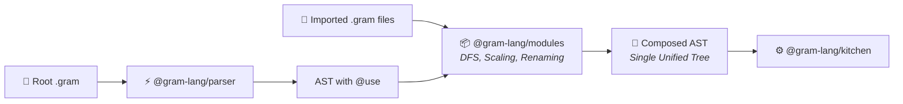
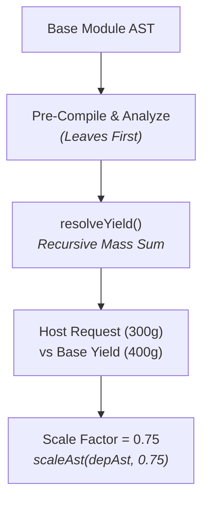

import Since from '../../../../../components/Since.astro';

<Since v="1.2.0" />

The `@gram-lang/modules` package forms the second stage in the Gram pipeline. It takes an entry `RecipeAST` containing `@use` import directives and transforms the multi-file dependency graph into a single, self-contained **composed AST** ready for compilation.



## Why Compose at the AST Level?

In traditional software compilation, modules can be compiled into separate object files and linked later. In computational cooking, however, compiling modules independently produces incorrect schedules:

- **ALAP (As Late As Possible) Scheduling**: If a pie crust requires 1 hour of chilling and 20 minutes of blind baking, its timeline must interleave dynamically with fillings and custards in the host recipe. Compiling the crust into fixed times beforehand would destroy this global scheduling optimization.
- **Relational Ingredients & Composites**: Ingredients in sub-bases (like butter and flour) must merge into the host's purchasing shopping list, respecting composite rules (`<@lemon`) and unit conversions across the entire dish.

By composing at the AST level **before** `@gram-lang/kitchen` runs, Gram compiles and schedules the entire meal as a single coherent recipe in one pass.

## Host Abstraction (`ModuleHost`)

`@gram-lang/modules` contains zero filesystem I/O or platform-specific logic. It defines the `ModuleHost` interface, leaving file reading and path resolution to the environment:

- **CLI (`@gram-lang/cli`)**: Resolves project-root (`@/...`) and alias paths (`@bases/...`) using `node:fs` and `node:path`.
- **Language Server (`@gram-lang/language-server`)**: Reads from active in-memory editor buffers before falling back to disk.
- **Browser Playground (`packages/docs`)**: Employs `createMemoryHost` with a virtual in-memory file dictionary, allowing live multi-tab editing without a filesystem.

## 1. Graph Traversal & Cycle Detection (`graph.ts`)

When `loadModuleGraph(entryUri, host)` is called, it performs a single depth-first search (DFS) traversal:

1. **Cycle Detection**: Maintains a traversal stack `pathStack`. If a dependency matches an active parent URI, it records a non-fatal `MODULE_CYCLE` diagnostic (`A → B → A`) and terminates that branch without crashing.
2. **Diamond Dependencies**: Each URI is loaded and parsed at most once. If recipes `A` and `B` both import base `C`, `C` is loaded once and stored in the `modules` registry.
3. **Topological Ordering**: Modules are pushed to `order` as DFS post-order visits complete (leaves first). This guarantees that child dependencies are measured and composed before their parents.

## 2. Public Exports & Intermediate Hygiene (`exports.ts`, `rename.ts`)

### Export Rules
Only section-level intermediate declarations (`## Pastry Dough ->&crust`) are considered public exports:
- Step-level intermediate declarations (`->&chopped`) remain strictly private to their module.
- If a module has no section-level declaration, its last section is deterministically selected as the `default` export.

### Variable Renaming & Hygiene
To prevent name collisions when multiple files declare common names (e.g. `&dough` or `&mixture`):
1. **Bound Exports**: Renamed directly to the local identifier chosen in the host's `@use` line (`@use "./base.gram" as &myDough`).
2. **Internal Variables**: Prefixed using the binding name (e.g. `&dough` becomes `&myDough$dough`).
3. **Collision Safety Net**: After renaming, `checkRenameCollisions()` validates all identifiers post-slugification to ensure no distinct intermediates accidentally merge.

## 3. Physical Yield Measurement & Proportional Scaling (`yield.ts`)

When an importing recipe requests a specific quantity of an imported base (e.g. `&crust{300g}`):



1. **`resolveYield`**: Recursively measures the total physical mass in grams (`metrics.totalMass`) produced by the target export section and any upstream sections feeding into it.
2. **`computeScaleFactor`**: Evaluates the ratio:
   ```text
   Scale Factor = max(Sum of Requested Quantities / Export Yield)
   ```
3. **AST Scaling**: `scaleAst()` multiplies every numeric ingredient and timer in the sub-tree before splicing it into the host.

## 4. Inline Mode vs. Stock Mode (`--stock`)

Gram supports two execution modes for modular dependencies:

| Feature | Inline Mode (Default) | Stock Mode (`--stock`) |
|---|---|---|
| **Timeline / Gantt** | All sub-recipe steps are spliced into the host schedule and interleaved via ALAP. | **Zero timeline cost**: steps are omitted entirely. |
| **Shopping List** | Raw ingredients (flour, butter) bubble up to the master shopping list. | Appears as a single purchasable unit (e.g., `1 pastry dough`). |
| **Nutritional Profile** | Aggregated from individual raw ingredients. | Calculated via synthetic ingredient records weighted by `accountedMass / yieldBasisMass`. |

In stock mode, `composeRecipe()` generates synthetic ingredient definitions (`syntheticIngredients`) carrying the module's real nutritional profile and unit weight. When passed to `@gram-lang/analyzer`, the host recipe maintains complete nutritional accuracy even though preparation steps were skipped.
