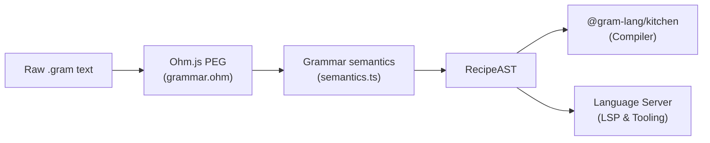

import { Card, CardGrid, LinkCard, Tabs, TabItem } from '@astrojs/starlight/components';

The `@gram-lang/parser` package is the foundation of the Gram ecosystem. Its sole responsibility is to read raw `.gram` text and convert it into an Abstract Syntax Tree (AST).



## Ohm.js

Gram's syntax rules are defined using [Ohm.js](https://ohmjs.org/), an object-oriented parsing toolkit built around Parsing Expression Grammars (PEGs).

Ohm makes it straightforward to build modular grammars. Because of this, `@gram-lang/parser` is fast and strictly enforces the structural rules of the language. For example, whitespace is forbidden immediately around the composite marker `<@` (`invalidComposite` in the grammar), so `pastry < @dough` fails to parse while `<@dough` succeeds.

## The abstract syntax tree (AST)

When parsing succeeds, the parser outputs an AST. This is a tree of JavaScript objects representing every semantic token in the recipe.

<Tabs>
  <TabItem label="Source .gram">
```gram
Add the @flour{200g}.
```
  </TabItem>
  <TabItem label="Generated AST node">
```json
{
  "type": "Ingredient",
  "name": "flour",
  "quantity": {
    "type": "Quantity",
    "value": { "type": "single", "value": 200, "text": "200" },
    "unit": "g",
    "fixed": false
  },
  "modifiers": [],
  "alias": null,
  "preparation": null,
  "composite": null
}
```
  </TabItem>
</Tabs>

In this example, the step is parsed into a `Step` node containing a leading `Text` node (`"Add the "`), an `Ingredient` node, and a trailing `Text` node (`"."`).

Note that `quantity.value` is always a `QuantityValueAST` object, never a bare number — this allows the parser to preserve fractions (`1/2`) and ranges (`2-3`) alongside the author's original text representation.

## Supported AST nodes

The parser exposes specific node types for every construct in the Gram language (`ASTNodeType` in `src/types.ts`):

<CardGrid>
  <Card title="Recipe" icon="document">
    The root node containing frontmatter metadata (`meta`) and child `Section` nodes.
  </Card>
  <Card title="Section" icon="list-format">
    A grouping of `Step` and top-level `Comment` nodes. Can carry an optional retro-planning anchor (`~{...}`) and an intermediate declaration.
  </Card>
  <Card title="Step" icon="puzzle">
    A single paragraph containing text and semantic inline tokens. Supports an optional leading action tag (e.g. `[Preheat]`).
  </Card>
  <Card title="Ingredient & Cookware" icon="star">
    Represent ingredients (`@flour`) and tools (`#whisk`). Can be wrapped in an `Alternative` node when combined with the `|` operator.
  </Card>
  <Card title="Quantity" icon="analytics">
    Represents amounts in three forms: standard numeric/fraction/range (`Quantity`), relative baker's percentage (`RelativeQuantity`), or raw text (`TextQuantity`).
  </Card>
  <Card title="Composite & Reference" icon="random">
    Composite references (`<@lemon`) aggregate components into a whole item. Reference nodes consume intermediate variables (`&dough`).
  </Card>
</CardGrid>

:::tip[Modifiers are raw symbols]
The `modifiers` array on `Ingredient` and `Cookware` nodes holds the raw punctuation characters as written in the source (`?`, `-`, `*`, `&`), not semantic labels. The `=` marker is handled separately: rather than appearing in `modifiers`, it sets `quantity.fixed` to `true`.
:::

## Purely syntactic

`@gram-lang/parser` performs strictly syntactic parsing without semantic domain evaluation:

- It does not check whether a referenced variable `&dough` was declared previously.
- It does not scale quantities or convert units.
- It does not verify whether an ingredient exists in your `ingredients.yaml` database.

It does, however, perform a few localized structural validations during tree construction: it validates recipe frontmatter against a schema (discarding invalid fields), computes the midpoint for range quantities (`2-3` provides an average of `2.5`) for downstream convenience, and emits clear syntax errors for malformed composite references.

Semantic resolution, timeline generation, and reference validation take place in the next pipeline stage: `@gram-lang/kitchen`.

## Related resources

<CardGrid>
  <LinkCard
    title="Parser API reference"
    description="Full API signature, AST types, parse errors, and options for @gram-lang/parser."
    href="/docs/reference/api/parser/"
  />
  <LinkCard
    title="Kitchen compilation"
    description="How the compiler resolves intermediate variables, builds task graphs, and compiles recipes."
    href="/docs/explanation/engine/kitchen/"
  />
  <LinkCard
    title="Document structure syntax"
    description="Complete syntax reference for recipe sections, steps, frontmatter, and comments."
    href="/docs/reference/syntax/document-structure/"
  />
</CardGrid>
