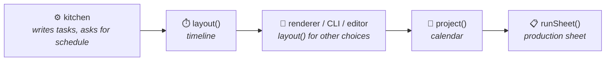

`@gram-lang/scheduler` is the part of Gram that decides **when** things happen. Until 1.4.0 this was a part of the Kitchen; it is now a package of its own, so that the same engine serves the compiler, the renderer, the CLI, the editor and your own tools.

It sits **beneath** the Kitchen: `@gram-lang/kitchen` depends on it, never the other way round. It knows nothing about the AST, about `.gram` syntax or about the compiled recipe. Its only input is a neutral **task graph**, which a test checks by forbidding any import of another Gram package.

## The task graph

The Kitchen writes the graph into the compiled recipe (`tasks`): it holds the facts of the recipe and nothing that depends on how you read it.

- **`prep` tasks**: the work of getting a section ready. Each section has one for what it gathers or prepares from raw ingredients, plus one per intermediate it uses (`&dough`), which can't start before the intermediate exists.
- **`step` tasks**: one per step, with the hands-on time.
- **`passive` tasks**: the timers of a step, with the offset at which they start, and the track for a named one (`~_oven{}`).
- **Durations** are `{ nominal, min?, max? }`: `min` and `max` are there only for a passive rest written as a range, and `nominal` is what the default timeline plans on (the shortest figure of a passive range, the longest of an active one, the value itself otherwise).
- Each task lists what it waits for (`after`), and its id is stable and readable: `s0.prep`, `s1.prep.dough`, `s0.3`, `s0.3.t0`.
- Each section carries its working day (`day`), its deadline in minutes before the end when it has an anchor, and the intermediate it makes.

Because the graph doesn't depend on any option, every combination of mise en place plan and choice of rests is computed from it, without compiling again.

## Two levels

| Level | Function | Input | Output |
|---|---|---|---|
| **1. Timeline** | `layout(graph, options)` | The graph, and optionally `{ miseEnPlace, rests }` | A `Schedule` (blocks, working days, totals) and the diagnostics that don't depend on anyone |
| **2. Calendar** | `project(recipes, context)` | The graph(s), a serving time, a time zone, availability | A plan: every block with its date and time, the rests that moved, when you are not available, and what could not be fixed |
| | `runSheet(plan)` | The plan | The structure of a production sheet |

Both are **pure**: the same input always gives the same output, nothing is read from the machine (no clock, no time zone), and the graph is never modified. `project()` takes a list of recipes from the start, but plans only the first one for now, and says so (`MULTI_RECIPE_UNSUPPORTED`).

## How `layout()` works

The engine is the as-late-as-possible algorithm described in [ALAP scheduling](/docs/explanation/alap-scheduling/), in passes:

1. **Backward pass**: walking from the last section to the first, each step gets the latest time it can start, from the section anchors and from what consumes what it makes.
2. **Named tracks**: two timers on one track can't overlap; the second is pushed back, and a contention is reported.
3. **Rebase**: everything is shifted so the timeline starts at 0.
4. **Mise en place**: the preparation of each group of sections is inserted as work of its own and the backward pass runs again, so each preparation ends exactly when the work it precedes starts. One group per section gives "by section", one group in all gives "all at the start", one per working day gives "by working day". An intermediate made inside its group is planned right before the section that uses it.

The rests written as a range are read on the figure `rests` picks (shortest, middle, longest), and an active timer on its nominal one, so a cooking uncertainty never lets dinner be late.

## How `project()` works

It lays the graph out, places the end at the serving time, and then walks back from the service. Each stretch of work outside your availability is moved by making the nearest rest after it that is written as a range longer or shorter, by laying the graph out again with that rest changed. See [Planning in real time](/docs/explanation/planning-in-real-time/) for what that means for you.

Time is counted in absolute minutes since the epoch, and local time is read with `Intl.DateTimeFormat` and an explicit time zone. There is no date library and no hidden clock: the same plan comes out under any `TZ`, and a day of 23 or 25 hours counts for what it lasts.

## Diagnostics

Two families, kept apart on purpose:

- **Of the recipe itself**, known at compile time and returned by `layout()` as data: `TIME_PARADOX`, `TRACK_CONTENTION`, `SESSION_OVERFLOW`. The Kitchen words them as warnings, with the title and the source location of the section, so there is one list of warnings, visible in the editor.
- **Of your context**, which only exist once there is a serving time and availability: `ACTIVE_OUTSIDE_AVAILABILITY`, `ACTIVE_BLOCK_EXCEEDS_AVAILABILITY`, `SESSION_DAY_MISMATCH`, `START_IN_PAST`, `MULTI_RECIPE_UNSUPPORTED`. They are part of the result of `project()`, not compiler warnings.

## In the pipeline

See the [scheduler API reference](/docs/reference/api/scheduler/) for the functions and their types.
