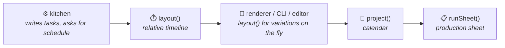

import Since from '../../../../../components/Since.astro';
import { Steps, LinkCard, CardGrid } from '@astrojs/starlight/components';

<Since v="1.4.0" />

`@gram-lang/scheduler` is the component in Gram responsible for the temporal dimension: it determines **precisely when** each task must be executed. Until version 1.4.0, this logic was part of the Kitchen compiler. It is now isolated in its own package, allowing the same engine to serve the compiler, renderer, CLI, Language Server (LSP), and your custom integrations.

The scheduler sits **beneath** the Kitchen: `@gram-lang/kitchen` depends on it, never the other way around. It has no knowledge of the AST, the `.gram` syntax, or the compiled recipe. Its only input is an agnostic **task graph**, and architecture tests strictly forbid importing any other Gram package into it.

## The task graph

Kitchen writes this graph into the compiled recipe (`tasks`): it contains the intrinsic facts of the recipe, independent of any scheduling or display options:

- **`prep` tasks**: the work required to prepare a section. Each section has a preparation task for gathering and weighing its raw ingredients, plus one per intermediate variable consumed (`&dough`), which cannot begin before that intermediate is ready.
- **`step` tasks**: one per step, corresponding to hands-on active work.
- **`passive` tasks**: the passive timers of a step (baking, rising, resting, chilling…), with the offset at which they start, and an optional track for dedicated equipment (`~_oven{}`).
- **Structured durations**: each task has a duration `{ nominal, min?, max? }`. The `min` and `max` bounds are only present for waits specified as a range (`~_{8-16h}`); `nominal` represents the default duration (the minimum value for a passive timer, the maximum value for an active task, or the fixed duration otherwise).
- **Explicit dependencies**: each task lists the IDs of those it waits for (`after`). IDs are deterministic and human-readable: `s0.prep`, `s1.prep.dough`, `s0.3`, `s0.3.t0`.
- **Section metadata**: each section carries its target working day (`day`), its deadline in minutes before service when anchored, and any intermediate it produces.

Because this graph does not depend on user options, every combination of mise en place strategy and wait elasticity can be recalculated on the fly without recompiling the recipe.

## Two scheduling levels

| Level | Function | Input | Output |
|---|---|---|---|
| **1. Relative timeline** | `layout(graph, options)` | The task graph, and optionally `{ miseEnPlace, rests }` | A `Schedule` (ordered blocks, relative working days, time totals) and diagnostics intrinsic to the recipe |
| **2. Calendar projection** | `project(recipes, context)` | One or more graphs, a serving time, a time zone, and availability | A timestamped plan: each block with its local date and time, adjusted waits, unavailable periods, and unresolved conflicts |
| | `runSheet(plan)` | The projected plan | The hierarchical structure of a production sheet |

Both functions are **strictly pure**: identical inputs always yield identical outputs, no system clock or implicit time zone is read, and the input graph remains immutable. `project()` accepts a list of recipes by design, but currently plans only the first one while emitting the `MULTI_RECIPE_UNSUPPORTED` diagnostic.

## How `layout()` works

The engine implements the as-late-as-possible algorithm described in [ALAP scheduling](/docs/explanation/alap-scheduling/), structured in multiple passes:

<Steps>
1. **Backward pass (ALAP)**  
   Traversing sections from last to first, each step receives the latest possible start time based on section anchors and steps that consume its preparations.

2. **Named track allocation**  
   Two timers assigned to the same track (e.g. `~_oven{}`) cannot overlap. The earlier timer is pushed backward to clear the track, and a contention diagnostic (`TRACK_CONTENTION`) is reported.

3. **Rebasing to origin**  
   The entire timeline is shifted so that the initial moment starts exactly at zero.

4. **Inserting mise en place**  
   Preparation work for each group of sections is inserted as dedicated tasks, and the backward pass runs again so that each preparation finishes precisely when the first step requiring it begins. Depending on the chosen strategy:
   - `"perSection"` places preparation right before each section;
   - `"upfront"` groups all preparations at the very start of the recipe;
   - `"perSession"` places preparations at the beginning of each working day.
</Steps>

Waits written as a range follow the strategy specified via `rests` (`"shortest"`, `"balanced"`, or `"longest"`). Active timers always take their nominal maximum duration, ensuring cooking uncertainties never delay the service.

## How `project()` works

`project()` lays the graph out using `layout()`, anchors the final moment at the target serving time, and walks backward along the timeline:

- Any active work stretch falling into unavailable hours is shifted by lengthening or shortening the nearest flexible wait (written as a range) downstream.
- The entire timeline is re-laid out on each adjustment to verify dependencies and track availability against the concrete result.
- For an end-to-end explanation, see [Planning in real time](/docs/explanation/planning-in-real-time/).

Internal time is counted in continuous absolute minutes since the POSIX epoch. Local time display relies on `Intl.DateTimeFormat` with an explicit time zone. No third-party date library or implicit system clock is involved: the plan remains byte-for-byte identical regardless of host environment, and a 23-hour or 25-hour daylight saving transition day counts for its actual duration.

## Two diagnostic families

The engine strictly separates two categories of issues:

- **Intrinsic recipe diagnostics**: detected during layout by `layout()` (`TIME_PARADOX`, `TRACK_CONTENTION`, `SESSION_OVERFLOW`). Kitchen transforms them into compiler warnings (`WarningCode`), enriched with section titles and source locations for display in editor tooling.
- **Contextual projection diagnostics**: these only arise once the serving time and user availability are evaluated against the recipe (`ACTIVE_OUTSIDE_AVAILABILITY`, `ACTIVE_BLOCK_EXCEEDS_AVAILABILITY`, `SESSION_DAY_MISMATCH`, `START_IN_PAST`, `MULTI_RECIPE_UNSUPPORTED`). They form part of the result returned by `project()` and are not compilation warnings.

## In the pipeline

See the [scheduler API reference](/docs/reference/api/scheduler/) for complete function signatures and TypeScript types.

## Related resources

<CardGrid>
  <LinkCard
    title="Scheduler API reference"
    description="Function signatures, options, and TypeScript types for layout(), project(), and runSheet()."
    href="/docs/reference/api/scheduler/"
  />
  <LinkCard
    title="Planning in real time"
    description="How the scheduler projects tasks onto clock times and user availability windows."
    href="/docs/explanation/planning-in-real-time/"
  />
  <LinkCard
    title="ALAP scheduling"
    description="Understand the reverse planning algorithm that optimizes passive and active tasks."
    href="/docs/explanation/alap-scheduling/"
  />
  <LinkCard
    title="Mise en place and planning"
    description="How preparation costs and multi-day sessions interact with temporal planning."
    href="/docs/explanation/mise-en-place-and-planning/"
  />
</CardGrid>
