import Since from '../../../../components/Since.astro';
import { LinkCard, CardGrid } from '@astrojs/starlight/components';

<Since v="1.4.0" />

When reading a recipe, three distinct concepts are often conflated: **raw ingredient requirements**, **prior preparation work**, and **temporal scheduling**. Gram explicitly separates these three dimensions, with only the last being subject to user preference.

For a straightforward recipe, default settings handle scheduling automatically without extra configuration. The following sections are intended for those orchestrating multi-component recipes or preparations spanning several days.

## Three concepts, one choice

| | Definition | Affected by scheduling choice? |
|---|---|---|
| **Ingredients** | Material requirements: section ingredient lists, consolidated shopping list | No |
| **Mise en place** | Preparation work: fetching, weighing, washing, peeling, chopping. Each section reports its own preparation cost (`miseEnPlace`) | No |
| **Planning** | Temporal scheduling: relative timeline, total duration, overall passive duration, and Gantt chart | **Yes**, this is the only dimension modified |

A recipe never imposes its own schedule. It declares culinary facts (required ingredients and estimated preparation time); it is up to the **user** to decide how to organize this work along the timeline.

A straightforward rule to remember: switching scheduling strategies never changes the ingredients, the shopping list, the preparation time, or the active work. It solely shifts work blocks across the timeline.

## The three mise en place strategies

Gram provides three strategies to schedule mise en place. Consider this recipe:

```gram
## Dough ->&dough

[Mix] Mix @flour{500g} and @water{300ml} in a #bowl.

[Rise] Let it rise ~_{30min}.

## Filling ->&filling

[Slice] Slice @onions{200g}(finely sliced).

## Assembly

[Combine] Combine &dough and the &filling, then bake ~{25min}.
```

Gram automatically calculates preparation time for each section based on ingredients to weigh or chop and cookware required (here: 3 min for dough, 3 min for filling, 1 min for assembly, totaling 7 min). Cumulative active cooking work is 29 minutes across all scheduling choices.

### By section (default)

This mode schedules each section's preparation as close as possible to its execution. Whenever a passive duration occurs (fermentation, oven baking, cooling), Gram inserts the preparation of subsequent steps.

In culinary and manufacturing operations, this is known as working in **masked time**: active work performed *during* a passive wait adds zero extra minutes to the recipe's total duration.

```mermaid
gantt
    title By section — Masked time execution (1 h 01)
    dateFormat  HH:mm
    axisFormat %H:%M
    todayMarker off
    section Dough
    Mise en place                     : p1, 00:00, 3m
    Mix                               : active, a1, 00:03, 2m
    Rise (passive)                    : r1, 00:05, 30m
    section Filling
    Mise en place                     : p2, 00:30, 3m
    Slice                             : active, a2, 00:33, 2m
    section Assembly
    Mise en place                     : p3, 00:35, 1m
    Combine and bake                  : active, a3, 00:36, 25m
```



- Dough is prepared at 00:00, then rises for 30 minutes (from 00:05 to 00:35).
- Filling mise en place occurs in masked time toward the end of the rise (starting at 00:30): chopped onions stay fresh rather than lingering on the counter.
- Overall total duration is optimized to **1 h 01** (61 min).

### All at the start

This mode groups all ingredient weighing and chopping before beginning the first step:

```mermaid
gantt
    title All at the start — Upfront preparation (1 h 04)
    dateFormat  HH:mm
    axisFormat %H:%M
    todayMarker off
    section Mise en place
    Dough                             : p1, 00:00, 3m
    Filling                           : p2, 00:03, 3m
    section Dough
    Mix                               : active, a1, 00:06, 2m
    Rise (passive)                    : r1, 00:08, 30m
    section Filling
    Slice                             : active, a2, 00:36, 2m
    section Assembly
    Retrieve dough                    : p3, 00:38, 1m
    Combine and bake                  : active, a3, 00:39, 25m
```



- Dough and filling ingredients are prepared upfront starting at 00:00 (until 00:06).
- Total duration increases to **1 h 04** (64 min), as filling prep is no longer absorbed in masked time during the rise.

### By session (or working day)

This mode consolidates preparation by working day. When a recipe fits within a single day (with no past day anchors like `~{-1d}`), this mode yields results identical to "All at the start". Its primary purpose is structuring multi-day production schedules (see below).

No single mode is universally superior: the first optimizes total duration and ingredient freshness; the second suits cooks who prefer gathering all ingredients beforehand; the third organizes complex multi-day workflows.

:::note[Special case: intermediates are never prepared before they exist]
An intermediate ingredient (`&dough`) is produced during recipe execution: it cannot be retrieved or measured before its producing section completes. This rule applies across all scheduling modes:

- **Accounting**: an intermediate is counted in the mise en place of the section that **consumes** it, not the one that produces it.
- **In "All at the start" mode**: raw ingredients are gathered upfront, but the intermediate is retrieved only when downstream steps require it (in our example, `&dough` is retrieved after rising, right before assembly).
:::

## Elastic passive durations written as ranges

A passive duration can be fixed (`~_{12h}`) or specified as a range (`~_{12-24h}`: ready after 12 hours, viable up to 24 hours). A fixed passive duration never shifts. In contrast, a range introduces temporal elasticity, and you decide how to interpret it via the `rests` option, just as you choose mise en place placement:

- **`shortest`** (default): selects the range's minimum duration;
- **`balanced`**: selects the median duration;
- **`longest`**: selects the maximum duration.

This selection affects total duration, idle passive time, and the Gantt chart, while leaving active cooking work unchanged. Conversely, an active timer specified as a range (`~{40-50min}`) reflects cooking uncertainty rather than elasticity: it is always scheduled using its maximum duration to ensure service is never delayed.

When a target serving time and cooking availability are provided, Gram utilizes this elasticity to shift active work away from overnight hours: see [Planning in real time](/docs/explanation/planning-in-real-time/).

## Scheduling configuration

A cornerstone of Gram's architecture is that **a recipe contains no syntax to dictate its schedule**. It describes purely culinary facts (ingredients, cookware, actions, and durations).

During compilation, Kitchen preserves data neutrality. The compiled recipe output carries raw facts (`miseEnPlace`, and `tasks`: the neutral dependency graph) alongside a single default schedule in `schedule` (mise en place by section, shortest passive durations):

```json
{
  "miseEnPlace": { /* raw facts: estimated durations per section */ },
  "tasks":       { /* neutral task graph */ },
  "schedule":    { /* default schedule laid out from tasks */ }
}
```

Any alternative configuration (upfront, per-session, longest passive durations...) is computed on demand from `tasks` using the pure `layout()` function of `@gram-lang/scheduler`, **without recompiling**. The scheduling choice occurs **at rendering, export, or display time**:

| Tool | Mise en place placement | Passive duration selection |
|---|---|---|
| **CLI** (`gram view`, `export`, `print`, `plan`) | `--mise-en-place <per-section\|upfront\|per-session>` | `--rests <shortest\|balanced\|longest>` |
| **VS Code** | `gram.miseEnPlace` setting | `gram.rests` setting |
| **Playground** | "Mise en place" selector | "Rests" selector |
| **Renderer** (`@gram-lang/renderer`) | `miseEnPlace: "perSection" \| "upfront" \| "perSession"` | `rests` option |

For application developers building custom interfaces, this separation eliminates the need to reimplement scheduling logic: read `schedule` for default planning, or invoke `layout()` for customized projections (see the [kitchen API reference](/docs/reference/api/kitchen/) and the [scheduler API reference](/docs/reference/api/scheduler/)).

## Recipes over several days

Lengthy recipes (**sourdough bread**, **marinated meats**, **croissants**, or **gravlax**) naturally break down into sessions: each day, one prepares only what that specific day requires. The **by session** strategy (`per-session`) generates a daily production roadmap based on the retro-planning day anchors (`~{-1d}`, `~{-2d}`) declared in the recipe.

```gram
---
title: Filled tart
---

## Cream ~{-3d} ->&cream

[Whisk] Whisk @milk{500ml} and @eggs{4}.

[Chill] Let it set at ^{4C} for ~_{24h}.

## Crust ->&crust

[Work] Work &cream{150g} with @flour{300g} and @butter{150g}.

## Tart ~{-1d}

[Fill] Fill with &crust{400g}.

[Bake] Bake for ~{30min}.

## Serve

[Dust] Dust with @sugar{10g}.
```

### Working day segmentation

To structure a recipe into daily sessions, the scheduling engine relies exclusively on section anchors specified **in days** (`~{-1d}`, `~{-2d}`, `~{-3d}`):

- **`~{-Nd}` (days) = a distinct working day.** This conveys explicit human intent (*"prepare the day before (D-1)"*, *"two days prior (D-2)"*). Gram then groups the mise en place of those sections into a dedicated session.
- **`~{-Nh}` (hours) = a relative deadline within a day.** An anchor such as `~{-2h}` or `~{-36h}` indicates that a step must complete 2 hours (or 36 hours) before serving, but **never** initiates a new working day on its own. Because a `.gram` recipe has no knowledge of actual meal timing, converting hours into calendar days would introduce meal-dependent ambiguity (`~{-12h}` lands in the morning for an 8 p.m. dinner, but at midnight the day before for a noon lunch).

An unanchored section inherits the day of the **furthest day anchor among downstream sections**, or serving day (Day D) by default. In the example, the crust has no anchor of its own: it is assigned to D-1 alongside the tart, and ALAP scheduling places it as late as possible, immediately prior to assembly.

:::caution[Common pitfalls]
Two frequent patterns do **not** initiate a new working day:

1. **A long passive timer without section anchor**: a step with `~_{48h}` pushes the step two days backward on the Gantt chart, but does not create a D-2 session without an explicit section day anchor (`## Cream ~{-2d}`).
2. **An anchor in hours**: a value like `~{-18h}` or `~{-36h}` remains a deadline within that section's assigned day. To trigger a genuine session the previous day, use `~{-1d}` explicitly.
:::

In the example above:
- **Cream** is prepared on **D-3**;
- **Crust** and **tart** are executed on **D-1**;
- **Serving** occurs on **Day D**.

Each working day is designed to fit within the 24 hours preceding the next. If an extensive passive duration forces active work outside this window, Gram emits a `SESSION_OVERFLOW` diagnostic and recommends anchoring the section further back.

### Mise en place aggregation per session

At the start of each working day, Gram consolidates the mise en place required for that day's steps:

- An intermediate **produced on an earlier day** (the cream, prepared on D-3) is retrieved at the opening of the session where it is consumed (on D-1).
- An intermediate **produced on the same day** (the crust for the tart) is prepared immediately prior to assembly, as it does not yet exist at the start of the day.

Cumulative preparation time and active cooking work remain strictly identical across all scheduling strategies.

:::tip[Chaining sections]
When several sections follow each other on the same day, anchor only the final one (`## Tart ~{-1d}`) and leave upstream sections unanchored (like the crust above): they automatically inherit its day and sequence immediately before it. Assigning `~{-1d}` to each creates concurrent deadlines at the exact same moment, causing a time paradox warning when dependencies exist between them.
:::

## Related resources

<CardGrid>
  <LinkCard
    title="Times and durations syntax"
    description="Learn how to declare active durations, passive rests, and section day anchors."
    href="/docs/reference/syntax/times/"
  />
  <LinkCard
    title="ALAP scheduling"
    description="How the compiler calculates backwards timeline alignment and named track contention."
    href="/docs/explanation/alap-scheduling/"
  />
  <LinkCard
    title="Planning in real time"
    description="Project recipe timelines onto actual clock times and availability windows."
    href="/docs/explanation/planning-in-real-time/"
  />
</CardGrid>
