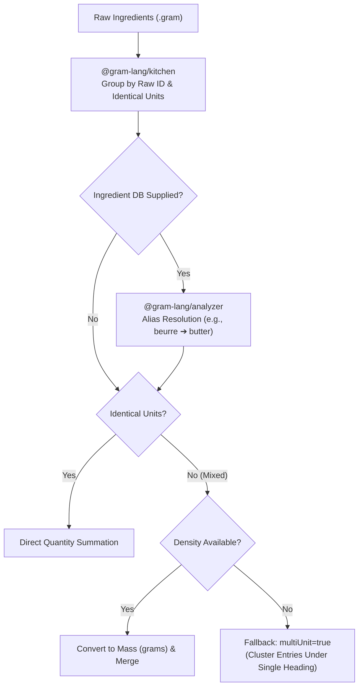

When the `@gram-lang/kitchen` package processes an Abstract Syntax Tree (AST), one of its core responsibilities is generating the shopping list. 

This is not a simple concatenation of ingredients. The compiler performs a complex aggregation process to ensure the list is physically accurate and optimized for purchasing.

## The Aggregation Pipeline

When a recipe (or a batch of multiple recipes) is passed to the Kitchen for shopping list generation, the following pipeline executes:

import { Steps } from '@astrojs/starlight/components';

<Steps>
1. ### ID Normalization and Aliasing
   `@gram-lang/kitchen` itself groups ingredients purely by the raw id it assigned during parsing (a slug of the name you wrote) — it has no access to `ingredients.yaml` and can't know that `@butter` and `@beurre` refer to the same ingredient. On its own, kitchen's shopping list lists them as two separate entries.

   Alias resolution happens one layer up, in `@gram-lang/analyzer`, which does have access to the ingredient database. If `beurre` is listed as an alias of `butter` in `ingredients.yaml`, the analyzer re-groups kitchen's raw entries by this canonical id, merging `@butter` and `@beurre` into a single `butter` entry. **This step only runs when an ingredient database is supplied** — without one (compiling with `@gram-lang/kitchen` alone, or a CLI command run without a database), aliases are not resolved and the two ingredients stay separate.

2. ### Unit Merging
   If the grouped ingredients share the same unit (e.g., `100g` and `50g`), they are simply summed (`150g`) — this happens directly in `@gram-lang/kitchen`, no database needed.

   If they have different units (e.g., `100g` and `1 cup`), summing them requires converting through mass, which — like aliasing — depends on the ingredient database and therefore happens in `@gram-lang/analyzer`. If every contributing quantity resolves to a mass (density known, from the database or a recipe-level override), the analyzer converts them all to grams and merges them into a single entry.

   **Fallback: missing density.** If the density can't be resolved for at least one of the units involved, the analyzer can't produce a single reliable mass total. Rather than guessing, it keeps the entries separate, renames them to the canonical id, and flags all of them with `multiUnit: true`. Renderers use this flag to cluster the entries together under one heading (e.g. "⚠️ Mixed units") instead of scattering them across the list — making it clear to the cook that they're the same ingredient, without silently mis-adding incompatible units.

   :::tip[Canonical id vs. displayed name]
   The canonical id (e.g. `butter`) exists purely so entries can be grouped and merged — it's an internal key, not the label shown to the cook. The **name** displayed in a shopping-list entry follows one rule, applied identically everywhere (the Playground, `gram view`, `gram shop`, `gram export`):

   | In Recipe | Matched ID | Database `name` | Displayed Name | Why? |
   | --- | --- | --- | --- | --- |
   | `@flour` | `flour` (Exact) | Wheat Flour | **Wheat Flour** | Exact match = prefer database's enriched name. |
   | `@farine` (FR) | `flour` (Alias) | Wheat Flour | **farine** | Alias match = keep recipe's wording to preserve language. |
   | `@harina` (ES) | `flour` (Alias) | Wheat Flour | **harina** | The trick works with any language configured in your aliases. |
   | `@moon dust`| *None* | *None* | **moon dust** | No match = keep recipe's wording. |

   This is what makes a Gram ecosystem truly international. Whether you write a recipe in Spanish, French, or German, and compile it against a global database maintained in English, your shopping list will always preserve your local terminology (`harina`, `farine`, `Mehl`). Meanwhile, recipes using the database's native vocabulary still benefit from enriched names.

   **No database, or no matching entry?** There's simply no canonical `name` to prefer, so the recipe's own wording is always used — this works with an empty database (`{}`), a database that has no entry at all for that ingredient, and with `@gram-lang/kitchen`'s `compile()` used on its own without ever calling `@gram-lang/analyzer`.
   :::

3. ### Ghosting Relative Quantities
   Relative quantities (like `@water{50% @&flour}`) pose a unique problem for shopping lists, especially in multi-recipe batch processing. 

   If you scale the batch, the water quantity depends on a flour quantity that might belong to a specific recipe. To prevent mathematical paradoxes, the Kitchen **ghosts** relative quantities in the shopping list. This means they are excluded from the main aggregation and listed separately as unresolvable dependencies, ensuring the static weights remain mathematically pure.

4. ### Resolving Composites (MAX vs SUM)
   The most complex part of the aggregation pipeline is handling Composite Ingredients (`<@`). 

   When multiple children point to the same parent, the compiler uses two distinct rules to figure out how many parents you need to buy:

   1. **The MAX Rule (Non-Destructive)**: 
      If the children use *different parts* of the parent (e.g., lemon juice and lemon zest), you don't need two lemons. The compiler takes the maximum equivalent parent mass required by either child. If you need 3 lemons worth of juice, but only 1 lemon worth of zest, the shopping list will say `3 lemons`.
   2. **The SUM Rule (Destructive)**:
      If the children use the *same part* of the parent (e.g., chicken breast for a salad, and chicken breast for a soup), you cannot reuse the same chicken. The compiler sums the equivalent parent masses required by both children.
</Steps>

## The Final Output
The result is a highly optimized, deduplicated, and mathematically sound array of `ShoppingItem` objects, grouped by stable culinary categories (`CATEGORY_KEYS` from `@gram-lang/i18n`) and sorted according to localized category rules (`getCategoryLabels(lang)`), ready to be rendered in the terminal or a web UI.

