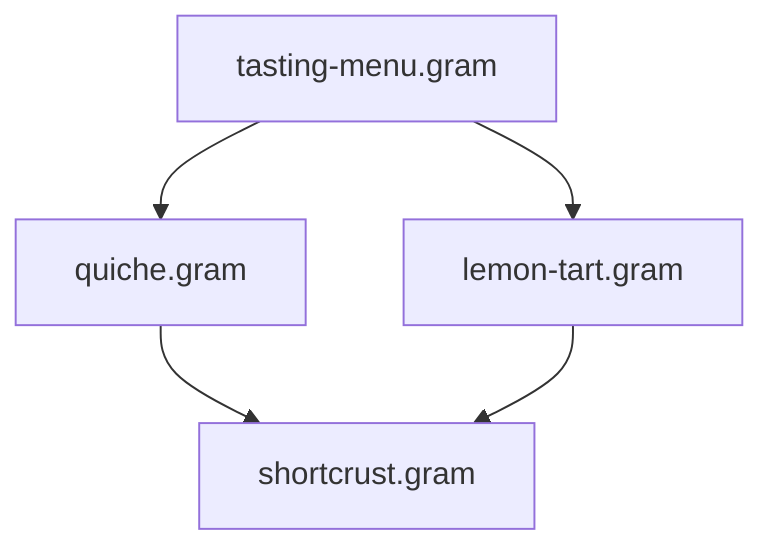

import { Tabs, TabItem, FileTree, CardGrid, Card, LinkCard } from '@astrojs/starlight/components';

As your collection of `.gram` recipes grows, decomposing complex dishes into reusable components — pastries, sauces, stocks, infusions — saves time and ensures consistency across your culinary repertoire.

This guide walks you through practical patterns for structuring, organizing, and executing modular Gram projects.

---

## 1. Organizing folders and configuring path aliases

You are free to organize your project files however you like. A standard modular structure separates reusable sub-recipes into dedicated directories:

<FileTree>
- .gram/
  - config.yaml
  - ingredients.yaml
- components/
  - bases/
    - shortcrust.gram
    - sourdough-starter.gram
  - sauces/
    - bechamel.gram
    - veloute.gram
- desserts/
  - lemon-tart.gram
- dinner.gram
</FileTree>

Gram provides three intuitive ways to reference component files across your project:

<Tabs>
  <TabItem label="Project-root (@/)">
    Use `@/` to reference files relative to the project root (where `.gram/` lives), regardless of how deeply nested the importing recipe is:

    ```gram
    @use "@/components/bases/shortcrust.gram" as &crust
    @use "@/components/sauces/bechamel.gram" as &sauce
    ```
  </TabItem>

  <TabItem label="Custom aliases (paths:)">
    Declare custom path shortcuts in `.gram/config.yaml`:

    ```yaml
    # .gram/config.yaml
    paths:
      bases: ./components/bases
      sauces: ./components/sauces
      infusions: ./shared/infusions
    ```

    Then import cleanly using `@alias/`:

    ```gram
    @use "@bases/shortcrust.gram" as &crust
    @use "@sauces/bechamel.gram" as &sauce
    ```
  </TabItem>

  <TabItem label="Relative paths">
    Reference files relative to the current recipe's directory:

    ```gram
    @use "./bases/shortcrust.gram" as &crust
    @use "../sauces/bechamel.gram" as &sauce
    ```
  </TabItem>
</Tabs>

---

## 2. Managing multi-component preparations (Destructuring)

Some sub-recipes produce **multiple distinct components** through a single culinary process. 

For example, an inverted puff pastry (*feuilletage inversé*) requires preparing both a water dough (*détrempe*) and a block of tourage butter (*beurre manié*):

```gram title="components/bases/inverted-puff-pastry.gram"
---
title: 'Inverted Puff Pastry Elements'
yields: [detrempe:350g, beurre-manie:400g]
---

## Water Dough ->&detrempe
[Mix] the @flour{250g}, @water{120ml}, @salt{5g}, and @butter{50g}(melted) for ~{5min}. Wrap and chill in the #fridge for ~_{2h}.

## Tourage Butter Block ->&beurre-manie
[Knead] the @butter{300g}(cold) with @flour{100g} into a pliable block. Chill in the #fridge for ~_{1h}.
```

In your main recipe, destructured imports let you bind both components cleanly:

```gram title="kings-cake.gram"
@use "@/components/bases/inverted-puff-pastry.gram" as { &detrempe, &beurre-manie }

## Turn and Assembly
[Encase] the &detrempe into the center of the &beurre-manie.
[Perform] 2 double turns, resting for ~_{1h} in the #fridge between turns.
```

:::tip[Local renaming]
If a module's export names clash with variables in your own recipe, rename them with `as`:
```gram
@use "@/components/bases/inverted-puff-pastry.gram" as {
  &detrempe as &dough-base,
  &beurre-manie as &tourage-block
}
```
:::

---

## 3. Chaining imports and diamond dependencies

### Chained imports (Transitivity)
Recipes can import sub-recipes that themselves import other bases:


* **Encapsulation:** `dinner.gram` only interacts with `&veloute`. Internal variables within `chicken-stock.gram` remain completely private.
* **Unified shopping list & timeline:** Raw ingredients (chicken, celery, carrots) and simmering steps from `chicken-stock.gram` bubble up into the main dinner shopping list and Gantt schedule.

### Diamond dependencies
When a menu imports multiple dishes that share a common foundation (e.g. an entrée and a dessert that both import `shortcrust.gram`):



* The shared base file is parsed **only once**.
* The compiler creates independent instances scaled to each dish's exact requirements.
* Base ingredients (flour, butter) are consolidated automatically on your shopping list.

### Circular imports
If Recipe A imports B which imports A, Gram immediately detects the loop and halts with a `MODULE_CYCLE` diagnostic showing the full dependency chain (`A -> B -> A`).

---

## 4. Scheduling multi-day preparations (`~{-2d}`)

When a preparation must begin days before cooking (such as a sourdough starter, an aged marinade, or a slow infusion), anchor it directly on the `@use` line:

```gram title="sourdough-bread.gram"
@use "@/components/bases/sourdough-starter.gram" as &starter ~{-2d}

## Main Dough
[Knead] the @bread flour{500g}, @water{350g}, and @salt{10g} with &starter{150g}.
```

* The sourdough starter's completion is anchored to **2 days before** the main dough is mixed.
* ALAP (As Late As Possible) scheduling automatically aligns any earlier feeding or rest steps accordingly.

---

## 5. Working with ready-made stock (`--stock`)

When you already have a component prepared (bought ready-made from a store or prepped the day before), you don't need to make it from scratch. 

Inform the CLI using the `--stock` option:

```bash
# Pass the specifier matching your import
gram shop dinner.gram --stock @bases/shortcrust.gram

# Pass multiple on-hand items as a comma-separated list
gram cook dinner.gram --stock @bases/shortcrust.gram,@sauces/bechamel.gram
```

<CardGrid>
  <Card title="Zero Timeline Overhead" icon="seti:clock">
    All preparation and cooking steps for stocked items are omitted from the interactive cooking guide and Gantt schedule.
  </Card>
  <Card title="Simplified Shopping List" icon="list-format">
    Aggregates as a single purchasable unit (e.g., `1 shortcrust pastry`) rather than listing raw ingredients like flour and butter.
  </Card>
  <Card title="Accurate Nutritional Totals" icon="heart">
    Calories and macronutrients remain fully accurate, derived directly from the base module's nutritional profile.
  </Card>
</CardGrid>

---

## Related Resources

<CardGrid>
  <LinkCard 
    title="Tutorial: Splitting Recipes with Modules" 
    description="Hands-on walk-through extracting a sweet pastry dough into a reusable module." 
    href="/docs/tutorials/module-imports" 
  />
  <LinkCard 
    title="Module Imports Reference" 
    description="Detailed specifications for syntax, scaling equations, and encapsulation rules." 
    href="/docs/reference/syntax/modules" 
  />
</CardGrid>
