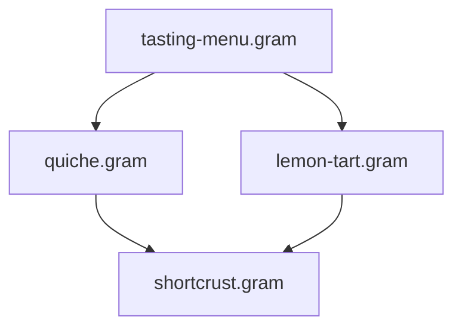

import { Steps, Tabs, TabItem, FileTree, CardGrid, Card, LinkCard } from '@astrojs/starlight/components';

As your collection of `.gram` recipes grows, decomposing complex dishes into reusable components — pastries, sauces, stocks, infusions — saves time and ensures consistency across your culinary repertoire. Extracting these core components into their own dedicated files eliminates repetitive copy-pasting: whenever you refine your dough (a dialed-in resting time, a tweaked flour ratio), every recipe in your collection immediately benefits from the improvement.

This guide walks you through practical patterns for structuring, organizing, and executing modular Gram projects with `@use`.

---

## Step-by-step: Extracting and importing your first module

If you followed [Your First Recipe](/docs/tutorials/first-recipe), the **Lemon Meringue Tart** was written from start to finish in a single `.gram` file. Here is how to extract the sweet pastry dough into a reusable component and import it with `@use`.

<Steps>

1.  **Extract the base into its own file**

    Start from the dough section in your recipe:

    ```gram title="Original section"
    ## Sweet Pastry Dough ->&pastry dough{}

    [Process] In a #food processor{}, the @flour{180g}, @icing sugar{55g}, and @salt{1/4 tsp}.

    [Crumble] Add the @butter{115g}(cold, cut into small cubes) and mix for ~{1-2min} until sandy.

    [Combine] Add the @egg{1}, @?vanilla extract{1/2 tsp} and mix until the dough comes together.

    [Rest] Wrap in plastic and let it rest in the fridge for ~_{1h}.
    ```

    Move this preparation into its own file at `bases/sweet-pastry-dough.gram`:

    ```gram title="bases/sweet-pastry-dough.gram"
    ---
    title: 'Sweet Pastry Dough'
    ---

    ## Sweet Pastry Dough

    [Process] In a #food processor{}, the @flour{180g}, @icing sugar{55g}, and @salt{1/4 tsp}.

    [Crumble] Add the @butter{115g}(cold, cut into small cubes) and mix for ~{1-2min} until sandy.

    [Combine] Add the @egg{1}, @?vanilla extract{1/2 tsp} and mix until the dough comes together.

    [Rest] Wrap in plastic and let it rest in the fridge for ~_{1h}.
    ```

    *   **Binding name is chosen on import**: For a single-purpose module, the `->&pastry dough{}` declaration on the section header is optional. The importing file chooses its local variable name with `as &dough` (`@use "..." as &dough`). For complex modules that produce multiple distinct components, declaring `->&` on each section remains the standard way to export each part by name (see [What a module exports](/docs/reference/syntax/modules#what-a-module-exports)).
    *   **Automatic yield calculation**: When an importing recipe asks for a specific amount (such as `&dough{250g}`), Gram sums this file's own ingredient masses to work out its yield, then scales every quantity automatically.

2.  **Import the base into your host recipe**

    Back in your tart recipe, replace the dough section with an `@use` directive placed right after the frontmatter, before the first step:

    ```gram title="lemon-tart.gram"
    ---
    title: Lemon Meringue Tart
    portions: 8
    ---

    @use "./bases/sweet-pastry-dough.gram" as &dough

    ## Lemon Curd ->&curd

    [Whisk] In a #saucepan{}, the @lemon zest{1 tbsp}<@lemon, @lemon juice{120g}<@lemon{2}, @sugar{125% @&lemon juice}, and @eggs{3}.

    [Cook] Over ^{medium heat} for ~{8min} until thickened.

    ## Baking the Tart Shell ->&baked shell{}

    [Preheat] The #oven to ^{350F}.

    [Roll out] The &dough{450g} for ~{5min} and place it in a #tart ring{}.

    [Bake] For ~_{20min} until golden. Let cool.

    ## Assembly

    [Pour] The &curd into the &baked shell{}. Chill in the fridge for ~_{2h}.
    ```

    Downstream tools — the Gantt timeline, shopping list, and nutritional analysis — work seamlessly. The dough's `~_{1h}` passive rest interleaves with making the lemon curd because `@use` inlines the steps into the global schedule.

3.  **Reuse the base across multiple recipes**

    A second recipe (for example, a batch of jam tartlets) can import the exact same base file:

    ```gram title="jam-tartlets.gram"
    ---
    title: Jam Tartlets
    ---

    @use "./bases/sweet-pastry-dough.gram" as &dough

    ## Tartlets

    [Divide] The &dough{450g} into 12 small tart tins.

    [Bake] At ^{180C} for ~_{15min} until golden.

    [Fill] Each shell with a spoonful of @jam{15g}.
    ```

    Whenever you refine `bases/sweet-pastry-dough.gram` (adjusting resting time or tuning flour ratios), both recipes instantly benefit from the update during compilation.

</Steps>

---

## 1. Organizing folders and configuring path aliases

You are free to organize your project files however you like. A standard modular structure separates reusable sub-recipes into dedicated directories:

<FileTree>
- .gram/
  - config.yaml
  - ingredients.yaml
- components/
  - bases/
    - shortcrust.gram
    - sourdough-starter.gram
  - sauces/
    - bechamel.gram
    - veloute.gram
- desserts/
  - lemon-tart.gram
- dinner.gram
</FileTree>

Gram provides three intuitive ways to reference component files across your project:

<Tabs>
  <TabItem label="Project-root (@/)">
    Use `@/` to reference files relative to the project root (where `.gram/` lives), regardless of how deeply nested the importing recipe is:

    ```gram
    @use "@/components/bases/shortcrust.gram" as &crust
    @use "@/components/sauces/bechamel.gram" as &sauce
    ```
  </TabItem>

  <TabItem label="Custom aliases (paths:)">
    Declare custom path shortcuts in `.gram/config.yaml`:

    ```yaml
    # .gram/config.yaml
    paths:
      bases: ./components/bases
      sauces: ./components/sauces
      infusions: ./shared/infusions
    ```

    Then import cleanly using `@alias/`:

    ```gram
    @use "@bases/shortcrust.gram" as &crust
    @use "@sauces/bechamel.gram" as &sauce
    ```
  </TabItem>

  <TabItem label="Relative paths">
    Reference files relative to the current recipe's directory:

    ```gram
    @use "./bases/shortcrust.gram" as &crust
    @use "../sauces/bechamel.gram" as &sauce
    ```
  </TabItem>
</Tabs>

---

## 2. Managing multi-component preparations (Destructuring)

Some sub-recipes produce **multiple distinct components** through a single culinary process. 

For example, an inverted puff pastry (*feuilletage inversé*) requires preparing both a water dough (*détrempe*) and a block of tourage butter (*beurre manié*):

```gram title="components/bases/inverted-puff-pastry.gram"
---
title: 'Inverted Puff Pastry Elements'
---

## Water Dough ->&detrempe
[Mix] the @flour{250g}, @water{120ml}, @salt{5g}, and @butter{50g}(melted) for ~{5min}. Wrap and chill in the #fridge for ~_{2h}.

## Tourage Butter Block ->&beurre-manie
[Knead] the @butter{300g}(cold) with @flour{100g} into a pliable block. Chill in the #fridge for ~_{1h}.
```

In your main recipe, destructured imports let you bind both components cleanly:

```gram title="kings-cake.gram"
@use "@/components/bases/inverted-puff-pastry.gram" as { &detrempe, &beurre-manie }

## Turn and Assembly
[Encase] the &detrempe into the center of the &beurre-manie.
[Perform] 2 double turns, resting for ~_{1h} in the #fridge between turns.
```

:::tip[Local renaming]
If a module's export names clash with variables in your own recipe, rename them with `as`:
```gram
@use "@/components/bases/inverted-puff-pastry.gram" as {
  &detrempe as &dough-base,
  &beurre-manie as &tourage-block
}
```
:::

---

## 3. Chaining imports and diamond dependencies

### Chained imports (Transitivity)
Recipes can import sub-recipes that themselves import other bases:


* **Encapsulation:** `dinner.gram` only interacts with `&veloute`. Internal variables within `chicken-stock.gram` remain completely private.
* **Unified shopping list & timeline:** Raw ingredients (chicken, celery, carrots) and simmering steps from `chicken-stock.gram` bubble up into the main dinner shopping list and Gantt schedule.

### Diamond dependencies
When a menu imports multiple dishes that share a common foundation (e.g. an entrée and a dessert that both import `shortcrust.gram`):



* The shared base file is parsed **only once**.
* The compiler creates independent instances scaled to each dish's exact requirements.
* Base ingredients (flour, butter) are consolidated automatically on your shopping list.

### Circular imports
If Recipe A imports B which imports A, Gram immediately detects the loop and halts with a `MODULE_CYCLE` diagnostic showing the full dependency chain (`A -> B -> A`).

---

## 4. Scheduling multi-day preparations (`~{-2d}`)

When a preparation must begin days before cooking (such as a sourdough starter, an aged marinade, or a slow infusion), anchor it directly on the `@use` line:

```gram title="sourdough-bread.gram"
@use "@/components/bases/sourdough-starter.gram" as &starter ~{-2d}

## Main Dough
[Knead] the @bread flour{500g}, @water{350g}, and @salt{10g} with &starter{150g}.
```

* The sourdough starter's completion is anchored to **2 days before** the main dough is mixed.
* ALAP (As Late As Possible) scheduling automatically aligns any earlier feeding or rest steps accordingly.

---

## 5. Working with ready-made stock (`--stock`)

When you already have a component prepared (bought ready-made from a store or prepped the day before), you don't need to make it from scratch. 

Inform the CLI using the `--stock` option:

```bash
# Pass the specifier matching your import
gram shop dinner.gram --stock @bases/shortcrust.gram

# Pass multiple on-hand items as a comma-separated list
gram cook dinner.gram --stock @bases/shortcrust.gram,@sauces/bechamel.gram
```

<CardGrid>
  <Card title="Zero Timeline Overhead" icon="seti:clock">
    All preparation and cooking steps for stocked items are omitted from the interactive cooking guide and Gantt schedule.
  </Card>
  <Card title="Simplified Shopping List" icon="list-format">
    Aggregates as a single purchasable unit (e.g., `1 shortcrust pastry`) rather than listing raw ingredients like flour and butter.
  </Card>
  <Card title="Accurate Nutritional Totals" icon="heart">
    Calories and macronutrients remain fully accurate, derived directly from the base module's nutritional profile.
  </Card>
</CardGrid>

---

## 6. Encapsulation & Math Scoping

A module's relative quantities and ingredient dependencies (`@sugar{125% @&lemon juice}` in the curd) resolve only against *the sections within that specific module*. A host recipe that uses the same ingredient names elsewhere never collides with a base's internal math, and vice versa. 

This strict section-scoping guarantees that splitting a recipe into files never introduces unexpected side effects. See [Encapsulation](/docs/reference/syntax/modules#encapsulation) for complete details.

---

## Try it in the Playground

The web-based [Playground](/play) supports editing multi-file recipes: open the **Lemon Tart (multi-file, @use)** example from the recipe dropdown to explore a host recipe and its imported base side by side in separate tabs.

---

## Related Resources

<CardGrid>
  <LinkCard 
    title="Module Imports Reference" 
    description="Detailed specifications for syntax, scaling equations, and encapsulation rules." 
    href="/docs/reference/syntax/modules" 
  />
  <LinkCard 
    title="CLI Reference" 
    description="Complete documentation for gram build, gram shop, --stock and global CLI options." 
    href="/docs/reference/tooling/cli" 
  />
</CardGrid>
