Gram ne se contente pas de lire les recettes de haut en bas ; il les réordonnance activement pour vous faire gagner du temps.

Pour ce faire, il s'appuie sur un algorithme d'ordonnancement nommé **ALAP (As Late As Possible - *Le plus tard possible*)**. Cela garantit que chaque ingrédient est préparé pile au moment où il est requis, évitant que des préparations ne patientent inutilement sur le plan de travail.

## Le Problème : L'Ordonnancement Naïf (Forward Scheduling)

Imaginez une recette où vous devez préparer une pâte et la laisser reposer 1 heure, puis réaliser une sauce express en 10 minutes, avant de cuire le tout.

```gram
[Pétrir] La @farine avec l'@eau et laisser reposer ~_{1h}. ->&pâte

[Mélanger] Les ingrédients de la sauce ~{10min}. ->&sauce

[Cuire] La &pâte avec la &sauce pendant ~_{30min}.
```

Avec un ordonnancement naïf de haut en bas (*Forward Scheduling*), la ligne du temps (*timeline*) ressemblerait à ça :

```mermaid
gantt
    title Ordonnancement Naïf (50 min d'attente inutile)
    dateFormat  m
    axisFormat %M
    
    section Pâte
    Pétrir (Actif)                      : active, a1, 0, 2m
    Repos de la Pâte (Repos Passif)     : a2, after a1, 60m
    
    section Sauce
    Mélanger (Actif)                    : active, a3, after a1, 10m
    Sauce en attente (50m Inutiles !)   : crit, a4, after a3, 50m
    
    section Cuire
    Cuire (Cuisson Passive)             : a5, after a2, 30m
```



Le problème saute aux yeux : vous terminez la sauce à la minute 12, mais le repos de la pâte ne s'achève qu'à la minute 62. Résultat, la sauce reste 50 minutes sur le comptoir à refroidir (ou pire, à tourner) !

## La Solution : L'Ordonnancement ALAP

Au lieu d'ordonnancer les étapes dès que possible, le compilateur de Gram les ordonnance **le plus tard possible**.

Le moteur travaille à l'envers, en partant de la fin de la recette. Lorsqu'il repère que l'étape `[Cuire]` nécessite la `&pâte`, il fixe une échéance stricte (une *deadline*) pour le moment où la `&pâte` doit être prête. Il repousse ensuite l'étape `[Mélanger]` au dernier moment, de sorte que le repos d'une heure s'achève *exactement* au démarrage de la cuisson.

Voici la chronologie réelle générée par Gram :

```mermaid
gantt
    title Ordonnancement ALAP (Gram - Optimisé)
    dateFormat  m
    axisFormat %M
    
    section Sauce
    Mélanger (Actif)                    : active, b1, 0, 10m
    
    section Pâte
    Pétrir (Actif)                      : active, b2, after b1, 2m
    Repos de la Pâte (Repos Passif)     : b3, after b2, 60m
    
    section Cuisson
    Cuire (Cuisson Passive)             : b4, after b3, 30m
```



*(Note : Le temps actif pour l'étape de la pâte revient à la valeur par défaut de 2 minutes puisqu'elle ne spécifie qu'un minuteur passif).*

En repoussant la création de la `&pâte` vers la fin, Gram vient automatiquement intercaler l'étape `Mélanger` *pendant* le repos de la pâte. Votre temps actif est optimisé, et aucune préparation n'attend dans le vide.

## Les "Named Tracks" (Minuteurs séquentiels)

Cette logique de recul (*backtracking*) alimente nativement les `Named Tracks` (pistes nommées) de Gram. Si vous attribuez le même nom à plusieurs minuteurs passifs (par exemple, `~_four{20min}` et `~_four{30min}`), Gram va forcer leur exécution séquentielle en arrière-plan puisqu'ils se partagent une ressource limitée (le four).

Grâce à l'algorithme ALAP, cette contrainte de séquentialité se répercute proprement vers l'arrière tout au long de la *timeline*. Les étapes de préparation associées sont décalées au moment optimal pour garantir un flux de travail continu en arrière-plan, sans monopoliser vos mains actives :

```mermaid
gantt
    title Exécution Séquentielle des Named Tracks (~_four)
    dateFormat  m
    axisFormat %M
    
    section Piste Tarte
    Préparer la Tarte (Actif)         : active, p1, 0, 5m
    Cuire la Tarte (~_four)           : p2, after p1, 20m
    
    section Piste Pain (Intercalé par ALAP)
    Préparer le Pain (Actif)          : active, b1, 15, 5m
    Cuire le Pain (~_four)            : b2, after p2, 30m
```



Remarquez comment l'étape `Préparer le Pain` est automatiquement planifiée pendant la cuisson de la tarte (entre la 15e et la 20e minute), garantissant que le pain est prêt à entrer dans le `~_four` à la minute exacte 25 où la tarte en sort.

## Bonnes Pratiques pour une Chronologie Cohérente

Pour tirer le meilleur parti de l'ordonnancement ALAP de Gram et vous assurer que votre chronologie générée est à la fois réaliste et utile, suivez ces bonnes pratiques :

import { Steps } from '@astrojs/starlight/components';

<Steps>
1. **Utilisez des Minuteurs Passifs (`~_`) pour les Tâches de Fond**
    Dès qu'une étape implique de l'attente (cuisson au four, repos, mijotage), utilisez *systématiquement* un minuteur passif. Si vous utilisez par erreur un minuteur actif (`~{1h}` au lieu de `~_{1h}`), Gram déduira que vos mains sont prises pendant une heure entière. Cela fige la chronologie et empêche ALAP d'intercaler d'autres tâches !

2. **Déclarez Tôt, Consommez Tard**
    Pour que la magie d'ALAP opère, vous devez délimiter clairement le moment où un ingrédient est produit et celui où il est consommé. Déclarez un intermédiaire (`->&nom`) dès que sa préparation active est terminée, et référencez-le (`&nom`) *uniquement* dans l'étape exacte où il est finalement utilisé. Gram étirera automatiquement l'écart entre les deux.

3. **Utilisez les "Named Tracks" pour les Ressources Limitées**
    Si vous n'avez qu'un seul four et que vous devez y cuire deux choses différentes, utilisez les *Named Tracks* (par exemple `~_four{10min}` et `~_four{30min}`). Si vous utilisez de simples minuteurs passifs anonymes (`~_{10min}`), Gram supposera que vous possédez une infinité de fours et les ordonnancera en parallèle.

4. **Gardez les Étapes Actives Logiques mais Réalistes**
    Les étapes sans minuteur rajoutent par défaut 2 minutes de temps actif. Ne saucissonnez pas un mouvement fluide en 10 micro-étapes, sous peine de gonfler artificiellement la *timeline* de 20 minutes. Groupez les étapes de manière logique pour le flux de travail.

</Steps>

## Cas d'usage : Visualisation des données

Puisque l'ordonnancement ALAP calcule automatiquement les repères absolus `start` et `end` pour chaque étape (à la minute près) et les expose dans le JSON compilé, les interfaces *front-end* n'ont plus la moindre gymnastique mathématique à réaliser. Elles se contentent d'afficher la donnée.

La manière la plus percutante de visualiser cette chronologie compilée est via un diagramme de Gantt. Il démontre instantanément comment les tâches passives se chevauchent et comment l'algorithme ALAP optimise votre temps en cuisine.

Vous pouvez découvrir un exemple concret de diagramme de Gantt propulsé par le moteur de Gram dans le **[Playground Officiel](/fr/play/)**. Il vous suffit d'écrire une recette et d'activer la vue "Gantt" pour voir les données temporelles s'afficher visuellement en temps réel.
