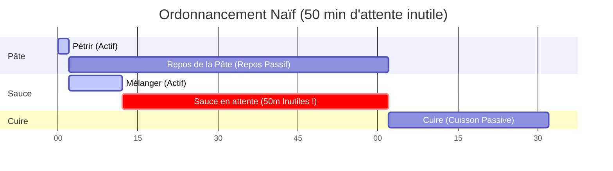
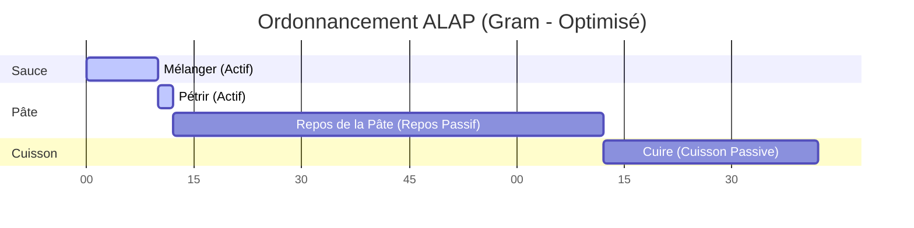
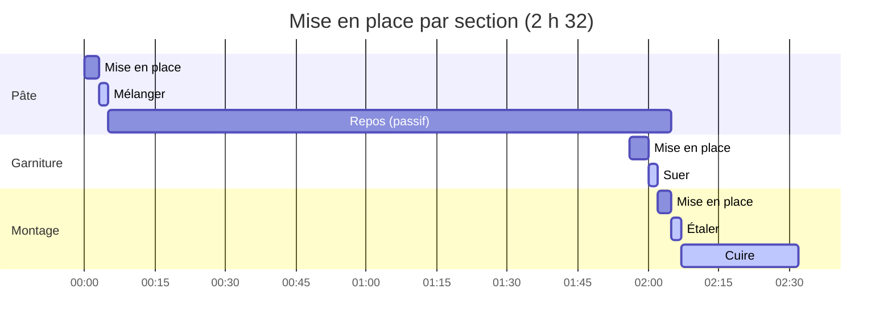
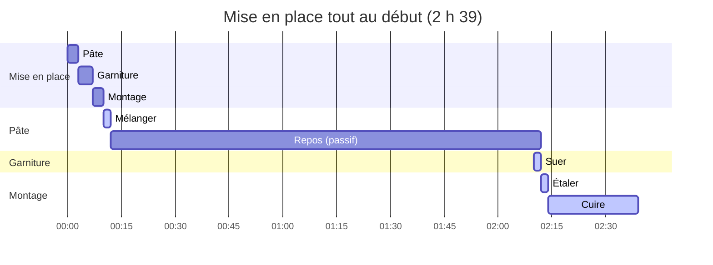
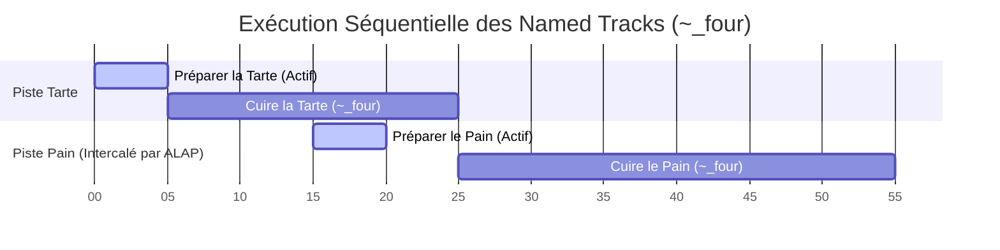

import Since from '../../../../../components/Since.astro';

Gram ne se contente pas de lire les recettes de haut en bas ; il les réordonnance activement pour vous faire gagner du temps.

Pour ce faire, il s'appuie sur un algorithme d'ordonnancement nommé **ALAP (As Late As Possible - *Le plus tard possible*)**. Cela garantit que chaque ingrédient est préparé pile au moment où il est requis, évitant que des préparations ne patientent inutilement sur le plan de travail.

## Le problème : l'ordonnancement naïf (Forward Scheduling)

Imaginez une recette où vous devez préparer une pâte et la laisser reposer 1 heure, puis réaliser une sauce express en 10 minutes, avant de cuire le tout.

```gram
[Pétrir] La @farine avec l'@eau et laisser reposer ~_{1h}. ->&pâte

[Mélanger] Les ingrédients de la sauce ~{10min}. ->&sauce

[Cuire] La &pâte avec la &sauce pendant ~_{30min}.
```

Avec un ordonnancement naïf de haut en bas (*Forward Scheduling*), la ligne du temps (*timeline*) ressemblerait à ça :


```mermaid
gantt
    title Ordonnancement Naïf (50 min d'attente inutile)
    dateFormat  m
    axisFormat %M
    
    section Pâte
    Pétrir (Actif)                      : active, a1, 0, 2m
    Repos de la Pâte (Repos Passif)     : a2, after a1, 60m
    
    section Sauce
    Mélanger (Actif)                    : active, a3, after a1, 10m
    Sauce en attente (50m Inutiles !)   : crit, a4, after a3, 50m
    
    section Cuire
    Cuire (Cuisson Passive)             : a5, after a2, 30m
```

Le problème saute aux yeux : vous terminez la sauce à la minute 12, mais le repos de la pâte ne s'achève qu'à la minute 62. Résultat, la sauce reste 50 minutes sur le comptoir à refroidir (ou pire, à tourner) !

## La solution : l'ordonnancement ALAP

Au lieu d'ordonnancer les étapes dès que possible, le compilateur de Gram les ordonnance **le plus tard possible**.

Le moteur travaille à l'envers, en partant de la fin de la recette. Lorsqu'il repère que l'étape `[Cuire]` nécessite la `&pâte`, il fixe une échéance stricte (une *deadline*) pour le moment où la `&pâte` doit être prête. Il repousse ensuite l'étape `[Mélanger]` au dernier moment, de sorte que le repos d'une heure s'achève *exactement* au démarrage de la cuisson.

Voici la chronologie réelle générée par Gram :


```mermaid
gantt
    title Ordonnancement ALAP (Gram - Optimisé)
    dateFormat  m
    axisFormat %M
    
    section Sauce
    Mélanger (Actif)                    : active, b1, 0, 10m
    
    section Pâte
    Pétrir (Actif)                      : active, b2, after b1, 2m
    Repos de la Pâte (Repos Passif)     : b3, after b2, 60m
    
    section Cuisson
    Cuire (Cuisson Passive)             : b4, after b3, 30m
```

*(Note : Le temps actif pour l'étape de la pâte revient à la valeur par défaut de 2 minutes puisqu'elle ne spécifie qu'un minuteur passif).*

En repoussant la création de la `&pâte` vers la fin, Gram vient automatiquement intercaler l'étape `Mélanger` *pendant* le repos de la pâte. Votre temps actif est optimisé, et aucune préparation n'attend dans le vide.

## Planifier la mise en place
<Since v="1.4.0" />

La mise en place d'une section (rassembler et préparer ses ingrédients et son matériel) est planifiée comme une étape à part entière, en tête de cette section. Prenons une pâte qui repose deux heures, suivie d'une garniture qui demande d'émincer des oignons :

```gram
## Pâte ->&pâte

[Mélanger] La @farine{500g} et l'@eau{300ml} dans un #saladier.

[Repos] Laisser reposer la pâte ~_{2h}.

## Garniture ->&garniture

[Suer] Faire revenir les @oignons{200g}(émincés) dans une #poêle.

## Montage

[Étaler] La &garniture sur la &pâte

[Cuire] Au #four pendant ~{25min}.
```

Planifiée **par section** (le comportement par défaut), chaque préparation se fait juste avant sa section. Celles de la garniture et du montage glissent dans les deux heures de repos de la pâte, quand vos mains sont libres de toute façon :


```mermaid
gantt
    title Mise en place par section (2 h 32)
    dateFormat  HH:mm
    axisFormat %H:%M
    todayMarker off
    section Pâte
    Mise en place                     : p1, 00:00, 3m
    Mélanger                          : active, a1, 00:03, 2m
    Repos (passif)                    : r1, 00:05, 120m
    section Garniture
    Mise en place                     : p2, 01:56, 4m
    Suer                              : active, a2, 02:00, 2m
    section Montage
    Mise en place                     : p3, 02:02, 3m
    Étaler                            : active, a3, 02:05, 2m
    Cuire                             : active, a4, 02:07, 25m
```

Planifiée **tout au début**, toutes les préparations passent en premier, et la cuisine ne commence qu'une fois qu'elles sont terminées :


```mermaid
gantt
    title Mise en place tout au début (2 h 39)
    dateFormat  HH:mm
    axisFormat %H:%M
    todayMarker off
    section Mise en place
    Pâte                              : p1, 00:00, 3m
    Garniture                         : p2, 00:03, 4m
    Montage                           : p3, 00:07, 3m
    section Pâte
    Mélanger                          : active, a1, 00:10, 2m
    Repos (passif)                    : r1, 00:12, 120m
    section Garniture
    Suer                              : active, a2, 02:10, 2m
    section Montage
    Étaler                            : active, a3, 02:12, 2m
    Cuire                             : active, a4, 02:14, 25m
```

Les deux plans décrivent la même recette. Seule la chronologie change, de sept minutes de préparation (les quatre de la garniture et les trois du montage) qui ne tiennent plus dans le repos. C'est pour ça que le défaut est « par section », et c'est aussi pour ça qu'on peut préférer tout faire au début : un seul passage devant le plan de travail, et plus rien à préparer pendant qu'une étape tourne.

:::note[Un intermédiaire se pèse là où il sert]
Un intermédiaire comme `&pâte` coûte une minute de mise en place, comme n'importe quel ingrédient : il faut bien le peser. Cette minute est comptée dans la section qui l'**utilise** (ici, le montage), pas dans celle qui le fabrique.
:::

## Les "Named Tracks" (minuteurs séquentiels)

Cette logique de recul (*backtracking*) alimente nativement les `Named Tracks` (pistes nommées) de Gram. Si vous attribuez le même nom à plusieurs minuteurs passifs (par exemple, `~_four{20min}` et `~_four{30min}`), Gram va forcer leur exécution séquentielle en arrière-plan puisqu'ils se partagent une ressource limitée (le four).

Grâce à l'algorithme ALAP, cette contrainte de séquentialité se répercute proprement vers l'arrière tout au long de la *timeline*. Les étapes de préparation associées sont décalées au moment optimal pour garantir un flux de travail continu en arrière-plan, sans monopoliser vos mains actives :


```mermaid
gantt
    title Exécution Séquentielle des Named Tracks (~_four)
    dateFormat  m
    axisFormat %M
    
    section Piste Tarte
    Préparer la Tarte (Actif)         : active, p1, 0, 5m
    Cuire la Tarte (~_four)           : p2, after p1, 20m
    
    section Piste Pain (Intercalé par ALAP)
    Préparer le Pain (Actif)          : active, b1, 15, 5m
    Cuire le Pain (~_four)            : b2, after p2, 30m
```

Remarquez comment l'étape `Préparer le Pain` est automatiquement planifiée pendant la cuisson de la tarte (entre la 15e et la 20e minute), garantissant que le pain est prêt à entrer dans le `~_four` à la minute exacte 25 où la tarte en sort.

## Ancres, jours et sections qui dépendent les unes des autres

L'ancre de rétroplanning d'une section (`~{-2d}`) est une **échéance** : le travail de la section doit être terminé à ce moment-là, compté à rebours depuis la fin de la recette. Entre deux ancres, les sections qui n'en ont pas s'enchaînent en remontant depuis la section suivante, comme décrit plus haut.

Deux conséquences quand vous écrivez une recette sur plusieurs jours :

- **Annotez chaque section d'une journée.** Les journées de travail du planning « par journée de travail » viennent de ces ancres. Une section sans ancre prend le jour de la **prochaine ancre** de la recette, et les sections après la dernière ancre sont sur le jour même : une section non annotée peut donc tomber plus tard que prévu.
- **Un long minuteur passif ne crée pas de journée.** Avec `~_{48h}` dans une étape et sans ancre sur sa section, ALAP recule l'étape de deux jours sur le Gantt, mais les journées de travail du planning « par journée de travail » ne lisent que les ancres de section : la section reste donc sur le jour même. Écrivez l'ancre (`## Crème ~{-2d}`).
- **Une ancre de moins de 24 heures reste sur le jour même.** Le jour vaut `⌊|ancre| / 24 h⌋` : `~{-18h}` est le jour J, `~{-26h}` est J-1. Pour ouvrir la veille, utilisez `~{-1d}` ou plus de 24 heures.
- **Deux sections d'un même jour qui dépendent l'une de l'autre veulent des ancres différentes.** Avec `~{-1d}` sur un fond et sur le sirop qui en est fait, l'échéance du sirop est aussi celle du fond : le fond devrait être prêt avant sa propre échéance, et vous obtenez un avertissement de paradoxe temporel. Espacez-les (`~{-26h}` puis `~{-25h}` : les deux restent en J-1).

## Ancrage modulaire (`@use ... ~{-1d}`)

Lors de la composition de recettes modulaires avec `@gram-lang/modules`, vous pouvez déclarer un décalage rétro-planning directement sur une directive d'importation :

```gram
@use "@/components/bases/levain.gram" as &levain ~{-2d}
```

L'algorithme ALAP propage cet ancrage vers l'arrière à travers tout le sous-arbre importé :
- La section produisant l'export `&levain` est ancrée pour se terminer **2 jours avant** le démarrage de la recette principale (T-zéro).
- Toutes les étapes amont du module de levain (rafraîchis, fermentation) sont planifiées *encore plus tôt*, entraînant l'ensemble du sous-planning.
- En Phase 4 de compilation (Recalage positif), la chronologie globale est décalée vers l'avant pour que tous les temps absolus débutent à 0.

## Bonnes pratiques pour une chronologie cohérente

Pour tirer le meilleur parti de l'ordonnancement ALAP de Gram et vous assurer que votre chronologie générée est à la fois réaliste et utile, suivez ces bonnes pratiques :

import { Steps } from '@astrojs/starlight/components';

<Steps>
1. **Utilisez des Minuteurs Passifs (`~_`) pour les Tâches de Fond**
    Dès qu'une étape implique de l'attente (cuisson au four, repos, mijotage), utilisez *systématiquement* un minuteur passif. Si vous utilisez par erreur un minuteur actif (`~{1h}` au lieu de `~_{1h}`), Gram déduira que vos mains sont prises pendant une heure entière. Cela fige la chronologie et empêche ALAP d'intercaler d'autres tâches !

2. **Déclarez Tôt, Consommez Tard**
    Pour que la magie d'ALAP opère, vous devez délimiter clairement le moment où un ingrédient est produit et celui où il est consommé. Déclarez un intermédiaire (`->&nom`) dès que sa préparation active est terminée, et référencez-le (`&nom`) *uniquement* dans l'étape exacte où il est finalement utilisé. Gram étirera automatiquement l'écart entre les deux.

3. **Utilisez les "Named Tracks" pour les Ressources Limitées**
    Si vous n'avez qu'un seul four et que vous devez y cuire deux choses différentes, utilisez les *Named Tracks* (par exemple `~_four{10min}` et `~_four{30min}`). Si vous utilisez de simples minuteurs passifs anonymes (`~_{10min}`), Gram supposera que vous possédez une infinité de fours et les ordonnancera en parallèle.

4. **Gardez les Étapes Actives Logiques mais Réalistes**
    Les étapes sans minuteur rajoutent par défaut 2 minutes de temps actif. Ne saucissonnez pas un mouvement fluide en 10 micro-étapes, sous peine de gonfler artificiellement la *timeline* de 20 minutes. Groupez les étapes de manière logique pour le flux de travail.

</Steps>

## Cas d'usage : visualisation des données

Puisque l'ordonnancement ALAP calcule automatiquement les repères absolus `start` et `end` pour chaque étape (à la minute près) et les expose dans le JSON compilé, les interfaces *front-end* n'ont plus la moindre gymnastique mathématique à réaliser. Elles se contentent d'afficher la donnée.

La manière la plus percutante de visualiser cette chronologie compilée est via un diagramme de Gantt. Il démontre instantanément comment les tâches passives se chevauchent et comment l'algorithme ALAP optimise votre temps en cuisine.

Vous pouvez découvrir un exemple concret de diagramme de Gantt propulsé par le moteur de Gram dans le **[Playground Officiel](/fr/play/)**. Il vous suffit d'écrire une recette et d'activer la vue "Gantt" pour voir les données temporelles s'afficher visuellement en temps réel.
