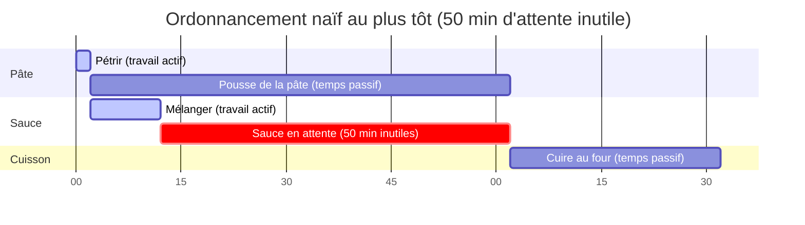
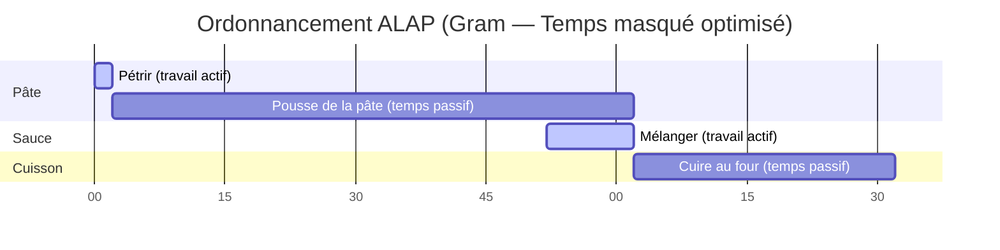
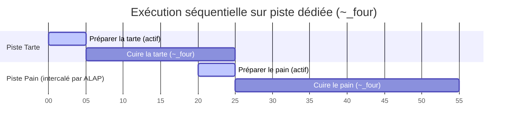

import Since from '../../../../../components/Since.astro';
import { Steps, LinkCard, CardGrid } from '@astrojs/starlight/components';

Gram ne se contente pas d'interpréter les recettes de haut en bas : il calcule activement leur ordonnancement optimal pour vous faire gagner un temps précieux en cuisine.

Pour y parvenir, le moteur s'appuie sur un algorithme d'ordonnancement rétrograde nommé **ALAP (*As Late As Possible* — au plus tard possible)**. Ce principe garantit que chaque ingrédient ou préparation intermédiaire est achevé exactement au moment où l'étape suivante en a besoin, évitant qu'un composant ne patiente et ne s'altère inutilement sur le plan de travail.

## Le problème : l'ordonnancement au plus tôt

Considérons une recette classique associant une pâte nécessitant 1 heure de levée, une sauce rapide demandant 10 minutes de préparation active, et une cuisson finale de l'ensemble :

```gram
[Pétrir] La @farine avec l'@eau et laisser lever ~_{1h}. ->&pâte

[Mélanger] Les ingrédients de la sauce ~{10min}. ->&sauce

[Cuire] La &pâte avec la &sauce au four pendant ~_{30min}.
```

Avec un ordonnancement linéaire naïf exécuté dès que possible (*Forward Scheduling*), la chronologie présenterait une rupture majeure :


```mermaid
gantt
    title Ordonnancement naïf au plus tôt (50 min d'attente inutile)
    dateFormat  m
    axisFormat %M
    
    section Pâte
    Pétrir (travail actif)              : active, a1, 0, 2m
    Pousse de la pâte (temps passif)    : a2, after a1, 60m
    
    section Sauce
    Mélanger (travail actif)            : active, a3, after a1, 10m
    Sauce en attente (50 min inutiles)  : crit, a4, after a3, 50m
    
    section Cuisson
    Cuire au four (temps passif)        : a5, after a2, 30m
```

Le défaut saute aux yeux : la sauce est achevée dès la 12e minute, alors que la pousse de la pâte ne se termine qu'à la 62e minute. La sauce reste donc 50 minutes sur le comptoir à tiédir ou à décanter avant d'être utilisée.

## La solution : l'ordonnancement rétrograde ALAP

Au lieu de déclencher les étapes au plus tôt, le compilateur de Gram procède **à rebours**, en partant de l'échéance finale de la recette.

Dès que le moteur identifie que l'étape finale `[Cuire]` consomme la `&pâte` et la `&sauce`, il calcule leur heure d'exigibilité stricte (*deadline*). Il décale ensuite la préparation de la sauce au moment le plus tardif possible, de façon à ce que sa confection s'achève *précisément* à l'instant où la pousse de la pâte prend fin et où la cuisson démarre.

Voici la chronologie optimisée générée par Gram :


```mermaid
gantt
    title Ordonnancement ALAP (Gram — Temps masqué optimisé)
    dateFormat  m
    axisFormat %M
    
    section Pâte
    Pétrir (travail actif)              : active, b1, 0, 2m
    Pousse de la pâte (temps passif)    : b2, after b1, 60m
    
    section Sauce
    Mélanger (travail actif)            : active, b3, 52, 10m
    
    section Cuisson
    Cuire au four (temps passif)        : b4, after b2, 30m
```

*(Note : à défaut de minuteur actif explicite sur le pétrissage, Gram lui alloue automatiquement 2 minutes de travail actif).*

En calant la confection de la sauce sur la fin de la pousse, Gram intercale ce travail actif **pendant** le temps passif de la pâte. Vos gestes s'enchaînent de manière fluide, le temps total est rationalisé et vos préparations conservent une fraîcheur maximale.

## Planifier la mise en place
<Since v="1.4.0" />

La mise en place d'une section (rassembler et peser les ingrédients, sortir le matériel) constitue une tâche à part entière planifiée en tête de section. Prenons l'exemple d'une pâte suivie d'une garniture à cuire :

```gram
## Pâte ->&pâte

[Mélanger] La @farine{500g} et l'@eau{300ml} dans un #saladier.

[Pointer] Laisser lever la pâte ~_{2h}.

## Garniture ->&garniture

[Suer] Faire revenir les @oignons{200g}(émincés) dans une #poêle.

## Montage

[Étaler] La &garniture sur la &pâte.

[Cuire] Au #four pendant ~{25min}.
```

Ordonnancée **par section** (le mode par défaut), la préparation de chaque section se place au plus près de son exécution. Les préparations de la garniture et du montage glissent naturellement au sein des 2 heures de pousse de la pâte, en temps masqué :


```mermaid
gantt
    title Mise en place par section (2 h 32)
    dateFormat  HH:mm
    axisFormat %H:%M
    todayMarker off
    section Pâte
    Mise en place                     : p1, 00:00, 3m
    Mélanger                          : active, a1, 00:03, 2m
    Pousse (temps passif)             : r1, 00:05, 120m
    section Garniture
    Mise en place                     : p2, 01:56, 4m
    Suer                              : active, a2, 02:00, 2m
    section Montage
    Mise en place                     : p3, 02:02, 3m
    Étaler                            : active, a3, 02:05, 2m
    Cuire                             : active, a4, 02:07, 25m
```

Ordonnée **tout au début**, la mise en place de tous les ingrédients bruts est regroupée en amont de toute cuisson :


```mermaid
gantt
    title Mise en place tout au début (2 h 39)
    dateFormat  HH:mm
    axisFormat %H:%M
    todayMarker off
    section Mise en place
    Pâte                              : p1, 00:00, 3m
    Garniture                         : p2, 00:03, 4m
    Montage                           : p3, 00:07, 3m
    section Pâte
    Mélanger                          : active, a1, 00:10, 2m
    Pousse (temps passif)             : r1, 00:12, 120m
    section Garniture
    Suer                              : active, a2, 02:10, 2m
    section Montage
    Étaler                            : active, a3, 02:12, 2m
    Cuire                             : active, a4, 02:14, 25m
```

Les deux plannings décrivent fidèlement la même recette. La durée globale varie uniquement de 7 minutes (les 4 minutes de préparation de la garniture et les 3 minutes du montage) qui ne sont plus absorbées en temps masqué pendant la pousse. Le mode « par section » optimise la durée totale, tandis que « tout au début » séduit les cuisiniers souhaitant dégager leur plan de travail avant d'allumer les feux.

:::note[Pesée des intermédiaires]
Un ingrédient intermédiaire (`&pâte`) requiert environ une minute de manipulation. Ce coût est imputé à la section qui le **consomme** (ici, le montage), et non à celle qui le produit.
:::

## Pistes d'équipement dédiées (named tracks)

L'algorithme rétrograde ALAP gère nativement les ressources physiques limitées via les **pistes nommées** (*named tracks*). Lorsque vous affectez le même identifiant à plusieurs minuteurs passifs (par exemple, `~_four{20min}` et `~_four{30min}`), Gram interdit leur chevauchement et impose une exécution séquentielle sur cet équipement.

La contrainte se propage automatiquement vers l'amont : les étapes actives associées sont repositionnées à l'instant idéal pour alimenter le four en continu sans temps mort :


```mermaid
gantt
    title Exécution séquentielle sur piste dédiée (~_four)
    dateFormat  m
    axisFormat %M
    
    section Piste Tarte
    Préparer la tarte (actif)         : active, p1, 0, 5m
    Cuire la tarte (~_four)           : p2, after p1, 20m
    
    section Piste Pain (intercalé par ALAP)
    Préparer le pain (actif)          : active, b1, 20, 5m
    Cuire le pain (~_four)            : b2, after p2, 30m
```

L'étape `Préparer le pain` est automatiquement programmée pendant la cuisson de la tarte (entre la 20e et la 25e minute) : le pain est ainsi prêt à enfourner dès que la tarte libère le four à la 25e minute.

## Ancres temporelles, sessions et dépendances

L'ancre de rétroplanning d'une section (`~{-2d}`) exprime une **échéance impérative** : le travail de cette section doit être achevé à ce moment précis, compté à rebours depuis l'heure de service. Entre deux sections ancrées, les étapes intermédiaires s'alignent automatiquement par rétro-propagation.

Quelques règles essentielles pour modéliser des recettes s'étendant sur plusieurs jours :

- **Ancrez en jours calendaires (`~{-Nd}`)** : le découpage en journées de travail repose exclusivement sur les ancres exprimées en jours (`~{-1d}`, `~{-2d}`). Une section sans ancre est rattachée au jour de l'ancre en jours la plus lointaine parmi les sections avales.
- **Un temps passif long n'initie pas de nouvelle journée** : une étape comportant `~_{48h}` décale bien l'étape vers l'amont sur le diagramme de Gantt, mais ne crée pas de session J-2 en l'absence d'une ancre de section explicite (`## Crème ~{-2d}`).
- **Une ancre en heures (`~{-Nh}`) ne découpe pas de session** : une valeur comme `~{-18h}` ou `~{-36h}` fixe une échéance stricte au sein de la journée, mais n'ouvre pas de session autonome. Pour débuter formellement la veille, utilisez l'ancre `~{-1d}`.
- **Sections successives au cours du même jour** : ancrez uniquement la dernière section (`## Tarte ~{-1d}`) et laissez les sections amont sans ancre. Assigner la même ancre à deux sections interdépendantes générerait un diagnostic de paradoxe temporel.

## Ancrage modulaire (`@use ... ~{-1d}`)

Lors de l'assemblage de recettes modulaires avec `@gram-lang/modules`, vous pouvez déclarer un décalage rétro-planning directement sur une directive d'importation :

```gram
@use "@/components/bases/levain.gram" as &levain ~{-2d}
```

L'algorithme ALAP répercute cet ancrage vers l'amont à travers l'ensemble du sous-arbre importé :
- La section produisant l'export `&levain` est calée pour s'achever **2 jours avant** l'assemblage principal.
- Toutes les étapes amont du module (rafraîchis, fermentations) sont planifiées proportionnellement plus tôt.
- En phase de finalisation, l'ensemble de la chronologie globale est recalé pour débuter à l'instant 0.

## Bonnes pratiques pour une chronologie fluide

Pour exploiter toute la puissance de l'ordonnancement ALAP de Gram, appliquez ces recommandations opérationnelles :

<Steps>
1. **Distinguez soigneusement travail actif et temps passif (`~_`)**
   Dès qu'une opération n'exige pas la présence continue du cuisinier (cuisson au four, fermentation, mijotage, refroidissement), utilisez un minuteur passif (`~_`). Si vous utilisiez par erreur un minuteur actif (`~{1h}` au lieu de `~_{1h}`), Gram supposerait que vous manipulez la préparation pendant une heure pleine, ce qui bloquerait l'ordonnancement d'autres tâches en temps masqué.

2. **Déclarez les intermédiaires au plus tôt, consommez-les au plus tard**
   Déclarez un ingrédient intermédiaire (`->&nom`) dès que sa confection active s'achève, et référencez-le (`&nom`) uniquement dans l'étape où il est incorporé. Gram ajustera automatiquement l'intervalle entre production et consommation.

3. **Mobilisez les pistes nommées pour les équipements partagés**
   Si vous disposez d'un unique four pour plusieurs préparations indépendantes, identifiez-le via une piste dédiée (`~_four{10min}`, `~_four{30min}`). Sans cette désignation, Gram considérerait que chaque tâche dispose de son propre équipement et les planifierait en parallèle.

4. **Découpez des étapes réalistes**
   Chaque étape sans minuteur hérite d'une durée forfaitaire de 2 minutes de travail actif. Privilégiez des étapes décrivant des unités de geste cohérentes plutôt qu'un découpage excessif qui alourdirait inutilement la durée active totale.
</Steps>

## Visualisation et intégration dans les interfaces

Grâce au calcul déterministe des bornes temporelles `start` et `end` par le moteur ALAP, les interfaces utilisateur n'ont aucune logique de calcul de dates à implémenter : elles exploitent directement les données du graphe planifié.

La représentation par diagramme de Gantt met en relief la synchronisation des tâches passives et l'imbrication du travail actif. Vous pouvez explorer cette dynamique en temps réel dans le **[Playground officiel de Gram](/fr/play/)** en activant la vue chronologique.

## Ressources associées

<CardGrid>
  <LinkCard
    title="Planifier en heures réelles"
    description="Découvrez comment le rétroplanning ALAP s'articule avec les horaires réels et vos disponibilités."
    href="/fr/docs/explanation/planning-in-real-time/"
  />
  <LinkCard
    title="Mise en place et planification"
    description="Comprenez l'articulation entre le travail préparatoire, l'ordonnancement et les ancres journalières."
    href="/fr/docs/explanation/mise-en-place-and-planning/"
  />
  <LinkCard
    title="Syntaxe des temps et durées"
    description="Déclarez durées actives, minuteurs passifs, pistes nommées et ancres de journées de travail."
    href="/fr/docs/reference/syntax/times/"
  />
  <LinkCard
    title="Référence de l'API Scheduler"
    description="Documentation complète de layout(), project() et du moteur d'ordonnancement."
    href="/fr/docs/reference/api/scheduler/"
  />
</CardGrid>
