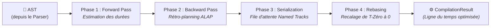

Si `@gram-lang/parser` dicte le vocabulaire, c'est `@gram-lang/kitchen` qui incarne la logique.

Le *package* Kitchen récupère l'AST (Arbre Syntaxique Abstrait) recraché par le *parser* et le compile. Son job ? Simuler le déroulé de la recette de bout en bout, résoudre les variables, extraire les compteurs de temps et *bootstrapper* la liste de courses.

## Responsabilités Principales

Le processus de compilation (orchestré par `core.ts`) délègue à plusieurs sous-modules :

### 1. Scope Structurel & Traitement (`processor.ts`)

Le processeur boucle sur chaque section et chaque étape de l'AST pour bâtir la *timeline* d'exécution.

- **Résolution des variables** : Au moindre `->&pâte`, la déclaration est enregistrée dans le Scope Global. À la moindre référence `&pâte`, il tisse le lien.
- **Diagnostics** : Le processeur a pour mission d'attraper les erreurs logiques. Plutôt que de crasher sauvagement, il empile des objets `Warning` structurés dans `CompilationResult.warnings`. L'idée ? Permettre à l'éditeur de toujours afficher un rendu, même partiel. Si vous invoquez `&pâte` sans la déclarer, bim : `UNDEFINED_REFERENCE`. Un vilain cycle `&a -> &b -> &a` ? L'algorithme DFS dans `graph.ts` le repèrera et lèvera un `CIRCULAR_REFERENCE`. Si besoin, un `gram check --strict` basculera ces *warnings* en erreurs fatales.
- **Génération de la Chronologie (*ALAP Scheduling*)** : Le moteur s'appuie sur un ordonnancement **ALAP (As Late As Possible)** (éclaté dans `src/schedule/` pour être bétonné de tests unitaires). Quatre passes s'enchaînent pour accoucher d'une timeline chirurgicale :
  - **Phase 1 (*Forward Pass*)** : Le compilateur jauge les temps actifs et les tâches de fond pour chronométrer le temps de production des intermédiaires (`->&nom`) de chaque section.
  - **Phase 2 (*Backward Pass*)** : Il remonte la recette à l'envers (`alap.ts`). À la moindre consommation d'un intermédiaire (`&nom`), le moteur note l'échéance critique à laquelle il *doit* être prêt, tout en digérant les éventuelles ancres de rétro-planning de section (`~{-1j}`). L'étape productrice sera alors calée *juste-à-temps* (JIT).
  - **Phase 3 (*Serialization*)** : L'algorithme des « pistes nommées » (*Named Tracks*, `tracks.ts`) entre en piste pour s'assurer que des *timers* passifs partageant un même nom (ex. `~_four`) ne se chevauchent pas matériellement. En cas de collision, les horaires de départ sont glissés chronologiquement.
  - **Phase 4 (*Positive Rebasing*)** : C'est la touche finale (`rebase.ts`). Si des préparations ont basculé dans le négatif (ex: la veille du jour J), l'intégralité de la timeline est translatée vers l'avant (du strict opposé du minimum absolu). La structure `timings` finale ne contiendra donc que des temps absolus, toujours positifs, démarrant à un T-Zéro absolu, ce qui est une bénédiction pour le front-end.

  ::: tip
  La flèche `👉` que vous voyez dans les recettes rendues (ex : `👉*pâte*`) est une icône d'affichage ajoutée par `@gram-lang/renderer`, pas de la syntaxe Gram. Dans le code source `.gram`, un intermédiaire est consommé avec un simple `&nom`.
  :::

### 2. Métriques de Temps (`metrics.ts` / `processor.ts`)

La Kitchen calcule quatre métriques de temps, combinées dans `core.ts` :
- **Temps Actif (`activeTime`)** : La somme de toutes les durées des minuteurs actifs, plus un défaut de 2 minutes pour toute étape qui ne déclare aucun minuteur.
- **Temps de Cuisson (`cookTime`)** : Le temps de fin absolu maximal de la chronologie de cuisson, en tenant compte de toute tâche de fond passive (comme faire reposer une pâte pendant 24 heures) qui se termine après la dernière étape active.
- **Temps de Préparation (`preparationTime`)** : Complètement indépendant des *timers*. C'est le temps forfaitaire de *mise-en-place* : 1 minute par ingrédient/matériel unique, plus 2 minutes additionnelles si une étape de préparation est exigée (ex : `@oignon(épluché)`).
- **Temps Total (`totalTime`)** : `preparationTime + cookTime` — le véritable investissement en temps pour ce plat (du fouinage dans les placards jusqu'au service).

### 3. Agrégation de la Liste de Courses (`shopping.ts`)

La Kitchen construit la liste de base des ingrédients nécessaires pour cuisiner la recette.

- **Fusion** : Elle empile les mentions d'un ingrédient via son ID brut (le slug du texte) et son unité. Ainsi, `@beurre{50 g}` dans la pâte et `@beurre{20 g}` dans le glaçage seront sommés arithmétiquement en une ligne unique de `70 g`.
- **Logique des Composites** : Elle orchestre l'impitoyable logique MAX et SUM des [Ingrédients Composites](../syntax/composite-ingredients.md). La quantité réclamée pour les enfants passe à la moulinette du MAX (ex: le plus gros entre « zeste de 2 citrons » et « jus de 3 citrons » gagne). Ensuite, toute quantité du parent utilisée « telle quelle » est sommée (SUM) par-dessus.
- **Agrégation Hybride** : Pour ne rien casser, les [Quantités Relatives](../syntax/relative-quantities.md) (basées sur des formules) sont stockées à part de la masse numérique absolue. La liste de courses est ainsi garantie mathématiquement exacte en toute circonstance.

:::tip[Ceci n'est pas la liste finale]
La Kitchen tournant à l'aveugle sans accès à `ingredients.yaml`, le regroupement repose bêtement sur l'ID brut. `@butter` et `@beurre` restent donc décorrélés à ce stade, tout comme `100 g` et `1 tasse` de farine ne seront pas fusionnés. L'intelligence métier avancée (ID canonique, conversion masse/volume via la densité) sera injectée plus tard par `@gram-lang/analyzer`. Voir [Agrégation de la Liste de Courses](../shopping-list-aggregation.md).
:::

:::tip[Une deuxième agrégation, différente, existe par section]
`section.ts` fournit un helper dédié `aggregateSectionIngredients`, taillé pour afficher un bloc d'ingrédients *scopé sur une seule section* (vs. la liste de courses globale). Ses règles n'ont rien à voir : deux occurrences du même ingrédient ne seront **pas** sommées. Elles seront conservées côte à côte en mode concaténation (`200g + 50g`). Le but ? Montrer visuellement la matière requise pour le plan de travail, et non ce qu'il faut acheter.
:::

## Sortie

La sortie brute de `@gram-lang/kitchen` est l'objet `CompilationResult` (la fameuse « recette compilée » mentionnée partout). Structurellement irréprochable et mathématiquement agrégé, ce JSON n'est néanmoins **pas encore physiquement exact**.

Par exemple, Kitchen sait que vous avez demandé `1 tasse` de farine, mais ne sait toujours pas combien ça pèse. Cet enrichissement physique massif se fera à la prochaine étape : place à l'**Analyseur** (*Analyzer*).

## Autres Responsabilités

- **Mise à l'échelle (Scaling)** : Si `scaleFactor` est injecté à la compilation, toutes les quantités sont redimensionnées proportionnellement. Sauf exceptions : les constantes préfixées par `=` (ex: `@sel{=5g}`, insensibles au volume de la recette) et les champs libres non quantifiables.
- **Validation du Pourcentage du Boulanger** : Le compilateur s'assure qu'un et un seul ingrédient porte la couronne du modificateur de pourcentage du boulanger (`*`). S'il y a des prétendants multiples, il sévira avec une belle erreur.
