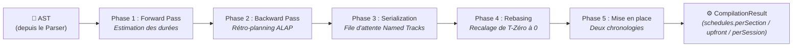

Si `@gram-lang/parser` dicte le vocabulaire, c'est `@gram-lang/kitchen` qui incarne la logique.

Le *package* Kitchen récupère l'AST (Arbre Syntaxique Abstrait) généré par le *parser* et le compile. Son job ? Simuler le déroulé de la recette de bout en bout, résoudre les variables, extraire les compteurs de temps et *bootstrapper* la liste de courses.

## Responsabilités principales

Le processus de compilation (orchestré par `core.ts`) délègue à plusieurs sous-modules :

### 1. Scope structurel & traitement (`processor.ts`)

Le processeur boucle sur chaque section et chaque étape de l'AST pour bâtir la *timeline* d'exécution.

- **Résolution des variables** : Au moindre `->&pâte`, la déclaration est enregistrée dans le Scope Global. À la moindre référence `&pâte`, il tisse le lien.
- **Diagnostics** : Le processeur a pour mission d'intercepter les erreurs logiques. Plutôt que d'échouer brutalement, il empile des objets `Warning` structurés dans `CompilationResult.warnings`. L'objectif est de permettre à l'éditeur de toujours afficher un rendu, même partiel. Si vous invoquez `&pâte` sans la déclarer, une alerte `UNDEFINED_REFERENCE` est émise. En cas de cycle de dépendances (`&a -> &b -> &a`), l'algorithme DFS dans `graph.ts` l'identifie et lève un `CIRCULAR_REFERENCE`. Si besoin, la commande `gram check --strict` basculera ces avertissements en erreurs bloquantes.
- **Génération de la Chronologie (*ALAP Scheduling*)** : Le moteur s'appuie sur un ordonnancement **ALAP (As Late As Possible)** (éclaté dans `src/schedule/` pour être bétonné de tests unitaires). Plusieurs passes s'enchaînent pour accoucher d'une timeline chirurgicale :
  - **Phase 1 (*Forward Pass*)** : Le compilateur jauge les temps actifs et les tâches de fond pour chronométrer le temps de production des intermédiaires (`->&nom`) de chaque section.
  - **Phase 2 (*Backward Pass*)** : Il remonte la recette à l'envers (`alap.ts`). À la moindre consommation d'un intermédiaire (`&nom`), le moteur note l'échéance critique à laquelle il *doit* être prêt, tout en digérant les éventuelles ancres de rétro-planning de section (`~{-1j}`). L'étape productrice sera alors calée *juste-à-temps* (JIT).
  - **Phase 3 (*Serialization*)** : L'algorithme des « pistes nommées » (*Named Tracks*, `tracks.ts`) entre en piste pour s'assurer que des *timers* passifs partageant un même nom (ex. `~_four`) ne se chevauchent pas matériellement. En cas de collision, les horaires de départ sont glissés chronologiquement.
  - **Phase 4 (*Positive Rebasing*)** : C'est l'étape d'ajustement final (`rebase.ts`). Si des préparations ont basculé dans le négatif (ex: la veille du jour J), l'intégralité de la chronologie est translatée vers l'avant (de l'opposé du minimum absolu). La chronologie finale ne contient donc que des temps absolus, toujours positifs, démarrant à un repère zéro, ce qui facilite l'intégration front-end.
  - **Phase 5 (mise en place, trois chronologies)** *(depuis la 1.4.0)* : la préparation de chaque section (voir les métriques ci-dessous) est ensuite planifiée de trois façons par un seul moteur, qui rejoue la passe arrière sur une copie des étapes en insérant la préparation comme des étapes à part, un groupe de sections à la fois : le chaînage existant fait finir chacune pile quand le travail qu'elle précède commence, et lui permet de chevaucher le repos d'une étape antérieure. La chronologie **par section** a un groupe par section, avec sa préparation en tête de cette section. La chronologie **upfront** n'a qu'un groupe : toute la préparation est rassemblée en tête de la première section. La chronologie **par session** a un groupe par journée de travail (le jour vient des ancres `~{-Nd}` des sections, en une seule passe arrière), donc chaque journée commence par sa propre préparation. Dans un groupe, un intermédiaire (`&pâte`) fabriqué par une section du même groupe n'existe pas quand le groupe commence : sa préparation est planifiée juste avant la section qui l'utilise. Les trois sont stockées dans le résultat, et c'est le lecteur qui choisit.

```mermaid
flowchart LR
    AST["📄 AST<br/>(depuis le Parser)"] --> P1["Phase 1 : Forward Pass<br/><i>Estimation des durées</i>"]
    P1 --> P2["Phase 2 : Backward Pass<br/><i>Rétro-planning ALAP</i>"]
    P2 --> P3["Phase 3 : Serialization<br/><i>File d'attente Named Tracks</i>"]
    P3 --> P4["Phase 4 : Rebasing<br/><i>Recalage de T-Zéro à 0</i>"]
    P4 --> P5["Phase 5 : Mise en place<br/><i>Deux chronologies</i>"]
    P5 --> Result["⚙️ CompilationResult<br/><i>(schedules.perSection / upfront / perSession)</i>"]
```

  ::: tip
  La flèche `👉` que vous voyez dans les recettes rendues (ex : `👉*pâte*`) est une icône d'affichage ajoutée par `@gram-lang/renderer`, pas de la syntaxe Gram. Dans le code source `.gram`, un intermédiaire est consommé avec un simple `&nom`.
  :::

### 2. Temps et mise en place (`metrics.ts` / `processor.ts`)

La Kitchen calcule quatre mesures de temps, combinées dans `core.ts` :
- **Temps actif (`activeTime`)** : la somme des durées de tous les minuteurs actifs, plus 2 minutes par défaut pour toute étape qui ne déclare aucun minuteur.
- **Temps d'attente** : le temps où l'on attend sans rien faire, soit le temps total moins la préparation et le temps actif. Il dépend du planning choisi, on le lit donc dans `schedules`.
- **Temps de préparation (`preparationTime`)** : *indépendant des minuteurs.* C'est le forfait de *mise en place* : 1 minute par ingrédient ou ustensile unique, plus 2 minutes supplémentaires quand une note de préparation est exigée (ex. `@oignon(épluché et émincé)`). Un ingrédient est compté une fois, dans la première section qui l'utilise ; un intermédiaire (`&pâte`) est compté là où il sert, pas là où il est fabriqué.
- **Temps total** : `preparationTime + activeTime + temps d'attente`, à lire aussi dans `schedules`, puisqu'il dépend du moment où se fait la préparation.

*(Depuis la 1.4.0)* Le temps de préparation n'est pas qu'un total : il est réparti par section dans `miseEnPlace`, une liste où chaque entrée dit à quelle section elle appartient et de quoi elle est faite (rassembler les ingrédients, rassembler le matériel, préparer un ingrédient). La somme des entrées vaut `preparationTime`. Les trois chronologies de `schedules` (`perSection`, `upfront` et `perSession`) placent ces entrées différemment.

:::note[Déprécié en 1.4.0]
Les anciens champs de temps (`timings` et `backgroundTasks` sur chaque étape, et `metrics.totalTime`, `idleTime`, `activeBreakdown`, `prepBreakdown` et `totalBreakdown`) gardent les mêmes valeurs et le même sens, mais sont dépréciés et retirés en 2.0.0. Lisez `schedules` et `miseEnPlace` à la place. Voir la [référence de l'API Kitchen](/fr/docs/reference/api/kitchen).
:::

### 3. Agrégation de la liste de courses (`shopping.ts`)

La Kitchen construit la liste de base des ingrédients nécessaires pour cuisiner la recette.

- **Fusion** : Elle empile les mentions d'un ingrédient via son ID brut (le slug du texte) et son unité. Ainsi, `@beurre{50 g}` dans la pâte et `@beurre{20 g}` dans le glaçage seront sommés arithmétiquement en une ligne unique de `70 g`.
- **Logique des Composites** : Elle orchestre l'impitoyable logique MAX et SUM des [Ingrédients Composites](/fr/docs/reference/syntax/composite-ingredients). La quantité réclamée pour les enfants passe à la moulinette du MAX (ex: le plus gros entre « zeste de 2 citrons » et « jus de 3 citrons » gagne). Ensuite, toute quantité du parent utilisée « telle quelle » est sommée (SUM) par-dessus.
- **Agrégation Hybride** : Pour ne rien casser, les [Quantités Relatives](/fr/docs/reference/syntax/relative-quantities) (basées sur des formules) sont stockées à part de la masse numérique absolue. La liste de courses est ainsi garantie mathématiquement exacte en toute circonstance.

:::tip[Ceci n'est pas la liste finale]
La Kitchen fonctionnant sans accès à `ingredients.yaml`, le regroupement repose uniquement sur l'ID brut. `@butter` et `@beurre` restent donc décorrélés à ce stade, tout comme `100 g` et `1 tasse` de farine ne seront pas fusionnés. La logique métier avancée (ID canonique, conversion masse/volume via la densité) sera appliquée plus tard par `@gram-lang/analyzer`. Voir [Agrégation de la Liste de Courses](/fr/docs/explanation/shopping-list-aggregation).
:::

:::tip[Une deuxième agrégation, différente, existe par section]
`section.ts` fournit un helper dédié `aggregateSectionIngredients`, taillé pour afficher un bloc d'ingrédients *scopé sur une seule section* (vs. la liste de courses globale). Ses règles n'ont rien à voir : deux occurrences du même ingrédient ne seront **pas** sommées. Elles seront conservées côte à côte en mode concaténation (`200g + 50g`). Le but ? Montrer visuellement la matière requise pour le plan de travail, et non ce qu'il faut acheter.
:::

## Sortie

La sortie brute de `@gram-lang/kitchen` est l'objet `CompilationResult` (la « recette compilée »). Structurellement irréprochable et mathématiquement agrégé, ce JSON n'est néanmoins **pas encore physiquement exact**.

Par exemple, Kitchen sait que vous avez demandé `1 tasse` de farine, mais ne sait toujours pas combien ça pèse. Cet enrichissement physique massif se fera à la prochaine étape : place à l'**Analyseur** (*Analyzer*).

## Autres responsabilités

- **Ajustement des proportions (Scaling)** : Si `scaleFactor` est injecté à la compilation, toutes les quantités sont redimensionnées proportionnellement. Sauf exceptions : les constantes préfixées par `=` (ex: `@sel{=5g}`, insensibles au volume de la recette) et les champs libres non quantifiables.
- **Validation du Pourcentage du Boulanger** : Le compilateur s'assure qu'un et un seul ingrédient porte la couronne du modificateur de pourcentage du boulanger (`*`). S'il y a des prétendants multiples, il sévira avec une belle erreur.
