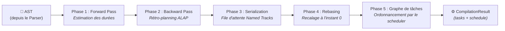

import Since from '../../../../../../components/Since.astro';
import { LinkCard, CardGrid } from '@astrojs/starlight/components';

Si `@gram-lang/parser` définit la grammaire et le vocabulaire du langage, `@gram-lang/kitchen` en constitue le moteur logique et structurel.

Le compilateur Kitchen prend en entrée l'arbre de syntaxe abstraite (AST) généré par le parseur. Son rôle : simuler l'exécution complète de la recette, résoudre les variables intermédiaires, construire le graphe de tâches pour l'ordonnancement temporel, et assembler une première liste d'achats consolidée.

## Responsabilités principales

Le pipeline de compilation (orchestré par `core.ts`) délègue le travail à plusieurs sous-modules spécialisés :

### 1. Portée structurelle & traitement (`processor.ts`)

Le processeur parcourt chaque section et chaque étape de l'AST pour bâtir la chronologie d'exécution.

- **Résolution des variables** : Chaque déclaration d'ingrédient intermédiaire (`->&pâte`) est enregistrée dans la table des symboles globale, puis reliée rigoureusement à chaque consommation ultérieure (`&pâte`).
- **Diagnostics structurels** : Le processeur intercepte les anomalies logiques. Plutôt que d'interrompre brutalement la chaîne de compilation, il empile des avertissements structurés dans `CompilationResult.warnings`, permettant aux éditeurs et outils de rendu d'afficher un résultat partiel exploitable. Si vous référencez `&pâte` sans l'avoir déclarée au préalable, un avertissement `UNDEFINED_REFERENCE` est émis. Les références circulaires (`&a -> &b -> &a`) sont identifiées par un parcours en profondeur (DFS dans `graph.ts`) et signalées par `CIRCULAR_REFERENCE`. En environnement de validation strict (`gram check --strict`), ces avertissements deviennent des erreurs bloquantes.
- **Ordonnancement rétrograde ALAP** : Le compilateur applique l'algorithme **ALAP (*As Late As Possible*)**, délégué depuis la version 1.4.0 au paquet spécialisé `@gram-lang/scheduler` (voir [Le moteur d'ordonnancement](/fr/docs/explanation/engine/scheduler/)). Plusieurs passes successives assurent un ordonnancement déterministe et optimisé :
  - **Phase 1 (*Forward Pass*)** : Le compilateur évalue les durées de travail actif et les tâches passives afin de quantifier le temps de production des intermédiaires (`->&nom`) de chaque section.
  - **Phase 2 (*Backward Pass*)** : Il remonte la recette à rebours (`alap.ts`). À chaque consommation d'un intermédiaire (`&nom`), le moteur calcule son échéance limite de disponibilité, en intégrant les ancres de rétroplanning de section (`~{-1d}`). L'étape productrice est alors calée *juste-à-temps*.
  - **Phase 3 (*Serialization*)** : L'ordonnanceur sérialise les pistes d'équipement dédiées (*named tracks*, `tracks.ts`) pour garantir que les minuteurs passifs partageant une même ressource matérielle (ex. `~_four`) ne se chevauchent pas. En cas de conflit, les tâches sont réordonnancées séquentiellement sans temps mort.
  - **Phase 4 (*Positive Rebasing*)** : Recalage chronologique final (`rebase.ts`). Si des préparations ont basculé en temps négatif (antérieures au moment du service), l'ensemble de la chronologie est translatée vers l'avant. La chronologie finale démarre strictement à 0 en valeurs positives, simplifiant son exploitation par les interfaces clientes.
  - **Phase 5 (*Graphe de tâches et planning par défaut*)** <Since v="1.4.0" /> : Kitchen formalise les résultats de la passe avant sous la forme d'un **graphe de tâches** agnostique (`tasks`) : tâches de préparation amont par section (`prep`), étapes actives (`step`), minuteurs passifs (`passive`) avec leurs bornes d'élasticité (`{ nominal, min, max }`), et graphe de dépendances (`after`). Le moteur `@gram-lang/scheduler` calcule ensuite le **planning par défaut** (`schedule` : mise en place par section, durées passives au plus court). Tout ordonnancement alternatif (mise en place groupée au départ, par journée, durées passives allongées) se calcule à la demande à partir de ce même graphe via `layout()`, sans recompiler. Le calendrier de chaque section est déterminé par ses ancres en jours `~{-Nd}`.

:::tip
La flèche `👉` visible dans les recettes rendues (ex : `👉*pâte*`) est un marqueur visuel injecté par `@gram-lang/renderer`, et non un élément de syntaxe Gram. Dans le fichier `.gram` source, un intermédiaire est consommé via la syntaxe standard `&nom`.
:::

### 2. Métriques temporelles et mise en place (`metrics.ts` / `processor.ts`)

Kitchen calcule quatre mesures temporelles fondamentales, consolidées dans `core.ts` :
- **Temps de travail actif (`activeTime`)** : cumul des durées de tous les minuteurs actifs, complété d'un forfait de 2 minutes pour chaque étape ne déclarant aucun minuteur.
- **Temps passif d'inactivité (`idleTime`)** : temps mort global durant lequel le cuisinier n'est mobilisé par aucune tâche active ou préparation (`totalTime - activeTime - preparationTime`). Cette durée dépend de la stratégie de mise en place retenue et se lit dans `schedule`.
- **Temps de préparation (`preparationTime`)** : forfait théorique de *mise en place*, indépendant des minuteurs. Il alloue 1 minute par ingrédient et ustensile unique, plus 2 minutes pour chaque ingrédient requérant une note de préparation préalable (ex. `@oignon(épluché et émincé)`). Chaque ingrédient est comptabilisé une seule fois dans la première section qui le mobilise ; un intermédiaire (`&pâte`) est comptabilisé là où il est consommé.
- **Temps total (`totalTime`)** : somme `preparationTime + activeTime + idleTime`. Cette durée se lit également dans `schedule`, puisqu'elle varie selon que la mise en place est réalisée en temps masqué ou regroupée au départ.

<Since v="1.4.0" /> Le temps de préparation est ventilé par section au sein de `miseEnPlace`, détaillant la nature de chaque action (rassemblement des ingrédients, du matériel, découpes). La somme des entrées équivaut exactement à `preparationTime`.

:::note[Éléments dépréciés]
<Since type="deprecated" v="1.4.0" /> Les anciens champs de temps (`timings` et `backgroundTasks` sur chaque étape, ainsi que `metrics.totalTime`, `idleTime`, `activeBreakdown`, `prepBreakdown` et `totalBreakdown`) sont dépréciés et seront retirés en version 2.0.0. Utilisez les propriétés structurées `schedule` et `miseEnPlace` à la place. Consultez la [référence de l'API Kitchen](/fr/docs/reference/api/kitchen).
:::

### 3. Agrégation de la liste de courses (`shopping.ts`)

Kitchen génère la liste de courses consolidée nécessaire à la réalisation de la recette :

- **Fusion syntaxique** : Le compilateur regroupe les occurrences d'un même ingrédient partageant un identifiant brut et une unité identique. Par exemple, `@beurre{50 g}` dans la pâte et `@beurre{20 g}` dans le glaçage sont automatiquement additionnés en une ligne consolidée de `70 g`.
- **Résolution des ingrédients composites** : Application stricte des règles MAX et SUM pour les [ingrédients composites](/fr/docs/reference/syntax/composite-ingredients). Les quantités requises pour les parties d'un ingrédient appliquent la règle du maximum (ex. le plus élevé entre « zeste de 2 citrons » et « jus de 3 citrons » l'emporte), avant d'y additionner (SUM) toute quantité de l'ingrédient parent mobilisée en l'état.
- **Agrégation hybride** : Les [quantités relatives](/fr/docs/reference/syntax/relative-quantities) fondées sur des formules textuelles sont conservées séparément des masses numériques absolues, garantissant l'exactitude de la liste en cas de mise à l'échelle.

:::tip[Liste préliminaire hors base d'ingrédients]
Kitchen opérant sans dépendance envers `ingredients.yaml`, le regroupement repose exclusivement sur les identifiants textuels bruts. `@butter` et `@beurre` ne sont donc pas fusionnés à ce stade, de même que `100 g` et `1 tasse` demeurent deux entrées distinctes. La standardisation massique et l'unification canonique sont déléguées à l'étape suivante via `@gram-lang/analyzer`. Consultez [Agrégation de la liste de courses](/fr/docs/explanation/shopping-list-aggregation).
:::

:::tip[Agrégation locale par section]
Le module `section.ts` propose la fonction `aggregateSectionIngredients`, conçue pour afficher les ingrédients *à l'échelle d'une section unique* (pour le plan de travail). Ses règles diffèrent de la liste globale : deux occurrences d'un même ingrédient n'y sont pas additionnées, mais juxtaposées (`200g + 50g`) afin d'expliciter chaque étape de mise en œuvre.
:::

## Sortie de compilation

La sortie de `@gram-lang/kitchen` est matérialisée par l'objet `CompilationResult` (la recette compilée). Structurellement validé et cohérent, ce JSON n'est néanmoins **pas encore physiquement standardisé**.

Par exemple, Kitchen enregistre la présence d'une mesure volumique comme `1 tasse` de farine, mais n'en connaît pas la masse correspondante en grammes. Cet enrichissement physique fait l'objet de l'étape suivante, assurée par **l'analyseur** (*Analyzer*).

## Autres responsabilités

- **Ajustement dynamique des proportions (Scaling)** : Lorsqu'un facteur d'échelle est spécifié à la compilation, toutes les quantités numériques sont redimensionnées proportionnellement, à l'exception des quantités fixes marquées par `=` (ex. `@sel{=5g}`, invariantes au volume) et des mentions textuelles libres.
- **Validation du pourcentage du boulanger** : Le compilateur s'assure qu'un unique ingrédient porte le modificateur de référence de panification (`*`). La détection de références multiples entraîne une erreur de compilation bloquante.

## Ressources associées

<CardGrid>
  <LinkCard
    title="Référence de l'API Kitchen"
    description="Signature d'API, options de compile() et types TypeScript pour @gram-lang/kitchen."
    href="/fr/docs/reference/api/kitchen/"
  />
  <LinkCard
    title="Moteur d'ordonnancement"
    description="Comment le scheduler projette le graphe de tâches en plannings ALAP et calendaires."
    href="/fr/docs/explanation/engine/scheduler/"
  />
  <LinkCard
    title="Moteur de l'analyseur"
    description="Comment l'étape d'analyse enrichit le JSON compilé avec la base ingredients.yaml."
    href="/fr/docs/explanation/engine/analyzer/"
  />
</CardGrid>
