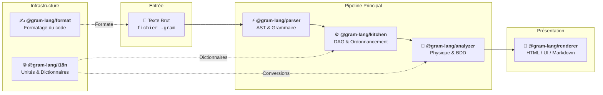

Sous le capot, Gram n'est pas un bloc monolithique. Il est composé d'une série de paquets spécifiques qui traitent une recette étape par étape. 

Comprendre ce cycle de vie est crucial si vous souhaitez intégrer Gram en profondeur dans vos propres applications ou créer de nouveaux outils par-dessus.

## Le Pipeline

La compilation d'une recette Gram suit un pipeline strict à sens unique :

### 1. Analyse Syntaxique (`@gram-lang/parser`)
Le voyage commence ici. L'analyseur (Parser) prend une chaîne de caractères brute (votre fichier `.gram`) et utilise une grammaire OhmJS pour en valider la syntaxe. 
Si la syntaxe est valide, il génère un **Arbre Syntaxique Abstrait (AST)**. Cet AST ne contient aucune logique — c'est simplement une représentation structurée du texte.

### 2. Compilation (`@gram-lang/kitchen`)
L'AST est ensuite transmis à la Kitchen (Cuisine). La Kitchen est responsable de la logique structurelle de la recette :
- **Portée (Scoping)** : Résolution des variables intermédiaires (ex : associer une référence `&pâte` à une déclaration `->&pâte`).
- **Métriques de Temps** : Calcul des temps `activeTime`, `cookTime`, `preparationTime`, et `totalTime` (`preparationTime + cookTime`) en analysant tous les minuteurs.
- **Génération de la Liste de Courses** : Agrégation des ingrédients, sommation des quantités et résolution des ingrédients composites (ex : combiner du zeste et du jus en citrons entiers).

La sortie est une recette logiquement correcte et compilée — un objet `CompilationResult`.

### 3. Enrichissement (`@gram-lang/analyzer`)
L'Analyseur (Analyzer) prend la recette compilée et la croise avec la base de données `ingredients.yaml` de votre projet. C'est ici que le monde physique rencontre le code numérique :
- **Standardisation des Masses** : Convertit les volumes (tasses, c.à.s) en poids précis en grammes en utilisant les densités spécifiques des ingrédients.
- **Calcul du Rendement** : Calcule le poids à l'achat par rapport au poids comestible.
- **Agrégation de la Liste de Courses** : Résout les alias de la base de données (ex. `beurre`/`butter`) et fusionne les quantités aux unités croisées en un seul total en grammes quand c'est possible, de sorte que le regroupement brut par unité de la Kitchen devienne la liste finale dédupliquée.
- **Estimation Nutritionnelle** : Calcule les calories et les macronutriments en se basant sur les masses standardisées.
- **Pourcentages du Boulanger** : Exprime la masse de chaque ingrédient en pourcentage d'un ingrédient de référence (typiquement la farine).

Chacun de ces ensembles de fonctionnalités peut être activé ou désactivé individuellement par l'application hôte.

### 4. Présentation (`@gram-lang/renderer` ou personnalisé)
Enfin, la recette entièrement enrichie est prête à être affichée. Vous pouvez utiliser le rendu officiel `@gram-lang/renderer` pour générer du Markdown, une vue web standard, ou un document HTML autonome prêt à imprimer — ou vous pouvez consommer le JSON directement dans votre propre front-end React, Vue ou Mobile.

### Infrastructure de support (`@gram-lang/i18n` & `@gram-lang/format`)
- **`@gram-lang/i18n`** : Sert de source de vérité unique pour les dictionnaires de normalisation d'unités et de temps, les tables de conversion d'unités (`UNIT_CONVERSIONS`), les multiplicateurs de durées (`TIME_TO_MINUTES`) et les clés de catégories stables (`CATEGORY_KEYS`).
- **`@gram-lang/format`** : Fournit le moteur de formatage de code canonique (13 règles déterministes) partagé entre la CLI et le Language Server.

## Architecture des Paquets

Cette séparation des préoccupations (separation of concerns) garantit que chaque paquet est très ciblé et réutilisable. Par exemple, si vous créez une extension d'éditeur qui n'a besoin que de colorer la syntaxe, vous n'avez besoin d'importer que `@gram-lang/parser`.

