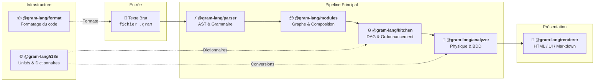

Sous le capot, Gram n'a rien d'un monolithe. C'est un assemblage de *packages* ultra-spécialisés qui se repassent la recette étape par étape. 

Saisir ce cycle de vie est indispensable si vous comptez embarquer Gram au cœur de vos applications ou *builder* des outils par-dessus.

## Le pipeline

La compilation d'une recette Gram s'écoule via un pipeline strictement unidirectionnel :

import { Steps } from '@astrojs/starlight/components';

<Steps>

1. ### Analyse syntaxique (`@gram-lang/parser`)
   Le voyage démarre ici. Le *parser* reçoit une chaîne de caractères brute (votre fichier `.gram`) et s'appuie sur une grammaire OhmJS pour en valider la syntaxe. 
   Si la syntaxe est correcte, il produit un **Arbre Syntaxique Abstrait (AST)**. Cet AST est dénué de toute logique métier : c'est une simple représentation structurelle du texte.

2. ### Résolution & composition de modules (`@gram-lang/modules`)
   Si la recette fait appel à des directives `@use`, `@gram-lang/modules` entre en scène : il explore le graphe de dépendances, désamorce les cycles, pèse les rendements des sous-recettes et isole les variables pour fusionner l'ensemble en un **AST composé** unique et autonome. Une recette mono-fichier sans import franchit cette étape sans la moindre altération.

3. ### Compilation (`@gram-lang/kitchen`)
   L'AST composé est ensuite transmis à la Kitchen (*Cuisine*). Elle porte la responsabilité de la logique structurelle de la recette :
   - **Scope & Ordonnancement** : Résolution des variables et calcul des plannings d'exécution optimisés via l'algorithme **ALAP (As Late As Possible)**.
   - **Métriques de Temps** : Extraction et calcul des *timers* (`activeTime`, `cookTime`, `preparationTime` et `totalTime`).
   - **Liste de courses** : Agrégation de base des ingrédients, sommation, et résolution des composites (ex : regrouper un zeste et un jus en un citron entier).

   Le résultat ? Une recette logiquement irréprochable et compilée sous la forme d'un `CompilationResult` (ou `ComposedCompilationResult`).

4. ### Enrichissement (`@gram-lang/analyzer`)
   L'Analyseur (*Analyzer*) récupère cette recette compilée et la croise avec votre base `ingredients.yaml`. C'est le moment où le physique percute le code :
   - **Standardisation des Masses** : Convertit les volumes (tasses, c.à.s) en masses sonnantes et trébuchantes via la densité des ingrédients.
   - **Calcul du Rendement** : Calcule la masse brute à l'achat selon la masse nette comestible.
   - **Liste de Courses (Avancée)** : Résout les ID canoniques (ex: `beurre` = `butter`) et consolide toutes les unités disparates en un poids unique en grammes. Le regroupement naïf de la Kitchen devient une liste *production-ready*.
   - **Estimation Nutritionnelle** : Calcule les macros et calories sur la base de ces masses unifiées.
   - **Pourcentage du Boulanger** : Exprime chaque ingrédient en proportion d'une référence (souvent la farine).

   Chaque *feature* de cette passe est désactivable à la carte via les options de l'application hôte.

5. ### Présentation (`@gram-lang/renderer` ou personnalisé)
   Votre recette enrichie en données est prête. Vous pouvez utiliser `@gram-lang/renderer` pour générer du Markdown, une UI web standard ou un HTML statique taillé pour l'impression. Vous pouvez également ignorer cette étape et injecter directement le JSON final dans votre application front-end (React, Vue, ou application native).
</Steps>

### Infrastructure de support (`@gram-lang/i18n` & `@gram-lang/format`)
- **`@gram-lang/i18n`** : La source de vérité absolue (SSOT) des dictionnaires de normalisation, des tables de conversion (`UNIT_CONVERSIONS`), des durées (`TIME_TO_MINUTES`) et des clés de catégories (`CATEGORY_KEYS`).
- **`@gram-lang/format`** : Le moteur de formatage canonique (13 règles strictes), partagé entre le CLI et le Language Server.

## Architecture des paquets

Cette séparation des préoccupations (*separation of concerns*) garantit des *packages* ultra-ciblés et réutilisables. Vous codez un plugin d'éditeur qui ne fait que de la coloration syntaxique ? Vous n'embarquerez que `@gram-lang/parser`.

