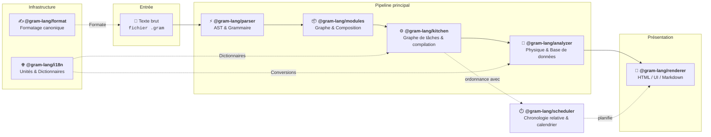

import Since from '../../../../../../components/Since.astro';
import { Steps, LinkCard, CardGrid } from '@astrojs/starlight/components';

Loin d'être un bloc monolithique, l'architecture de Gram repose sur une suite de paquets hautement spécialisés articulés au sein d'un pipeline séquentiel rigoureux.

Comprendre ce cycle de vie est essentiel pour intégrer Gram au cœur de vos applications ou concevoir vos propres outils sur mesure.

## Le pipeline de compilation

La compilation d'une recette Gram s'effectue au travers d'un flux de traitement strictement unidirectionnel :

<Steps>

1. ### Analyse syntaxique (`@gram-lang/parser`)
   Le processus débute ici. Le parseur reçoit le texte source brut (le fichier `.gram`) et s'appuie sur une grammaire Ohm.js pour en valider la conformité lexicale et syntaxique.
   Si la syntaxe est valide, il produit un **Arbre Syntaxique Abstrait (AST)**. Cet AST ne contient aucune logique métier : il s'agit d'une représentation arborescente neutre du document.

2. ### Résolution et composition de modules (`@gram-lang/modules`)
   Lorsque la recette comporte des directives d'importation `@use`, `@gram-lang/modules` explore le graphe de dépendances, désamorce les cycles, évalue les rendements des sous-recettes et encapsule les variables pour fusionner l'ensemble en un **AST composé** unique et autonome. Une recette mono-fichier sans import franchit cette étape sans la moindre altération.

3. ### Compilation structurelle (`@gram-lang/kitchen`)
   L'AST composé est transmis au compilateur Kitchen, garant de la logique structurelle de la recette :
   - **Variables et dépendances** : Déclaration des intermédiaires (`->&nom`) et résolution de leurs dépendances avales (`&nom`).
   - **Métriques temporelles fondamentales** : Calcul des durées actives (`activeTime`), de la mise en place globale (`preparationTime`) et ventilation par section (`miseEnPlace`).
   - **Graphe de tâches agnostique** : Formalisation de chaque tâche (`prep`, `step`, `passive`), de ses durées nominales et bornes d'élasticité, et de ses dépendances d'ordonnancement (`tasks`).
   - **Ordonnancement par défaut** : Calcul de la chronologie de référence via `@gram-lang/scheduler` (`schedule` : mise en place par section, durées passives au plus court). Tout ordonnancement alternatif (mise en place groupée au départ, par journée, durées passives maximales) est calculé à la demande à partir du même graphe, sans nécessiter de recompilation.
   - **Liste de courses initiale** : Fusion syntaxique des ingrédients par identifiant textuel brut et résolution des ingrédients composites.

   L'étape produit un objet `CompilationResult` (ou `ComposedCompilationResult`).

4. ### Enrichissement physique (`@gram-lang/analyzer`)
   L'Analyseur reçoit la recette compilée et la croise avec votre base de données d'ingrédients (`ingredients.yaml`). C'est l'étape où les grandeurs physiques viennent enrichir le modèle de données :
   - **Standardisation des masses** : Conversion des unités de volume (tasses, cuillères) en masses réelles en grammes via la densité propre à chaque ingrédient.
   - **Calcul des rendements** : Évaluation de la masse brute à l'achat selon la masse nette comestible requise.
   - **Liste de courses consolidée** : Résolution des synonymes canoniques (ex. `beurre` = `butter`) et agrégation multi-unités en un poids total unique.
   - **Estimation nutritionnelle** : Calcul des calories et macronutriments sur la base des masses standardisées.
   - **Pourcentages du boulanger** : Calcul des proportions massiques par rapport à l'ingrédient de référence (généralement la farine).

   Chaque fonctionnalité de cette étape peut être activée ou désactivée à la demande par l'application hôte.

5. ### Présentation et rendu (`@gram-lang/renderer` ou interface dédiée)
   La recette enrichie est prête pour l'affichage. Vous pouvez exploiter `@gram-lang/renderer` pour générer du Markdown, un fragment HTML interactif ou un document optimisé pour l'impression — ou consommer directement l'objet JSON au sein de votre propre interface applicative (React, Vue ou mobile).

</Steps>

### Le moteur d'ordonnancement (`@gram-lang/scheduler`)
<Since v="1.4.0" />

`@gram-lang/scheduler` se situe sous le compilateur Kitchen : Kitchen dépend de lui, jamais l'inverse. Le scheduler n'a aucune connaissance de l'AST ou de la syntaxe `.gram`, n'opérant que sur un graphe neutre de tâches. Il assure deux missions majeures :
- **`layout()`** ordonnance le graphe de tâches sur une chronologie relative, selon les options de mise en place et la durée choisie pour les temps passifs élastiques.
- **`project()`** projette cet ordonnancement sur le calendrier réel, à partir d'une heure de service cible, d'un fuseau horaire et de plages de disponibilité, puis `runSheet()` structure la fiche de production opérationnelle. Consultez [Planifier en heures réelles](/fr/docs/explanation/planning-in-real-time/) et [Le moteur d'ordonnancement](/fr/docs/explanation/engine/scheduler/).

### Infrastructure transversale (`@gram-lang/i18n` et `@gram-lang/format`)
- **`@gram-lang/i18n`** : Référentiel centralisé pour la normalisation linguistique, les tables de conversion d'unités (`UNIT_CONVERSIONS`), les durées (`TIME_TO_MINUTES`) et les clés de catégorisation (`CATEGORY_KEYS`).
- **`@gram-lang/format`** : Moteur de formatage déterministe (13 règles syntaxiques strictes), partagé entre le CLI et le serveur de langage (LSP).

## Architecture des paquets

Cette séparation stricte des responsabilités (*separation of concerns*) garantit des paquets ciblés, légers et réutilisables. Par exemple, une extension d'éditeur dédiée uniquement à la coloration syntaxique n'importera que le paquet `@gram-lang/parser`.

```mermaid
flowchart LR
    subgraph Input ["Entrée"]
        Raw["📄 Texte brut<br/><code>fichier .gram</code>"]
    end

    subgraph Pipeline ["Pipeline principal"]
        direction LR
        Parser["⚡ <b>@gram-lang/parser</b><br/>AST & Grammaire"]
        Modules["📦 <b>@gram-lang/modules</b><br/>Graphe & Composition"]
        Kitchen["⚙️ <b>@gram-lang/kitchen</b><br/>Graphe de tâches & compilation"]
        Analyzer["🔬 <b>@gram-lang/analyzer</b><br/>Physique & Base de données"]

        Parser --> Modules --> Kitchen --> Analyzer
    end

    Scheduler["⏱️ <b>@gram-lang/scheduler</b><br/>Chronologie relative & calendrier"]
    Kitchen -. ordonnance avec .-> Scheduler

    subgraph Output ["Présentation"]
        Renderer["🎨 <b>@gram-lang/renderer</b><br/>HTML / UI / Markdown"]
    end

    subgraph Infra ["Infrastructure"]
        Format["✍️ <b>@gram-lang/format</b><br/>Formatage canonique"]
        I18n["🌐 <b>@gram-lang/i18n</b><br/>Unités & Dictionnaires"]
    end

    Raw --> Parser
    Analyzer --> Renderer
    Scheduler -. planifie .-> Renderer
    Format -. Formate .-> Raw
    I18n -. Dictionnaires .-> Kitchen
    I18n -. Conversions .-> Analyzer
```

## Ressources associées

<CardGrid>
  <LinkCard
    title="Vue d'ensemble des APIs"
    description="Découvrez l'architecture, les imports et les rôles de chaque paquet @gram-lang."
    href="/fr/docs/reference/api/"
  />
  <LinkCard
    title="Philosophie de Gram"
    description="Les principes fondateurs des recettes sous forme de code, de la physique et du déterminisme."
    href="/fr/docs/explanation/philosophy/"
  />
  <LinkCard
    title="Créer une interface sur mesure"
    description="Comment intégrer les paquets du pipeline pour afficher des recettes dans vos applications."
    href="/fr/docs/how-to/build-custom-ui/"
  />
</CardGrid>
