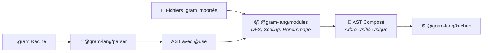
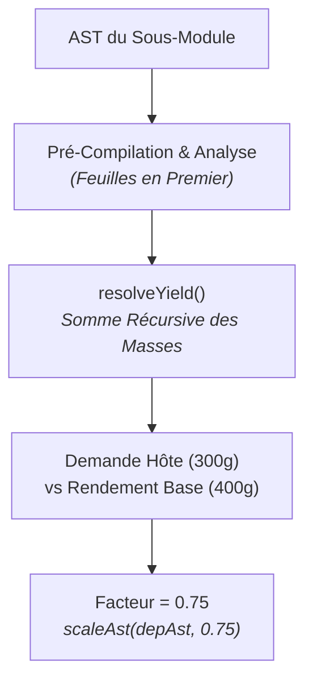

Le package `@gram-lang/modules` constitue la deuxième étape du pipeline de Gram. Il reçoit un `RecipeAST` racine comportant des directives d'importation `@use` et transforme le graphe de dépendances multi-fichiers en un **AST composé** unique, autonome et prêt pour la compilation.



## Pourquoi composer au niveau de l'AST ?

En compilation logicielle classique, les modules peuvent être compilés en fichiers objets distincts puis liés ultérieurement. En cuisine computationnelle, compiler des modules séparément produirait des plannings erronés :

- **Ordonnancement ALAP (As Late As Possible)** : Si une pâte à tarte nécessite 1 heure de repos au frais et 20 minutes de cuisson à blanc, son planning doit s'entremêler dynamiquement avec la préparation de la crème et des garnitures de la recette hôte. Compiler la pâte de manière isolée figerait ses minutages et briserait cette optimisation globale.
- **Ingrédients relationnels & Composites** : Les ingrédients des sous-bases (comme le beurre et la farine) doivent fusionner avec la liste de courses globale de l'hôte, en respectant les règles composites (`<@citron`) et les conversions d'unités pour l'ensemble du plat.

En effectuant la composition au niveau AST **avant** l'exécution de `@gram-lang/kitchen`, Gram compile et planifie l'ensemble du menu comme une recette unique en une seule passe.

## Abstraction de l'Hôte (`ModuleHost`)

`@gram-lang/modules` est totalement exempt d'I/O système ou de logique spécifique à une plateforme. Il définit l'interface `ModuleHost`, déléguant la lecture des fichiers et la résolution des chemins à l'environnement d'exécution :

- **CLI (`@gram-lang/cli`)** : Résout les chemins de racine (`@/...`) et les alias (`@bases/...`) via `node:fs` et `node:path`.
- **Serveur de Langage (`@gram-lang/language-server`)** : Lit en priorité depuis les tampons d'édition en mémoire avant de basculer sur le disque.
- **Playground Web (`packages/docs`)** : Utilise `createMemoryHost` avec un dictionnaire virtuel de fichiers en mémoire, autorisant l'édition multi-onglets en direct sans aucun système de fichiers.

## 1. Parcours du Graphe & Détection de Cycles (`graph.ts`)

Lors de l'appel à `loadModuleGraph(entryUri, host)`, le module effectue un parcours unique en profondeur (DFS) :

1. **Détection de Cycles** : Maintient une pile de parcours `pathStack`. Si une dépendance correspond à un URI parent actif, il consigne un diagnostic `MODULE_CYCLE` non fatal (`A → B → A`) et interrompt cette branche sans bloquer le système.
2. **Dépendances en Diamant** : Chaque URI est lue et analysée au maximum une fois. Si les recettes `A` et `B` importent toutes deux la base `C`, `C` est chargée une seule fois et conservée dans le registre `modules`.
3. **Ordre Topologique** : Les modules sont empilés dans `order` au fil des retours DFS (feuilles en premier). Cela garantit que les dépendances enfants sont mesurées et composées avant leurs importateurs.

## 2. Exports Publics & Hygiène des Variables (`exports.ts`, `rename.ts`)

### Règles d'Exportation
Seules les déclarations intermédiaires de niveau section (`## Pâte Sablée ->&pate`) constituent des exports publics :
- Les déclarations intermédiaires d'étape (`->&hachis`) restent strictement privées au sous-module.
- Si un module ne comporte aucune déclaration de section, sa dernière section est sélectionnée de manière déterministe comme export `default`.

### Renommage & Isolation Lexicale
Afin d'éviter tout conflit de nom lorsque plusieurs fichiers utilisent des identifiants génériques (ex : `&pate` ou `&melange`) :
1. **Exports Liés** : Renommés directement selon l'identifiant local choisi sur la ligne `@use` de l'hôte (`@use "./base.gram" as &maPate`).
2. **Variables Internes** : Préfixées avec le nom de liaison (ex : `&pate` devient `&maPate$pate`).
3. **Filet de Sécurité Anti-Collision** : Après renommage, `checkRenameCollisions()` valide les identifiants après slugification pour s'assurer qu'aucun intermédiaire distinct ne fusionne accidentellement.

## 3. Mesure du Rendement & Calcul des Proportions (`yield.ts`)

Lorsqu'une recette importatrice réclame une quantité précise d'une base (ex : `&pate{300g}`) :



1. **`resolveYield`** : Mesure récursivement la masse physique totale en grammes (`metrics.totalMass`) produite par la section exportée cible et toutes les sections en amont qui l'alimentent.
2. **`computeScaleFactor`** : Évalue le ratio :
   ```text
   Facteur d'échelle = max(Somme des quantités demandées / Rendement de l'export)
   ```
3. **Ajustement de l'AST** : `scaleAst()` multiplie chaque quantité numérique d'ingrédient et chaque minuteur dans le sous-arbre avant de l'insérer dans l'hôte.

## 4. Mode Inline vs Mode Stock (`--stock`)

Gram prend en charge deux modes d'exécution pour les dépendances modulaires :

| Fonctionnalité | Mode Inline (Défaut) | Mode Stock (`--stock`) |
|---|---|---|
| **Timeline / Gantt** | Toutes les étapes du sous-module sont insérées dans le planning hôte et entrelacées via ALAP. | **Coût timeline nul** : les étapes de préparation sont totalement omises. |
| **Liste de Courses** | Les ingrédients bruts (farine, beurre) remontent dans la liste de courses globale. | Apparaît comme une unité d'achat unique (ex : `1 pâte sablée`). |
| **Profil Nutritionnel** | Agrégé à partir de chaque ingrédient brut. | Calculé via des entrées d'ingrédients synthétiques pondérées par `accountedMass / yieldBasisMass`. |

En mode stock, `composeRecipe()` génère des définitions d'ingrédients synthétiques (`syntheticIngredients`) conservant le profil nutritionnel et la masse unitaire réels du sous-module. Transmises à `@gram-lang/analyzer`, elles permettent à la recette hôte de préserver une exactitude nutritionnelle absolue sans alourdir le planning de préparation.
