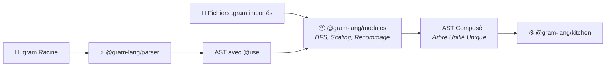
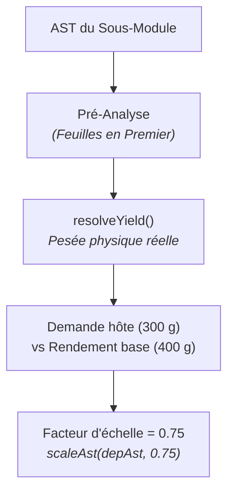

Le package `@gram-lang/modules` constitue la deuxième étape officielle du pipeline de Gram. Dès qu'une recette contient une ou plusieurs directives d'importation `@use`, ce module prend le relais du *parser* pour explorer le graphe de dépendances, résoudre les conflits de nommage, mesurer les rendements réels et fusionner le tout en un **AST composé unique**, prêt pour la compilation.



## Pourquoi composer directement au niveau de l'AST ?

Dans un compilateur logiciel classique, chaque fichier source peut être transformé en binaire objet séparé avant d'être relié à l'édition de liens (*linking*). En cuisine computationnelle, cette approche produit des plannings absurdes :

- **L'ordonnancement ALAP (*As Late As Possible*)** : Si une pâte brisée demande 1 heure de repos au frais puis 20 minutes de cuisson à blanc, son planning doit s'entremêler en direct avec la préparation de la garniture de la recette hôte. Si l'on compilait la pâte de manière isolée au préalable, ses horaires seraient figés et briseraient toute optimisation globale du temps de cuisine.
- **La consolidation des ingrédients & des composites** : Les ingrédients des sous-bases (le beurre, la farine, le sel) doivent s'agréger directement dans la liste de courses globale, en respectant la logique MAX/SUM des composites (`<@citron`) et les conversions d'unités sur l'intégralité du menu.

En réalisant la composition au niveau AST **en amont** de `@gram-lang/kitchen`, Gram compile, planifie et optimise l'ensemble du repas comme s'il s'agissait d'une seule et même recette écrite d'un seul trait.

## L'abstraction de l'hôte (`ModuleHost`)

Fidèle aux principes d'architecture de Gram, `@gram-lang/modules` ne fait aucun appel direct au système de fichiers (`node:fs`) et ne dépend d'aucune API propriétaire :

- **Dans le CLI (`@gram-lang/cli`)** : L'hôte implémente la résolution des chemins locaux (`./`), de la racine projet (`@/...`) et des alias de configuration (`@bases/...`) sur le disque.
- **Dans le Serveur de Langage (`@gram-lang/language-server`)** : L'hôte lit en priorité le contenu des tampons ouverts en mémoire dans l'éditeur avant d'aller chercher sur le disque, garantissant un retour instantané à la frappe.
- **Dans le Playground Web (`packages/docs`)** : La fonction `createMemoryHost` monte un système de fichiers virtuel en mémoire, rendant possible l'édition multi-onglets en direct dans le navigateur sans aucun serveur.

## 1. Exploration DFS & détection des cycles (`graph.ts`)

La fonction `loadModuleGraph(entryUri, host)` explore récursivement l'arbre de dépendances en une seule passe en profondeur (DFS) :

1. **Anti-cycle chirurgical** : Le moteur maintient une pile d'exécution `pathStack`. Dès qu'un import pointe vers un module déjà présent dans la chaîne courante, un diagnostic `MODULE_CYCLE` (`A → B → A`) est émis sans jamais planter le processus.
2. **Gestion des diamants** : Chaque fichier `.gram` est chargé et analysé une seule fois. Si deux préparations distinctes importent la même sous-base, celle-ci n'est lue qu'une fois.
3. **Ordre topologique (*Leaves First*)** : Les modules sont enregistrés dans `order` au fur et à mesure que leurs dépendances se résolvent (les feuilles d'abord). Ainsi, une base est toujours complètement analysée avant la recette qui la consomme.

## 2. Exports publics & hygiène lexicale (`exports.ts`, `rename.ts`)

### Que diffuse un sous-module ?
Seules les déclarations intermédiaires portées au niveau des en-têtes de section (`## Pâte Sablée ->&pate`) constituent des exports publics exploitables par l'importateur :
- Les déclarations intermédiaires d'étape (`->&hachis`) restent strictement privées et invisibles à l'extérieur.
- Si un module ne comporte aucune déclaration explicite sur ses sections, sa dernière section est automatiquement désignée comme export `default`.

### Renommage automatique sans collision
Pour éviter qu'une recette hôte et son sous-module ne se marchent sur les pieds avec des variables aux noms courants (`&pate`, `&appareil`, `&sirop`) :
1. **Liaison explicite** : L'export demandé est renommé selon l'identifiant local choisi sur la ligne `@use` (`@use "./base.gram" as &maPate`).
2. **Variables privées** : Toutes les autres variables internes du module sont préfixées par le nom de la liaison (ex : `&pate` devient `&maPate$pate`).
3. **Contrôle anti-collision post-slug** : Même si deux séparateurs diffèrent, `checkRenameCollisions()` vérifie le slug final de chaque identifiant pour garantir qu'aucune variable distincte ne fusionne par inadvertance.

## 3. Pesée des rendements & facteur d'échelle (`yield.ts`)

Lorsqu'une recette hôte ne consomme qu'une fraction d'une préparation de base (par exemple `&pate{300g}`) :



1. **`resolveYield`** : Mesure récursivement la masse comestible totale en grammes (`metrics.totalMass`) produite par la section exportée et les éventuelles sous-étapes qui la composent.
2. **`computeScaleFactor`** : Calcule le coefficient multiplicateur :
   ```text
   Facteur d'échelle = max(Somme des quantités demandées / Rendement de l'export)
   ```
3. **Ajustement en amont** : `scaleAst()` multiplie les ingrédients et durées du sous-arbre **avant** son injection dans l'hôte, garantissant des proportions parfaites.

## 4. Mode direct vs mode stock (`--stock`)

Gram propose deux approches complémentaires pour cuisiner avec des sous-recettes :

| Comportement | Mode Direct (Par défaut) | Mode Stock (`--stock`) |
|---|---|---|
| **Chronologie / Gantt** | Les étapes du sous-module sont intercalées au bon moment via ALAP. | **Impact chronologique nul** : toutes les étapes de préparation sont masquées. |
| **Liste de Courses** | Les matières premières brutes (œufs, beurre, farine) sont ajoutées au panier. | Transformé en un produit fini unique à acheter (ex : `1 pâte brisée`). |
| **Calcul Nutritionnel** | Somme des ingrédients bruts individuels. | Calculé via un ingrédient synthétique pondéré selon la masse réelle et les macros du sous-module. |

En mode stock, `composeRecipe()` crée à la volée un ingrédient synthétique (`syntheticIngredients`) porteur du profil nutritionnel et de la masse unitaire exacte de la sous-recette. Transmis à `@gram-lang/analyzer`, il assure que le total calorique et les macronutriments de votre plat restent mathématiquement rigoureux, même quand vous gagnez du temps en cuisine en achetant une base toute prête.
