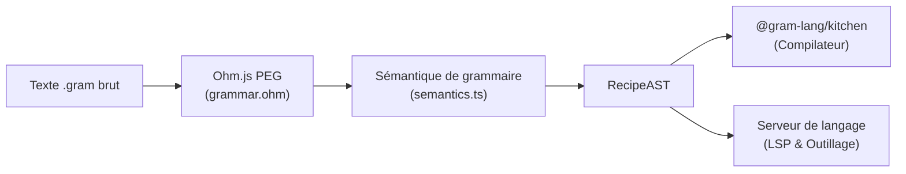

import { Card, CardGrid, LinkCard, Tabs, TabItem } from '@astrojs/starlight/components';

Le package `@gram-lang/parser` constitue le socle de l'écosystème Gram. Sa responsabilité unique consiste à lire le code source brut `.gram` pour le convertir en un Arbre Syntaxique Abstrait (*Abstract Syntax Tree*, ou AST).



## Ohm.js

Les règles syntaxiques de Gram sont définies avec [Ohm.js](https://ohmjs.org/), une boîte à outils d'analyse orientée objet fondée sur les grammaires d'analyse en expressions (*Parsing Expression Grammars*, ou PEG).

Ohm facilite la construction de grammaires modulaires et composables. Grâce à cette architecture, `@gram-lang/parser` est rapide et applique rigoureusement les contraintes de forme du langage. Par exemple, aucun espace n'est toléré immédiatement autour du marqueur composite `<@` (`invalidComposite` dans la grammaire) : ainsi, `pâte < @pâtefeuilletée` échoue à l'analyse alors que `<@pâtefeuilletée` est reconnu avec succès.

## L'arbre syntaxique abstrait (AST)

Lorsque l'analyse aboutit, le parseur produit un AST sous forme d'un arbre d'objets JavaScript représentant chaque élément sémantique de la recette.

<Tabs>
  <TabItem label="Source .gram">
```gram
Ajouter la @farine{200g}.
```
  </TabItem>
  <TabItem label="Nœud AST généré">
```json
{
  "type": "Ingredient",
  "name": "farine",
  "quantity": {
    "type": "Quantity",
    "value": { "type": "single", "value": 200, "text": "200" },
    "unit": "g",
    "fixed": false
  },
  "modifiers": [],
  "alias": null,
  "preparation": null,
  "composite": null
}
```
  </TabItem>
</Tabs>

Dans cet exemple, l'étape est traduite en un nœud `Step` abritant un nœud de texte initial (`"Ajouter la "`), un nœud `Ingredient`, et un nœud de texte final (`"."`).

Notez que `quantity.value` est systématiquement encapsulé dans un objet `QuantityValueAST` plutôt qu'un nombre brut : cela permet de préserver fidèlement les fractions (`1/2`) et les plages (`2-3`) tout en conservant la formulation textuelle d'origine de l'auteur.

## Nœuds AST supportés

Le parseur expose un type de nœud dédié pour chaque élément du langage (`ASTNodeType` dans `src/types.ts`) :

<CardGrid>
  <Card title="Recipe" icon="document">
    Le nœud racine contenant les métadonnées d'en-tête frontmatter (`meta`) et la suite de sections enfants (`Section`).
  </Card>
  <Card title="Section" icon="list-format">
    Un regroupement d'étapes (`Step`) et de commentaires de premier niveau. Peut porter une ancre de rétroplanning (`~{...}`) et une déclaration de variable intermédiaire.
  </Card>
  <Card title="Step" icon="puzzle">
    Un paragraphe décrivant une étape, enrichi de jetons sémantiques en ligne. Peut débuter par une balise d'action facultative (ex. `[Préchauffer]`).
  </Card>
  <Card title="Ingredient & Cookware" icon="star">
    Représentent les ingrédients (`@farine`) et le matériel (`#fouet`). Peuvent être combinés au sein d'un nœud `Alternative` via l'opérateur `|`.
  </Card>
  <Card title="Quantity" icon="analytics">
    Définit les quantités sous trois déclinaisons : numérique classique ou plage (`Quantity`), pourcentage de boulanger (`RelativeQuantity`), ou texte libre (`TextQuantity`).
  </Card>
  <Card title="Composite & Reference" icon="random">
    Les références composites (`<@citron`) rassemblent des sous-éléments dans un article global. Les nœuds de référence consomment des variables intermédiaires (`&pâte`).
  </Card>
</CardGrid>

:::tip[Les modificateurs sont des symboles bruts]
Le tableau `modifiers` sur les nœuds `Ingredient` et `Cookware` conserve directement les caractères de ponctuation tels qu'écrits dans le code source (`?`, `-`, `*`, `&`), sans étiquettes textuelles intermédiaires. L'attribut `=` est traité à part : plutôt que de figurer dans `modifiers`, il active directement `quantity.fixed: true`.
:::

## Purement syntaxique

`@gram-lang/parser` effectue une analyse purement syntaxique, sans évaluation sémantique ni validation métier :

- Il ne vérifie pas si une variable intermédiaire `&pâte` a été déclarée en amont.
- Il n'effectue aucun calcul d'échelle de quantité ni de conversion d'unités.
- Il ignore si un ingrédient est répertorié ou non dans le fichier `ingredients.yaml`.

Il réalise en revanche quelques ajustements locaux purement structurels lors de l'assemblage de l'arbre : il valide le frontmatter de la recette (écartant silencieusement les champs non conformes au schéma), calcule la moyenne des plages de valeurs (`2-3` produit une valeur moyenne de `2.5`) pour simplifier les calculs en aval, et émet des erreurs syntaxiques ciblées lorsque la syntaxe d'un ingrédient composite est invalide.

La résolution sémantique, la planification temporelle et la validation des références sont ensuite déléguées à l'étape suivante du pipeline : `@gram-lang/kitchen`.

## Ressources associées

<CardGrid>
  <LinkCard
    title="Référence de l'API Parser"
    description="Signatures d'API, types AST, erreurs de parsing et options pour @gram-lang/parser."
    href="/fr/docs/reference/api/parser/"
  />
  <LinkCard
    title="Compilation Kitchen"
    description="Comment le compilateur résout les variables, génère le graphe de tâches et compile la recette."
    href="/fr/docs/explanation/engine/kitchen/"
  />
  <LinkCard
    title="Structure du document"
    description="Spécification syntaxique complète pour les sections, étapes, frontmatter et commentaires."
    href="/fr/docs/reference/syntax/document-structure/"
  />
</CardGrid>
