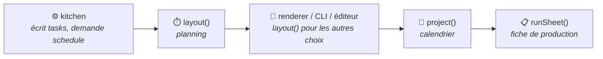

`@gram-lang/scheduler` est la partie de Gram qui décide **quand** les choses se passent. Jusqu'à la 1.4.0, elle faisait partie de la Kitchen ; c'est maintenant un paquet à part, pour que le même moteur serve le compilateur, le moteur de rendu, la CLI, l'éditeur et vos propres outils.

Il se place **sous** la Kitchen : `@gram-lang/kitchen` en dépend, jamais l'inverse. Il ne connaît ni l'AST, ni la syntaxe `.gram`, ni la recette compilée. Sa seule entrée est un **graphe de tâches** neutre, et un test interdit tout import d'un autre paquet de Gram pour que ça le reste.

## Le graphe de tâches

La Kitchen écrit le graphe dans la recette compilée (`tasks`) : il contient les faits de la recette, et rien qui dépende de la façon dont on la lit.

- **Tâches `prep`** : le travail pour préparer une section. Chaque section en a une pour ce qu'elle rassemble ou prépare à partir d'ingrédients bruts, plus une par intermédiaire qu'elle utilise (`&pâte`), qui ne peut pas commencer avant que l'intermédiaire existe.
- **Tâches `step`** : une par étape, avec le temps passé les mains dedans.
- **Tâches `passive`** : les minuteurs d'une étape, avec le décalage auquel ils démarrent, et la piste pour un minuteur nommé (`~_four{}`).
- **Les durées** sont `{ nominal, min?, max? }` : `min` et `max` n'existent que pour un repos passif écrit en fourchette, et `nominal` est ce sur quoi le planning par défaut se base (le chiffre le plus court d'une fourchette passive, le plus long d'une fourchette active, la valeur elle-même sinon).
- Chaque tâche liste ce qu'elle attend (`after`), et son identifiant est stable et lisible : `s0.prep`, `s1.prep.pâte`, `s0.3`, `s0.3.t0`.
- Chaque section porte sa journée de travail (`day`), son échéance en minutes avant la fin quand elle a une ancre, et l'intermédiaire qu'elle fabrique.

Comme le graphe ne dépend d'aucune option, chaque combinaison de plan de mise en place et de choix de repos se calcule à partir de lui, sans recompiler.

## Deux niveaux

| Niveau | Fonction | Entrée | Sortie |
|---|---|---|---|
| **1. Le planning** | `layout(graph, options)` | Le graphe, et éventuellement `{ miseEnPlace, rests }` | Un `Schedule` (blocs, journées, totaux) et les diagnostics qui ne dépendent de personne |
| **2. Le calendrier** | `project(recipes, context)` | Le ou les graphes, une heure de service, un fuseau, des disponibilités | Un plan : chaque bloc avec sa date et son heure, les repos qui ont bougé, les moments où vous n'êtes pas disponible, et ce qui n'a pas pu être arrangé |
| | `runSheet(plan)` | Le plan | La structure d'une fiche de production |

Les deux sont **pures** : la même entrée donne toujours la même sortie, rien n'est lu sur la machine (ni horloge, ni fuseau), et le graphe n'est jamais modifié. `project()` prend dès le départ une liste de recettes, mais ne planifie que la première pour l'instant, et le dit (`MULTI_RECIPE_UNSUPPORTED`).

## Comment fonctionne `layout()`

Le moteur est l'algorithme « le plus tard possible » décrit dans l'[ordonnancement ALAP](/fr/docs/explanation/alap-scheduling/), en plusieurs passes :

1. **Passe arrière** : en allant de la dernière section à la première, chaque étape reçoit le dernier moment où elle peut commencer, d'après les ancres des sections et ce qui consomme ce qu'elle fabrique.
2. **Pistes nommées** : deux minuteurs d'une même piste ne peuvent pas se chevaucher ; le second est repoussé, et une contention est signalée.
3. **Recalage** : tout est décalé pour que le planning commence à 0.
4. **Mise en place** : la préparation de chaque groupe de sections est insérée comme un travail à part, et la passe arrière est rejouée, de sorte que chaque préparation finit pile quand le travail qu'elle précède commence. Un groupe par section donne « par section », un seul groupe donne « tout au début », un par journée de travail donne « par journée ». Un intermédiaire fabriqué dans son groupe est planifié juste avant la section qui l'utilise.

Les repos écrits en fourchette se lisent sur le chiffre que `rests` choisit (le plus court, le milieu, le plus long), et un minuteur actif sur son chiffre nominal, pour qu'une incertitude de cuisson ne fasse jamais servir en retard.

## Comment fonctionne `project()`

Il pose le graphe, place la fin à l'heure du service, puis remonte le temps depuis le service. Chaque bloc de travail hors de vos disponibilités est déplacé en allongeant ou en raccourcissant le repos écrit en fourchette le plus proche après lui, en reposant le graphe avec ce repos modifié. Voir [Planifier en heures réelles](/fr/docs/explanation/planning-in-real-time/) pour ce que ça change pour vous.

Le temps est compté en minutes absolues depuis l'epoch, et l'heure locale se lit avec `Intl.DateTimeFormat` et un fuseau explicite. Pas de librairie de dates, pas d'horloge cachée : le même plan sort sous n'importe quelle valeur de `TZ`, et un jour de 23 ou de 25 heures compte pour ce qu'il dure.

## Les diagnostics

Deux familles, séparées exprès :

- **De la recette elle-même**, connus à la compilation et rendus par `layout()` sous forme de données : `TIME_PARADOX`, `TRACK_CONTENTION`, `SESSION_OVERFLOW`. La Kitchen les met en mots comme des avertissements, avec le titre et la position dans le source de la section : il n'y a qu'une liste d'avertissements, visible dans l'éditeur.
- **De votre contexte**, qui n'existent qu'à partir du moment où il y a une heure de service et des disponibilités : `ACTIVE_OUTSIDE_AVAILABILITY`, `ACTIVE_BLOCK_EXCEEDS_AVAILABILITY`, `SESSION_DAY_MISMATCH`, `START_IN_PAST`, `MULTI_RECIPE_UNSUPPORTED`. Ils font partie du résultat de `project()`, ce ne sont pas des avertissements du compilateur.

## Dans le pipeline

Voir la [référence de l'API scheduler](/fr/docs/reference/api/scheduler/) pour les fonctions et leurs types.
