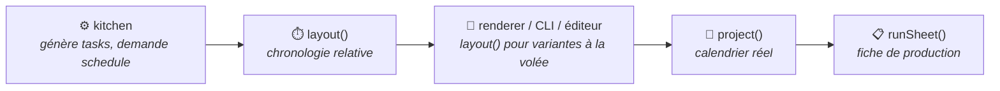

import Since from '../../../../../../components/Since.astro';
import { Steps, LinkCard, CardGrid } from '@astrojs/starlight/components';

<Since v="1.4.0" />

`@gram-lang/scheduler` est le composant de Gram qui gère la dimension temporelle : il détermine **à quel moment précis** chaque tâche doit s'exécuter. Jusqu'à la version 1.4.0, cette logique était intégrée au compilateur Kitchen. Elle est désormais isolée dans un paquet dédié, permettant au même moteur de servir le compilateur, le moteur de rendu, le CLI, le serveur de langage (LSP) et vos propres intégrations.

Le scheduler se situe **en dessous** de Kitchen : `@gram-lang/kitchen` dépend de lui, jamais l'inverse. Il n'a aucune connaissance de l'AST, de la syntaxe `.gram` ou de la recette compilée. Son unique point d'entrée est un **graphe de tâches** agnostique ; des tests d'architecture garantissent l'absence absolue de dépendance envers les autres paquets du monorepo.

## Le graphe de tâches

Kitchen génère ce graphe au sein de la recette compilée (`tasks`) : il formalise les données intrinsèques de la recette, indépendamment de toute option d'ordonnancement ou d'affichage :

- **Tâches `prep`** : le travail nécessaire pour préparer une section. Chaque section comporte une tâche de préparation pour rassembler et peser ses ingrédients bruts, plus une tâche par préparation intermédiaire utilisée (`&pâte`), qui ne peut débuter avant que l'intermédiaire ne soit disponible.
- **Tâches `step`** : une tâche par étape, correspondant à la durée de travail actif (manipulations manuelles directes).
- **Tâches `passive`** : les minuteurs passifs d'une étape (cuisson au four, pousse, repos, refroidissement…), avec le décalage auquel ils démarrent et la piste éventuelle pour un équipement dédié (`~_four{}`).
- **Durées structurées** : chaque tâche possède une durée `{ nominal, min?, max? }`. Les bornes `min` et `max` ne sont définies que pour les attentes écrites sous forme de fourchette (`~_{8-16h}`) ; `nominal` représente la durée retenue par défaut (la valeur minimale pour un minuteur passif, maximale pour une tâche active, ou la valeur fixe le cas échéant).
- **Dépendances explicites** : chaque tâche liste les identifiants de celles dont elle dépend (`after`). Les identifiants sont déterministes et lisibles : `s0.prep`, `s1.prep.pâte`, `s0.3`, `s0.3.t0`.
- **Métadonnées de section** : chaque section porte son jour de travail cible (`day`), son échéance en minutes avant la fin lorsqu'elle possède une ancre, et la variable intermédiaire qu'elle produit.

Ce graphe étant totalement indépendant des choix de l'utilisateur, toute combinaison de mise en place et d'élasticité des attentes peut être recalculée à la volée, sans recompiler la recette.

## Deux niveaux de planification

| Niveau | Fonction | Entrée | Sortie |
|---|---|---|---|
| **1. Chronologie théorique** | `layout(graph, options)` | Le graphe de tâches, et optionnellement `{ miseEnPlace, rests }` | Un `Schedule` (blocs ordonnancés, journées relatives, cumuls de temps) et les diagnostics intrinsèques à la recette |
| **2. Projection calendaire** | `project(recipes, context)` | Le ou les graphes, une heure de service, un fuseau horaire et les disponibilités | Un plan horodaté : chaque bloc avec sa date et heure locales, les attentes ajustées, les plages d'indisponibilité et les conflits non résolus |
| | `runSheet(plan)` | Le plan projeté | La structure arborescente d'une fiche de production |

Ces fonctions sont **strictement pures** : une même entrée produit toujours la même sortie, aucune horloge système ni fuseau implicite n'est consulté, et le graphe d'origine demeure immuable. `project()` accepte par conception une collection de recettes, mais ne planifie pour le moment que la première en signalant le diagnostic `MULTI_RECIPE_UNSUPPORTED`.

## Fonctionnement de `layout()`

Le moteur applique l'algorithme au plus tard décrit dans l'[ordonnancement ALAP](/fr/docs/explanation/alap-scheduling/), articulé en plusieurs passes successives :

<Steps>
1. **Passe arrière (ALAP)**  
   En parcourant les sections de la dernière à la première, chaque étape reçoit l'instant de démarrage le plus tardif possible, calculé d'après les ancres temporelles et les étapes consommatrices de ses préparations.

2. **Résolution des pistes nommées**  
   Deux minuteurs affectés à une même ressource (ex. `~_four{}`) ne peuvent pas se chevaucher. Le plus en amont est automatiquement décalé pour libérer la piste, et une contention (`TRACK_CONTENTION`) est signalée.

3. **Recalage à l'origine**  
   L'ensemble de la chronologie est translaté pour que l'instant initial corresponde exactement à zéro.

4. **Insertion de la mise en place**  
   Le travail de pesée et de préparation associé à chaque groupe de sections est inséré sous forme de blocs de travail dédiés, puis la passe arrière est réexécutée pour que chaque préparation s'achève précisément à l'instant où débute la première étape qui la requiert. Selon l'option choisie :
   - `"perSection"` insère la préparation juste avant chaque section ;
   - `"upfront"` regroupe toutes les préparations au tout début de la recette ;
   - `"perSession"` place les préparations au début de chaque journée de travail.
</Steps>

Les attentes écrites sous forme de fourchette adoptent la stratégie spécifiée via `rests` (`"shortest"`, `"balanced"` ou `"longest"`). Les minuteurs actifs adoptent quant à eux toujours leur durée maximale nominale, garantissant qu'un aléa de préparation ne retarde jamais le service.

## Fonctionnement de `project()`

`project()` commence par ordonnancer le graphe via `layout()`, cale l'instant final sur l'heure de service demandée, puis remonte la chronologie :

- Tout bloc de travail actif débordant sur une plage d'indisponibilité est décalé en allongeant ou en raccourcissant l'attente flexible (écrite sous forme de fourchette) la plus proche en aval.
- L'ordonnancement complet est recalculé à chaque ajustement pour vérifier la validité des dépendances et l'absence de conflit de piste.
- Pour une explication pas à pas, consultez le guide [Planifier en heures réelles](/fr/docs/explanation/planning-in-real-time/).

Le temps interne est compté en minutes continues absolues depuis l'époque POSIX. La restitution en heure locale s'appuie sur `Intl.DateTimeFormat` avec un fuseau horaire explicite. Aucun recours à une bibliothèque tierce ou à une horloge système implicite n'est nécessaire : le plan reste strictement identique quel que soit l'environnement hôte, et une journée de 23 ou 25 heures (changement d'heure) est restituée avec sa durée réelle.

## Deux familles de diagnostics

Le moteur distingue rigoureusement deux catégories d'anomalies :

- **Diagnostics intrinsèques à la recette** : identifiés dès la phase d'ordonnancement par `layout()` (`TIME_PARADOX`, `TRACK_CONTENTION`, `SESSION_OVERFLOW`). Kitchen les transforme en avertissements de compilation (`WarningCode`), enrichis du titre de la section et de son emplacement dans le code source pour l'affichage dans l'éditeur.
- **Diagnostics contextuels de projection** : ils n'apparaissent qu'une fois l'heure de service et les disponibilités utilisateur confrontées à la recette (`ACTIVE_OUTSIDE_AVAILABILITY`, `ACTIVE_BLOCK_EXCEEDS_AVAILABILITY`, `SESSION_DAY_MISMATCH`, `START_IN_PAST`, `MULTI_RECIPE_UNSUPPORTED`). Ils font partie du résultat retourné par `project()` et ne constituent pas des erreurs de compilation.

## Intégration dans le pipeline

Pour explorer les signatures de fonctions et leurs types TypeScript, consultez la [référence de l'API scheduler](/fr/docs/reference/api/scheduler/).

## Ressources associées

<CardGrid>
  <LinkCard
    title="Référence de l'API Scheduler"
    description="Signatures de fonctions, options et types TypeScript pour layout(), project() et runSheet()."
    href="/fr/docs/reference/api/scheduler/"
  />
  <LinkCard
    title="Planifier en heures réelles"
    description="Comment le moteur projette les tâches sur des horaires réels et vos plages de disponibilité."
    href="/fr/docs/explanation/planning-in-real-time/"
  />
  <LinkCard
    title="Ordonnancement ALAP"
    description="Comprenez l'algorithme rétrograde qui optimise les tâches actives et passives."
    href="/fr/docs/explanation/alap-scheduling/"
  />
  <LinkCard
    title="Mise en place et planification"
    description="Comment les coûts de préparation et les sessions sur plusieurs jours interagissent."
    href="/fr/docs/explanation/mise-en-place-and-planning/"
  />
</CardGrid>
