import Since from '../../../../../components/Since.astro';

<Since v="1.4.0" />

À la lecture d'une recette, on a vite tendance à confondre trois notions : **ce qu'il faut**, **la préparation requise** et **le moment où on s'y met**. Gram prend le parti de bien les dissocier, et seul le dernier relève réellement d'un choix.

Pour une recette simple, pas d'inquiétude : la configuration par défaut s'occupe de tout sans aucun réglage. La suite s'adresse à celles et ceux qui souhaitent orchestrer une recette plus élaborée, composée de plusieurs préparations ou étalée sur plusieurs jours.

## Trois notions, un seul choix

| | Ce que c'est | Le choix de planning le modifie-t-il ? |
|---|---|---|
| **Ingrédients** | Ce qu'il faut : la liste d'ingrédients de chaque section, la liste de courses | Non |
| **Mise en place** | Le travail de préparation : sortir, peser, éplucher, tailler. Chaque section annonce son propre coût (`miseEnPlace`) | Non |
| **Planning** | Quand ce travail a lieu : la chronologie, le temps total, le temps d'attente et le diagramme de Gantt | **Oui**, c'est la seule chose qu'il change |

La recette ne dicte jamais son propre planning. Elle énonce des faits (les ingrédients requis et le temps nécessaire pour les préparer), et c'est **vous** qui décidez comment organiser ce travail dans le temps.

Une règle simple à retenir : changer de planning ne modifie jamais les ingrédients, la liste de courses, le temps de préparation ni le temps actif. Cela déplace simplement les blocs de travail sur la chronologie.

## Les trois plannings

Gram propose trois stratégies pour organiser la mise en place. Prenons cette recette :

```gram
## Pâte ->&pâte

[Mélanger] La @farine{500g} et l'@eau{300ml} dans un #saladier.

[Pointer] Laisser reposer ~_{30min}.

## Garniture ->&garniture

[Émincer] Les @oignons{200g}(finement émincés).

## Montage

[Assembler] La &pâte et la &garniture, puis cuire ~{25min}.
```

Gram estime automatiquement un temps de préparation pour chaque section selon les ingrédients à peser ou découper et le matériel requis (ici : 3 min pour la pâte, 3 min pour la garniture, 1 min pour le montage, soit 7 min au total). Le temps actif de cuisine est de 29 minutes, quel que soit le planning choisi.

### Par section (défaut)

Ce mode positionne la préparation de chaque section au plus près de son exécution. Dès qu'un temps d'attente passif se présente (un repos de pâte, une cuisson au four), Gram en profite pour y glisser la préparation de la suite.

En cuisine professionnelle comme en gestion de production, c'est ce qu'on appelle travailler en **temps masqué** : une tâche active effectuée *pendant* une attente passive n'ajoute aucune minute supplémentaire au temps total de la recette.

```mermaid
gantt
    title Par section — Travail en temps masqué (1 h 01)
    dateFormat  HH:mm
    axisFormat %H:%M
    todayMarker off
    section Pâte
    Mise en place                     : p1, 00:00, 3m
    Mélanger                          : active, a1, 00:03, 2m
    Repos (passif)                    : r1, 00:05, 30m
    section Garniture
    Mise en place                     : p2, 00:30, 3m
    Émincer                           : active, a2, 00:33, 2m
    section Montage
    Mise en place                     : p3, 00:35, 1m
    Assembler et cuire                : active, a3, 00:36, 25m
```



- La pâte est préparée à 00:00, puis repose 30 minutes (de 00:05 à 00:35).
- La garniture est préparée en temps masqué pendant la fin du repos de la pâte (à partir de 00:30) : vos oignons restent frais et n'attendent pas inutilement sur le plan de travail.
- La durée totale est optimisée à **1 h 01** (61 min).

### Tout au début

Ce mode rassemble l'ensemble des pesées et découpes des ingrédients bruts avant d'allumer le feu :

```mermaid
gantt
    title Tout au début — Préparation groupée (1 h 04)
    dateFormat  HH:mm
    axisFormat %H:%M
    todayMarker off
    section Mise en place
    Pâte                              : p1, 00:00, 3m
    Garniture                         : p2, 00:03, 3m
    section Pâte
    Mélanger                          : active, a1, 00:06, 2m
    Repos (passif)                    : r1, 00:08, 30m
    section Garniture
    Émincer                           : active, a2, 00:36, 2m
    section Montage
    Sortir la pâte                    : p3, 00:38, 1m
    Assembler et cuire                : active, a3, 00:39, 25m
```



- La pâte et la garniture sont préparées dès 00:00 (jusqu'à 00:06).
- La durée totale passe à **1 h 04** (64 min), car la préparation de la garniture n'est plus réalisée en temps masqué pendant le repos de la pâte.

### Par session (ou par journée de travail)

Ce mode regroupe la préparation par journée de travail. Comme cette recette tient sur une seule journée (aucune section n'a d'ancre dans le passé comme `~{-1d}`), ce mode donne exactement le même résultat que « Tout au début ». Il prend tout son sens pour les recettes étalées sur plusieurs jours (voir ci-après).

Aucun mode n'est meilleur qu'un autre : le premier optimise le temps global et la fraîcheur des découpes ; le deuxième convient à celles et ceux qui aiment avoir tous les bols prêts avant de commencer ; le troisième structure les plannings de production étalés dans le temps.

:::note[Cas particulier : un intermédiaire n'est jamais préparé avant d'exister]
Un ingrédient intermédiaire (`&pâte`) est produit au cours de la recette : on ne peut donc ni le sortir ni le peser avant que la section qui le fabrique soit terminée. Cette règle de bon sens s'applique à tous les plannings :

- **Comptabilisation** : l'intermédiaire compte dans la mise en place de la section qui l'**utilise**, pas de celle qui le fabrique.
- **En mode « Tout au début »** : les ingrédients bruts sont préparés dès le départ, mais l'intermédiaire n'est mobilisé qu'au moment précis où la section suivante en a besoin (dans notre exemple, `&pâte` est récupéré après son repos, juste avant le montage).
:::

## Les repos en fourchette

Un repos peut être exact (`~_{12h}`) ou écrit en fourchette (`~_{12-24h}` : prêt dès 12 heures, encore bon à 24). Un repos exact ne bouge jamais. Une fourchette est une marge, et vous choisissez comment la lire, comme vous choisissez l'endroit de la mise en place :

- **`shortest`** (par défaut) : chacun de ces repos dure le plus court de sa fourchette ;
- **`balanced`** : le milieu ;
- **`longest`** : le plus long.

Cela change les temps total et d'attente et le diagramme de Gantt, rien d'autre. Un minuteur actif écrit en fourchette (`~{40-50min}`) est une incertitude de cuisson, pas une marge : il est toujours planifié sur son chiffre le plus long, pour ne jamais servir en retard, quel que soit votre choix.

Quand vous indiquez aussi à Gram l'heure du service et vos disponibilités, il se sert de cette marge pour que votre propre travail évite la nuit : voir [Planifier en heures réelles](/fr/docs/explanation/planning-in-real-time/).

## Où et comment choisir son planning

Une règle fondamentale dans Gram : **la recette ne contient aucune syntaxe pour imposer son planning**. Elle décrit uniquement des faits culinaires (les ingrédients, le matériel, les actions et les temps).

Lors de la compilation, Gram ne vous oblige pas non plus à faire un choix figé. Le JSON compilé transporte les faits (`miseEnPlace`, et `tasks` : la liste de tout ce qu'il y a à faire et de ce que chaque tâche attend) et **un seul planning par défaut**, `schedule` (mise en place par section, repos les plus courts) :

```json
{
  "miseEnPlace": { /* faits bruts : durées estimées par section */ },
  "tasks":       { /* le graphe des tâches, indépendant de tout réglage */ },
  "schedule":    { /* le planning par défaut, posé à partir de `tasks` */ }
}
```

Toute autre combinaison (tout au début, par journée, repos les plus longs...) se calcule à la demande à partir de `tasks`, avec `layout()` de `@gram-lang/scheduler`, **sans recompiler**. Le choix du planning intervient donc **uniquement au moment du rendu, de l'export ou de l'affichage** : c'est le consommateur final (le cuisinier ou l'interface) qui décide quelle projection temporelle visualiser :

| Outil | Où va la mise en place | Durée des repos |
|---|---|---|
| **CLI** (`gram view`, `gram export`, `gram print`, `gram cook`, `gram plan`) | `--mise-en-place <per-section\|upfront\|per-session>` | `--rests <shortest\|balanced\|longest>` |
| **VS Code** | Réglage `gram.miseEnPlace` | Réglage `gram.rests` |
| **Playground** | Sélecteur « Mise en place » | Sélecteur « Repos » |
| **Moteur de rendu** (`@gram-lang/renderer`) | Option `miseEnPlace: "perSection" \| "upfront" \| "perSession"` | Option `rests` |

Pour les développeurs qui créent leur propre interface, c'est particulièrement pratique : vous n'avez aucun algorithme d'ordonnancement à réécrire côté client. Lisez `schedule` pour le planning par défaut, ou appelez `layout()` pour un autre (voir la [référence de l'API kitchen](/fr/docs/reference/api/kitchen/) et celle de l'[API scheduler](/fr/docs/reference/api/scheduler/)).

## Les recettes sur plusieurs jours

Une recette longue (**pain au levain**, **bœuf mariné**, **croissants** ou **saumon gravlax**) s'organise naturellement par sessions : chaque jour, on prépare uniquement ce dont la journée a besoin. Le planning **par session** (`per-session`) génère une feuille de route quotidienne, en se basant simplement sur les ancres de rétroplanning (`~{-1d}`, `~{-2d}`) déjà présentes dans votre recette.

```gram
## Crème ~{-3d} ->&crème

[Fouetter] Le @lait{500ml} et les @œufs{4}.

[Reposer] Laisser prendre à ^{4C} pendant ~_{24h}.

## Fond ->&fond

[Travailler] La &crème{150g} avec la @farine{300g} et le @beurre{150g}.

## Tarte ~{-1d}

[Garnir] Avec le &fond{400g}

[Cuire] ~{30min}.

## Service

[Saupoudrer] De @sucre{10g}.
```

### Comment Gram découpe les journées

Pour structurer une recette en sessions quotidiennes, il faut des ancres **en jours** : `~{-1d}`, `~{-2d}`, `~{-3d}`. La distinction entre les deux unités est fondamentale :

- **`~{-Nd}` (jours) = une journée de travail.** C'est une intention humaine claire (*« cette préparation se fait la veille (J-1) »*, *« deux jours avant (J-2) »*). Gram regroupe alors la mise en place de ces sections dans une session dédiée.
- **`~{-Nh}` (heures) = une échéance à l'intérieur de la journée.** Une ancre comme `~{-2h}` ou `~{-36h}` indique au moteur d'ordonnancement que l'étape doit s'achever 2 heures, ou 36 heures, avant le service, mais elle n'ouvre **jamais** de journée à elle seule : une recette `.gram` ne connaît pas l'heure réelle de votre repas, et convertir des heures en jours créerait des ambiguïtés (`~{-12h}` tombe le matin même si vous dînez à 20 h, mais la veille à minuit si vous déjeunez à 12 h).

Une section sans ancre prend le jour de **l'ancre en jours la plus lointaine parmi les sections qui la suivent**, ou le jour J s'il n'y en a pas. Dans l'exemple, le fond n'a pas d'ancre : il tombe à J-1 avec la tarte, et l'ordonnancement ALAP le place le plus tard possible, juste avant elle.

:::caution[Attention aux faux amis]
Deux situations courantes ne créent **pas** de nouvelle journée de travail :

1. **Un long repos passif sans ancre de section** : une étape `[Repos] Laisser reposer ~_{48h}.` fait remonter l'étape de deux jours sur le diagramme de Gantt, mais ne crée pas de session J-2 si la section n'est pas explicitement ancrée. Pensez à nommer votre section avec son ancre (ex. : `## Crème ~{-2d}`).
2. **Une ancre en heures** : une valeur comme `~{-18h}` ou `~{-36h}` reste une échéance du jour où tombe la section. Une pâte préparée la veille au soir restera donc groupée sur le jour J. Pour ouvrir une vraie session la veille, utilisez explicitement `~{-1d}`.
:::

Dans l'exemple ci-dessus :
- La **crème** est travaillée à **J-3** ;
- Le **fond** et la **tarte** sont réalisés à **J-1** ;
- Le **service** a lieu le **jour J**.

Chaque journée est censée tenir dans les 24 heures qui précèdent la suivante. Si un long repos repousse le travail d'une journée hors de cette fenêtre (une pâte `~{-1d}` qui fermente 50 heures), Gram prévient avec `SESSION_OVERFLOW` et suggère d'ancrer la section plus loin.

### Ce que chaque session rassemble

Au début de chaque journée de travail, Gram rassemble la mise en place nécessaire aux étapes du jour :

- Un ingrédient intermédiaire **fabriqué un jour précédent** (la crème, confectionnée à J-3) est sorti dès le début de la session où on l'utilise (à J-1).
- Un intermédiaire **fabriqué le jour même** (le fond pour la tarte) attend son tour juste avant l'étape de montage, puisqu'il n'existe pas encore au démarrage de la journée.

Le temps de préparation global et le temps actif restent rigoureusement identiques entre tous les modes de planning.

:::tip
Quand plusieurs sections se suivent le même jour, n'ancrez que la dernière (`## Tarte ~{-1d}`) et laissez les autres sans ancre, comme le fond ci-dessus : elles prennent son jour et se placent juste avant elle. Leur donner à toutes `~{-1d}` fait de chacune une échéance au même instant, et quand l'une a besoin de l'autre, cela déclenche un avertissement de paradoxe temporel.
:::

## Pour aller plus loin

- [Temps et durées](/fr/docs/reference/syntax/times/#quand-se-fait-la-mise-en-place) pour explorer les trois types de temps d'une recette.
- [Ordonnancement ALAP](/fr/docs/explanation/alap-scheduling/) pour comprendre comment les étapes s'alignent automatiquement sur la chronologie.
