```mermaid
gantt
    title Par section — Travail en temps masqué (1 h 01)
    dateFormat  HH:mm
    axisFormat %H:%M
    todayMarker off
    section Pâte
    Mise en place                     : p1, 00:00, 3m
    Mélanger                          : active, a1, 00:03, 2m
    Repos (passif)                    : r1, 00:05, 30m
    section Garniture
    Mise en place                     : p2, 00:30, 3m
    Émincer                           : active, a2, 00:33, 2m
    section Montage
    Mise en place                     : p3, 00:35, 1m
    Assembler et cuire                : active, a3, 00:36, 25m
```

import Since from '../../../../../components/Since.astro';
import { LinkCard, CardGrid } from '@astrojs/starlight/components';

<Since v="1.4.0" />

Lors de la lecture d'une recette, trois notions complémentaires sont fréquemment confondues : **les besoins bruts**, **le travail de préparation préalable** et **l'ordonnancement temporel**. Gram distingue formellement ces trois aspects, seul le dernier dépendant des choix de l'utilisateur.

Pour une recette simple, la configuration par défaut planifie l'ensemble sans réglage particulier. Les sections suivantes s'adressent à celles et ceux qui souhaitent orchestrer une recette élaborée, composée de plusieurs préparations ou étalée sur plusieurs journées.

## Trois notions, un seul choix

| | Définition | Modifié par le choix d'ordonnancement ? |
|---|---|---|
| **Ingrédients** | Besoins matériels : la liste d'ingrédients de chaque section, la liste de courses consolidée | Non |
| **Mise en place** | Travail de préparation amont : pesée, lavage, épluchage, découpe. Chaque section annonce son propre coût (`miseEnPlace`) | Non |
| **Planning** | Ordonnancement temporel : chronologie relative, temps total, durée passive globale et diagramme de Gantt | **Oui**, c'est l'unique dimension modifiée |

La recette ne dicte jamais son propre ordonnancement. Elle énonce des faits culinaires (les ingrédients requis et le temps estimé pour les préparer) ; il revient à **l'utilisateur** de décider comment organiser ce travail dans le temps.

Une règle simple à retenir : changer d'option d'ordonnancement ne modifie jamais les ingrédients, la liste de courses, le temps de préparation ni le travail actif. Cela déplace uniquement les blocs de travail sur la chronologie.

## Les trois stratégies de mise en place

Gram propose trois stratégies pour organiser la mise en place. Prenons cette recette :

```gram
## Pâte ->&pâte

[Mélanger] La @farine{500g} et l'@eau{300ml} dans un #saladier.

[Pointer] Laisser reposer ~_{30min}.

## Garniture ->&garniture

[Émincer] Les @oignons{200g}(finement émincés).

## Montage

[Assembler] La &pâte et la &garniture, puis cuire ~{25min}.
```

Gram estime automatiquement un temps de préparation pour chaque section selon les ingrédients à peser ou découper et le matériel requis (ici : 3 min pour la pâte, 3 min pour la garniture, 1 min pour le montage, soit 7 min au total). Le travail actif cumulé est de 29 minutes, quelle que soit la stratégie retenue.

### Par section (défaut)

Ce mode positionne la préparation de chaque section au plus près de son exécution. Dès qu'un temps passif se présente (fermentation, cuisson au four, refroidissement), Gram y insère la préparation de l'étape suivante.

En cuisine professionnelle comme en gestion de production, c'est ce que l'on nomme le travail en **temps masqué** : une tâche active effectuée *pendant* une durée passive n'ajoute aucune minute supplémentaire au temps total de la recette.



- La pâte est préparée à 00:00, puis fermente pendant 30 minutes (de 00:05 à 00:35).
- La garniture est préparée en temps masqué vers la fin de la pousse de la pâte (à partir de 00:30) : les ingrédients découpés restent frais sans encombrer inutilement le plan de travail.
- La durée totale est optimisée à **1 h 01** (61 min).

### Tout au début

Ce mode rassemble l'ensemble des pesées et découpes des ingrédients bruts avant d'entamer la première manipulation :



```mermaid
gantt
    title Tout au début — Préparation groupée (1 h 04)
    dateFormat  HH:mm
    axisFormat %H:%M
    todayMarker off
    section Mise en place
    Pâte                              : p1, 00:00, 3m
    Garniture                         : p2, 00:03, 3m
    section Pâte
    Mélanger                          : active, a1, 00:06, 2m
    Repos (passif)                    : r1, 00:08, 30m
    section Garniture
    Émincer                           : active, a2, 00:36, 2m
    section Montage
    Sortir la pâte                    : p3, 00:38, 1m
    Assembler et cuire                : active, a3, 00:39, 25m
```

- La pâte et la garniture sont préparées dès 00:00 (jusqu'à 00:06).
- La durée totale passe à **1 h 04** (64 min), la préparation de la garniture n'étant plus réalisée en temps masqué pendant la pousse de la pâte.

### Par session (ou par journée de travail)

Ce mode regroupe la préparation par journée de travail. Lorsque la recette s'exécute sur une seule journée (sans ancre temporelle passée comme `~{-1d}`), ce mode produit un résultat strictement identique à « Tout au début ». Il prend tout son sens pour les recettes planifiées sur plusieurs jours (voir ci-après).

Aucun mode n'est intrinsèquement supérieur : le premier optimise le temps global et la fraîcheur des préparations ; le deuxième convient aux cuisiniers préférant rassembler tous leurs ingrédients avant de cuisiner ; le troisième structure les plannings de production étalés dans le temps.

:::note[Cas particulier : un intermédiaire n'est jamais préparé avant d'exister]
Un ingrédient intermédiaire (`&pâte`) est produit au cours de la recette : il ne peut être mobilisé ou pesé avant que la section qui le fabrique ne soit achevée. Cette règle s'applique à toutes les stratégies d'ordonnancement :

- **Comptabilisation** : l'intermédiaire entre dans la mise en place de la section qui le **consomme**, non de celle qui le produit.
- **En mode « Tout au début »** : les ingrédients bruts sont préparés dès le départ, mais l'intermédiaire n'est mobilisé qu'au moment précis où la section avale en a besoin (dans notre exemple, `&pâte` est récupéré après son repos, juste avant le montage).
:::

## Durées passives élastiques en fourchette

Une durée passive peut être exacte (`~_{12h}`) ou exprimée sous forme de fourchette (`~_{12-24h}` : prête dès 12 heures, encore viable à 24). Un temps passif fixe ne subit aucun ajustement. Une fourchette offre en revanche une élasticité temporelle dont vous choisissez l'interprétation via l'option `rests`, tout comme vous sélectionnez le positionnement de la mise en place :

- **`shortest`** (par défaut) : retient la borne inférieure de la fourchette ;
- **`balanced`** : retient la valeur médiane ;
- **`longest`** : retient la borne supérieure.

Ce choix influe sur le temps total, le temps passif global et le diagramme de Gantt, sans modifier le travail actif. À l'inverse, un minuteur actif écrit en fourchette (`~{40-50min}`) exprime une incertitude de cuisson et non une marge d'élasticité : il est systématiquement planifié sur sa durée maximale, garantissant ainsi de ne jamais servir en retard.

Lorsque vous fournissez une heure de service et vos disponibilités, Gram utilise cette marge élastique pour ajuster l'ordonnancement et éviter le travail actif nocturne : voir [Planifier en heures réelles](/fr/docs/explanation/planning-in-real-time/).

## Configuration de l'ordonnancement

Une règle fondamentale régit l'architecture de Gram : **la recette ne contient aucune directive pour imposer son ordonnancement**. Elle décrit exclusivement des faits culinaires (ingrédients, matériel, gestes et durées).

Lors de la compilation, Kitchen conserve la neutralité des données. Le JSON compilé transporte les faits bruts (`miseEnPlace`, et `tasks` : le graphe de dépendances neutre) ainsi qu'un unique ordonnancement par défaut dans `schedule` (mise en place par section, durées passives au plus court) :

```json
{
  "miseEnPlace": { /* faits bruts : durées estimées par section */ },
  "tasks":       { /* graphe de tâches agnostique */ },
  "schedule":    { /* ordonnancement par défaut, calculé à partir de tasks */ }
}
```

Toute autre configuration (tout au début, par journée, durées passives maximales...) se calcule à la demande à partir de `tasks`, via la fonction pure `layout()` de `@gram-lang/scheduler`, **sans nécessiter de recompilation**. Le choix de l'ordonnancement intervient donc **au moment du rendu, de l'export ou de l'affichage** :

| Outil | Positionnement de la mise en place | Choix des durées passives |
|---|---|---|
| **CLI** (`gram view`, `export`, `print`, `plan`) | `--mise-en-place <per-section\|upfront\|per-session>` | `--rests <shortest\|balanced\|longest>` |
| **VS Code** | Réglage `gram.miseEnPlace` | Réglage `gram.rests` |
| **Playground** | Sélecteur « Mise en place » | Sélecteur « Repos » |
| **Moteur de rendu** (`@gram-lang/renderer`) | Option `miseEnPlace: "perSection" \| "upfront" \| "perSession"` | Option `rests` |

Pour les développeurs concevant une interface personnalisée, cette séparation évite de réécrire un algorithme d'ordonnancement : lisez `schedule` pour le planning par défaut, ou appelez `layout()` pour une variante sur mesure (voir la [référence de l'API kitchen](/fr/docs/reference/api/kitchen/) et celle de l'[API scheduler](/fr/docs/reference/api/scheduler/)).

## Les recettes sur plusieurs jours

Une recette longue (**pain au levain**, **viande marinée**, **croissants** ou **saumon gravlax**) s'organise naturellement par sessions : chaque jour, on prépare uniquement ce dont la journée a besoin. La stratégie **par session** (`per-session`) génère une feuille de route quotidienne, en se basant sur les ancres de rétroplanning (`~{-1d}`, `~{-2d}`) déclarées dans la recette.

```gram
---
title: Tarte garnie
---

## Crème ~{-3d} ->&crème

[Fouetter] Le @lait{500ml} et les @œufs{4}.

[Refroidir] Laisser prendre à ^{4C} pendant ~_{24h}.

## Fond ->&fond

[Travailler] La &crème{150g} avec la @farine{300g} et le @beurre{150g}.

## Tarte ~{-1d}

[Garnir] Avec le &fond{400g}.

[Cuire] Cuire ~{30min}.

## Service

[Saupoudrer] De @sucre{10g}.
```

### Découpage des journées de travail

Pour structurer une recette en sessions quotidiennes, le moteur d'ordonnancement s'appuie exclusivement sur des ancres exprimées **en jours** (`~{-1d}`, `~{-2d}`, `~{-3d}`) :

- **`~{-Nd}` (jours) = une journée de travail.** Cela exprime une intention explicite (*« préparation réalisée la veille (J-1) »*, *« deux jours avant (J-2) »*). Gram regroupe alors la mise en place de ces sections dans une session dédiée.
- **`~{-Nh}` (heures) = une échéance relative au sein de la journée.** Une ancre telle que `~{-2h}` ou `~{-36h}` indique que l'étape doit s'achever 2 heures (ou 36 heures) avant le service, mais n'ouvre **jamais** de nouvelle journée à elle seule. Une recette `.gram` ne connaissant pas l'heure réelle de votre repas, convertir des heures en jours introduirait des ambiguïtés dépendantes de l'heure du repas (`~{-12h}` tombe le matin pour un dîner à 20 h, mais la veille à minuit pour un déjeuner à 12 h).

Une section sans ancre hérite du jour de **l'ancre en jours la plus lointaine parmi les sections qui lui succèdent**, ou du jour J par défaut. Dans l'exemple, le fond ne possède pas d'ancre propre : il est affecté à J-1 avec la tarte, et l'ordonnancement ALAP le planifie au plus tard, immédiatement avant elle.

:::caution[Points d'attention]
Deux situations courantes n'ouvrent **pas** de nouvelle journée de travail :

1. **Un temps passif long sans ancre de section** : une étape comportant `~_{48h}` décale l'étape de deux jours vers l'amont sur le diagramme de Gantt, mais ne crée pas de session J-2 sans ancre de section explicite (`## Crème ~{-2d}`).
2. **Une ancre exprimée en heures** : une valeur comme `~{-18h}` ou `~{-36h}` demeure une échéance interne au jour de la section. Pour déclencher une véritable session la veille, utilisez l'ancre en jours `~{-1d}`.
:::

Dans l'exemple ci-dessus :
- La **crème** est préparée à **J-3** ;
- Le **fond** et la **tarte** sont réalisés à **J-1** ;
- Le **service** s'effectue le **jour J**.

Chaque journée est conçue pour s'inscrire dans les 24 heures précédant la suivante. Si un long temps passif repousse le travail d'une journée hors de cette fenêtre, Gram émet le diagnostic `SESSION_OVERFLOW` et suggère d'ancrer la section plus en amont.

### Agrégation de la mise en place par session

Au début de chaque journée de travail, Gram rassemble la mise en place requise pour les étapes du jour :

- Un ingrédient intermédiaire **confectionné lors d'un jour antérieur** (la crème, préparée à J-3) est sorti dès l'ouverture de la session où il est consommé (à J-1).
- Un intermédiaire **confectionné le jour même** (le fond pour la tarte) est préparé immédiatement avant l'étape de montage, puisqu'il n'existe pas encore au démarrage de la journée.

Le temps de préparation cumulé et le travail actif demeurent strictement identiques entre toutes les stratégies d'ordonnancement.

:::tip[Enchaînement de sections]
Lorsque plusieurs sections se succèdent au cours de la même journée, ancrez uniquement la dernière (`## Tarte ~{-1d}`) et laissez les sections amont sans ancre (comme le fond ci-dessus) : elles héritent naturellement de son jour et s'insèrent immédiatement avant elle. Assigner `~{-1d}` à chacune créerait des échéances concurrentes au même instant, déclenchant un avertissement de paradoxe temporel en présence de dépendances.
:::

## Ressources associées

<CardGrid>
  <LinkCard
    title="Syntaxe des temps et durées"
    description="Découvrez comment déclarer durées actives, repos passifs et ancres de journées de travail."
    href="/fr/docs/reference/syntax/times/"
  />
  <LinkCard
    title="Ordonnancement ALAP"
    description="Comment le compilateur rétroplanifie les tâches et résout les conflits de pistes nommées."
    href="/fr/docs/explanation/alap-scheduling/"
  />
  <LinkCard
    title="Planifier en heures réelles"
    description="Projetez le rétroplanning de la recette sur des horaires réels et vos plages de disponibilité."
    href="/fr/docs/explanation/planning-in-real-time/"
  />
</CardGrid>
