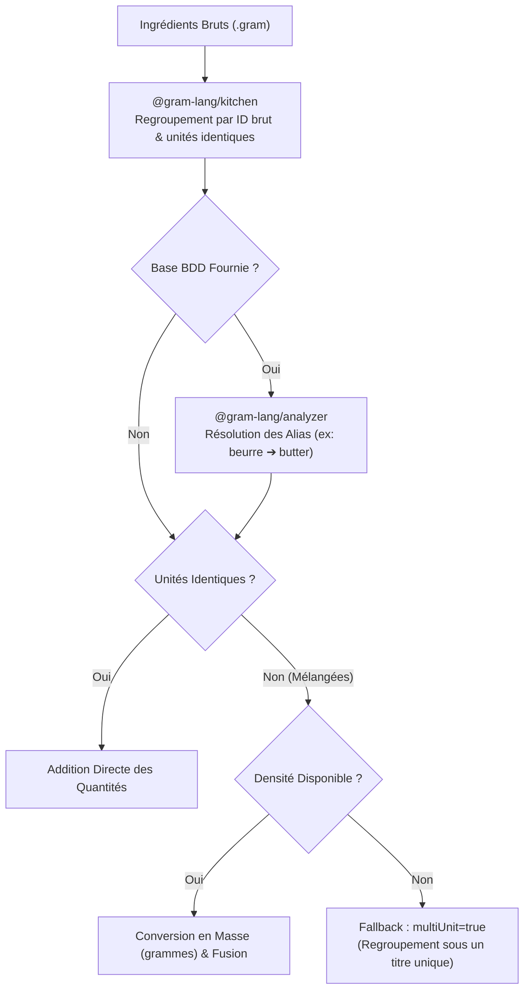

Lorsque le *package* `@gram-lang/kitchen` traite un Arbre Syntaxique Abstrait (AST), l'une de ses missions principales est la génération de la liste de courses.

Oubliez la simple concaténation d'ingrédients. Le compilateur opère un processus d'agrégation complexe pour garantir une liste physiquement exacte et parfaitement optimisée pour les achats.

## Le Pipeline d'Agrégation

Quand une recette (ou un lot complet) est envoyée à la Kitchen pour générer la liste de courses, le *pipeline* suivant se met en route :

import { Steps } from '@astrojs/starlight/components';

<Steps>
1. ### Normalisation des ID et Alias
   `@gram-lang/kitchen` regroupe nativement les ingrédients en se basant uniquement sur l'identifiant brut généré lors du *parsing* (un *slug* du nom saisi). N'ayant pas accès à `ingredients.yaml`, il ignore totalement que `@butter` et `@beurre` désignent la même chose, et les placera sur deux lignes distinctes.

   La résolution des alias intervient une couche au-dessus, dans `@gram-lang/analyzer`, qui lui accède à la base de données. Si `beurre` y est défini comme alias de `butter`, l'Analyseur va regrouper les entrées brutes sous cet identifiant canonique, fusionnant `@butter` et `@beurre` en une seule ligne `butter`. **Cette étape requiert impérativement une base de données** ; sans elle (compilation avec `@gram-lang/kitchen` seul, ou CLI lancé à nu), les alias sont ignorés et le doublon subsiste.

2. ### Fusion des Unités
   Si les ingrédients regroupés partagent la même unité (ex : `100 g` et `50 g`), ils sont simplement additionnés (`150 g`) — cela se produit directement dans `@gram-lang/kitchen`, sans avoir besoin de base de données.

   S'ils ont des unités différentes (ex : `100 g` et `1 tasse`), les additionner nécessite une conversion via la masse, ce qui — tout comme la résolution des alias — dépend de la base de données d'ingrédients et se produit donc dans `@gram-lang/analyzer`. Si chaque quantité contributrice se résout en une masse (densité connue, depuis la BDD ou une surcharge au niveau de la recette), l'analyseur les convertit toutes en grammes et les fusionne en une seule entrée.

   **Repli (*Fallback*) : densité manquante.** Si la densité est introuvable pour au moins l'une des unités, l'Analyseur ne peut mathématiquement pas produire un total fiable. Plutôt que d'inventer une valeur, il conserve les lignes séparées, leur applique l'identifiant canonique, et les marque via le *flag* `multiUnit: true`. Les moteurs de rendu exploitent ce flag pour regrouper ces entrées sous un en-tête commun (ex : « ⚠️ Unités mixtes »). Cela signale au cuisinier qu'il s'agit du même ingrédient, tout en évitant d'additionner silencieusement des choux et des carottes.

   :::tip[Id canonique vs. nom affiché]
   L'id canonique (ex : `butter`) n'existe que pour permettre le regroupement et la fusion des entrées — c'est une clé interne, pas le libellé montré au cuisinier. Le **nom** affiché dans une entrée de la liste de courses suit une seule règle, appliquée à l'identique partout (le Playground, `gram view`, `gram shop`, `gram export`) :

   | Ce que vous écrivez | ID Canonique trouvé | `name` dans la base | Nom affiché dans la liste | Pourquoi ? |
   | --- | --- | --- | --- | --- |
   | `@flour` | `flour` (Direct) | Wheat Flour | **Wheat Flour** | Correspondance directe = on utilise le nom enrichi de la base. |
   | `@farine` (FR) | `flour` (Alias) | Wheat Flour | **farine** | Alias = on garde le mot de la recette pour préserver sa langue. |
   | `@harina` (ES) | `flour` (Alias) | Wheat Flour | **harina** | L'astuce fonctionne avec n'importe quelle langue configurée dans vos alias. |
   | `@poussière` | *Aucun* | *Aucun* | **poussière** | Inconnu = on garde le mot de la recette. |

   C'est ce qui permet à un écosystème Gram d'être véritablement international. Que vous écriviez une recette en français, en espagnol ou en allemand et que vous la compiliez avec une base de données mondiale maintenue en anglais, votre liste de courses conservera toujours votre terminologie locale (`farine`, `harina`, `Mehl`). Pendant ce temps, les recettes utilisant le vocabulaire natif de la base bénéficieront de noms enrichis.

   **Pas de base de données, ou pas d'entrée correspondante ?** Il n'y a alors tout simplement aucun `name` canonique à préférer, donc le mot de la recette est toujours utilisé — cela fonctionne avec une base vide (`{}`), une base qui n'a aucune entrée pour cet ingrédient, et avec `compile()` de `@gram-lang/kitchen` utilisé seul, sans jamais appeler `@gram-lang/analyzer`.
   :::

3. ### Masquage (*Ghosting*) des quantités relatives
   Les quantités relatives (comme `@eau{50 % @&farine}`) constituent un véritable casse-tête pour les listes de courses, surtout lorsqu'on traite plusieurs recettes en lot (*batch*). 

   Si vous mettez le lot à l'échelle (*scaling*), la quantité d'eau dépend d'une quantité de farine ancrée dans une recette précise. Pour éviter les paradoxes mathématiques, la Kitchen vient **masquer (*ghost*)** ces quantités relatives dans la liste de courses. Elles sont exclues de l'agrégation principale et isolées en tant que dépendances non résolues, préservant ainsi la pureté mathématique des poids statiques.

4. ### Résolution des Composites (MAX vs SUM)
   La partie la plus complexe du pipeline d'agrégation est la gestion des Ingrédients Composites (`<@`). 

   Lorsque plusieurs enfants pointent vers le même parent, le compilateur utilise deux règles distinctes pour déterminer combien de parents vous devez acheter :

   1. **La Règle du MAX (Non-Destructrice)** : 
      Si les enfants utilisent des *parties différentes* du parent (ex : le jus de citron et le zeste de citron), vous n'avez pas besoin de deux citrons. Le compilateur prend l'équivalent maximal en masse du parent requis par l'un ou l'autre des enfants. Si vous avez besoin de jus pour 3 citrons, mais de zeste pour seulement 1 citron, la liste de courses indiquera `3 citrons`.
   2. **La Règle du SUM (Somme - Destructrice)** :
      Si les enfants utilisent la *même partie* du parent (ex : du blanc de poulet pour une salade, et du blanc de poulet pour une soupe), vous ne pouvez pas réutiliser le même poulet. Le compilateur additionne les masses équivalentes de parents requises par les deux enfants.
</Steps>

## Le résultat final
En sortie, vous obtenez un tableau d'objets `ShoppingItem` hautement optimisé, dédupliqué et mathématiquement rigoureux. Il est regroupé par clés de catégories culinaires stables (`CATEGORY_KEYS` issues de `@gram-lang/i18n`) et trié selon les règles de traduction locales (`getCategoryLabels(lang)`), prêt à être injecté dans votre terminal ou votre interface web.

