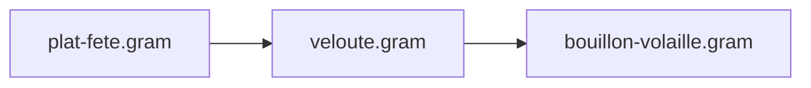
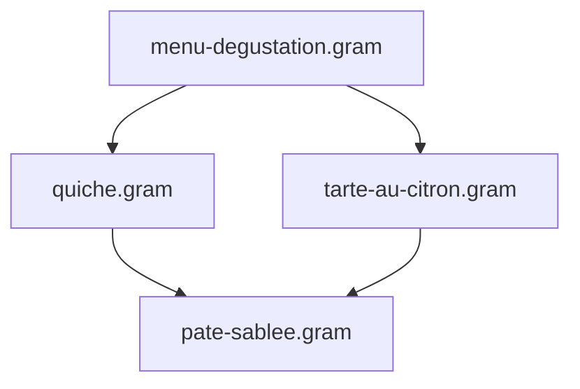

import { Steps, Tabs, TabItem, FileTree, CardGrid, Card, LinkCard } from '@astrojs/starlight/components';

À mesure que votre collection de recettes `.gram` grandit, décomposer vos préparations complexes en composants réutilisables — pâtes, sauces, bouillons, marinades — vous fait gagner un temps précieux et garantit une parfaite régularité culinaire. Extraire ces préparations fondamentales dans leurs propres fichiers vous évite de copier-coller les mêmes instructions partout : dès que vous perfectionnez votre pâte (un temps de repos affiné, un dosage ajusté), l'ensemble de vos recettes en profite instantanément.

Ce guide présente les bonnes pratiques pour structurer, découper et orchestrer vos projets Gram modulaires avec `@use`.

---

## Atelier pas à pas : Extraire et importer son premier module

Si vous avez suivi [Votre Première Recette](/fr/docs/tutorials/first-recipe), la **Tarte au citron meringuée** a été rédigée d'un seul bloc. Voici comment extraire la pâte sucrée vers un module réutilisable et l'importer avec `@use`.

<Steps>

1.  **Extraire la base dans son propre fichier**

    Reprenons la section de pâte de votre recette :

    ```gram title="Section d'origine"
    ## Pâte Sucrée ->&pâte sucrée{}

    [Mixer] Dans un #robot multifonction{}, la @farine{180 g}, le @sucre glace{55 g}, et le @sel{1/4 c.à.c}.

    [Sabler] Ajouter le @beurre{115 g}(froid, coupé en petits dés) et mélanger pendant ~{1-2 min} jusqu'à obtenir un mélange sableux.

    [Incorporer] Ajouter l'@œuf{1}, l'@?extrait de vanille{1/2 c.à.c} et mélanger jusqu'à ce que la pâte forme une boule.

    [Repos] Envelopper de film alimentaire et laisser reposer au réfrigérateur pendant ~_{1 h}.
    ```

    Déplaçons cette préparation dans son propre fichier à l'emplacement `bases/pate-sucree.gram` :

    ```gram title="bases/pate-sucree.gram"
    ---
    title: 'Pâte Sucrée'
    ---

    ## Pâte Sucrée

    [Mixer] Dans un #robot multifonction{}, la @farine{180 g}, le @sucre glace{55 g}, et le @sel{1/4 c.à.c}.

    [Sabler] Ajouter le @beurre{115 g}(froid, coupé en petits dés) et mélanger pendant ~{1-2 min} jusqu'à obtenir un mélange sableux.

    [Incorporer] Ajouter l'@œuf{1}, l'@?extrait de vanille{1/2 c.à.c} et mélanger jusqu'à ce que la pâte forme une boule.

    [Repos] Envelopper de film alimentaire et laisser reposer au réfrigérateur pendant ~_{1 h}.
    ```

    *   **Le nom de liaison est choisi à l'import** : Pour un module à composant unique, la déclaration `->&pâte sucrée{}` sur le titre de section n'est plus indispensable. La recette hôte choisit librement le nom de la variable avec `as &pâte` (`@use "..." as &pâte`). Dans le cas de modules produisant plusieurs préparations distinctes, déclarer `->&` sur chaque section reste le moyen privilégié d'exporter chaque composant par son nom (voir [Ce qu'un module exporte](/fr/docs/reference/syntax/modules#ce-quun-module-exporte)).
    *   **Calcul automatique du rendement** : Lorsqu'une recette hôte demande une quantité précise (comme `&pâte{250g}`), Gram additionne la masse des ingrédients du fichier pour calculer son rendement, puis adapte toutes les quantités automatiquement.

2.  **Importer la base dans votre recette hôte**

    Dans votre recette de tarte, remplacez la section de pâte par une directive `@use` placée juste après le frontmatter, avant la première étape :

    ```gram title="tarte-au-citron.gram"
    ---
    title: Tarte au Citron Meringuée
    portions: 8
    ---

    @use "./bases/pate-sucree.gram" as &pâte

    ## Crémeux au Citron ->&crémeux

    [Fouetter] Dans une #casserole{}, le @zeste de citron{1 c.à.s}<@citron, le @jus de citron{120 g}<@citrons{2}, le @sucre{125% @&jus de citron}, et les @œufs{3}.

    [Cuire] À ^{feu moyen} pendant ~{8 min} jusqu'à épaississement.

    ## Cuisson du Fond de Tarte ->&fond cuit{}

    [Préchauffer] Le #four à ^{180°C}.

    [Étaler] La &pâte{450g} pendant ~{5 min} et la foncer dans un #cercle à tarte{}.

    [Cuire] Pendant ~_{20 min} jusqu'à coloration dorée. Laisser refroidir.

    ## Assemblage

    [Verser] Le &crémeux dans le &fond cuit{}. Réfrigérer pendant ~_{2 h}.
    ```

    Tous les outils avals — diagramme de Gantt, liste de courses et valeurs nutritionnelles — fonctionnent de manière fluide. Le temps de repos `~_{1 h}` de la pâte s'entrelace avec la cuisson du crémeux car `@use` intègre les étapes importées dans l'ordonnancement global.

3.  **Réutiliser la base dans d'autres recettes**

    Une seconde recette (par exemple des tartelettes à la confiture) peut importer exactement la même base :

    ```gram title="tartelettes-confiture.gram"
    ---
    title: Tartelettes à la Confiture
    ---

    @use "./bases/pate-sucree.gram" as &pâte

    ## Tartelettes

    [Répartir] La &pâte{450g} dans des #moules à tartelettes{12}.

    [Cuire] À ^{180°C} pendant ~_{15 min} jusqu'à coloration dorée.

    [Garnir] Chaque fond d'une cuillère de @confiture{15 g}.
    ```

    Dès que vous peaufinez `bases/pate-sucree.gram`, toutes vos recettes en bénéficient immédiatement à la prochaine compilation.

</Steps>

---

## 1. Organiser ses dossiers et configurer ses alias

Vous êtes totalement libre d'organiser vos dossiers selon vos préférences. Une structure modulaire classique regroupe les sous-recettes dans des répertoires dédiés :

<FileTree>
- .gram/
  - config.yaml
  - ingredients.yaml
- composants/
  - bases/
    - pate-sablee.gram
    - levain-chef.gram
  - sauces/
    - bechamel.gram
    - veloute.gram
- desserts/
  - tarte-au-citron.gram
- diner.gram
</FileTree>

Gram propose trois manières complémentaires de cibler vos sous-recettes :

<Tabs>
  <TabItem label="Racine du projet (@/)">
    Utilisez `@/` pour cibler des fichiers depuis la racine du projet (l'emplacement de votre dossier `.gram/`), quel que soit le niveau d'imbrication de la recette appelante :

    ```gram
    @use "@/composants/bases/pate-sablee.gram" as &pate
    @use "@/composants/sauces/bechamel.gram" as &sauce
    ```
  </TabItem>

  <TabItem label="Alias configurés (paths:)">
    Déclarez des raccourcis personnalisés dans `.gram/config.yaml` :

    ```yaml
    # .gram/config.yaml
    paths:
      bases: ./composants/bases
      sauces: ./composants/sauces
      infusions: ./partage/infusions
    ```

    Puis importez directement avec `@alias/` :

    ```gram
    @use "@bases/pate-sablee.gram" as &pate
    @use "@sauces/bechamel.gram" as &sauce
    ```
  </TabItem>

  <TabItem label="Chemins relatifs">
    Pointez vers des fichiers situés à côté ou dans des sous-dossiers relatifs :

    ```gram
    @use "./bases/pate-sablee.gram" as &pate
    @use "../sauces/bechamel.gram" as &sauce
    ```
  </TabItem>
</Tabs>

---

## 2. Gérer les préparations multi-composants (Destructuring)

Certaines sous-recettes produisent **plusieurs préparations distinctes** au cours d'un même processus culinaire.

Par exemple, la pâte feuilletée inversée nécessite de préparer une détrempe et un beurre de tourage manié :

```gram title="composants/bases/elements-feuilletage-inverse.gram"
---
title: 'Éléments pour feuilletage inversé'
---

## Détrempe ->&detrempe
[Mélanger] la @farine{250g}, l'@eau{120ml}, le @sel{5g} et le @beurre{50g}(fondu) pendant ~{5min}. [Former] un carré et [réserver] au #frigo pour ~_{2h}.

## Beurre de tourage manié ->&beurre-manie
[Malaxer] le @beurre{300g}(froid) avec la @farine{100g} pour obtenir un bloc homogène et souple. [Étaler] en rectangle et [bloquer] au #frigo pour ~_{1h}.
```

Dans votre recette principale, l'import déstructuré vous permet de lier simultanément chaque préparation :

```gram title="galette-des-rois.gram"
@use "@/composants/bases/elements-feuilletage-inverse.gram" as { &detrempe, &beurre-manie }

## Tourage
[Enchâsser] la &detrempe au centre du &beurre-manie.
[Donner] 2 tours doubles espacés de ~_{1h} au #frigo.
```

:::tip[Renommage local]
Si les noms exportés entrent en conflit avec vos variables locales, renommez-les avec `as` :
```gram
@use "@/composants/bases/elements-feuilletage-inverse.gram" as {
  &detrempe as &base-pate,
  &beurre-manie as &beurre-tourage
}
```
:::

---

## 3. Chaînage d'imports et dépendances en diamant

### Chaînage d'imports (Transitivité)
Une recette peut importer une sous-recette qui elle-même importe une autre base :



* **Encapsulation :** `plat-fete.gram` interagit uniquement avec `&veloute`. Les variables internes du bouillon restent rigoureusement privées.
* **Liste de courses et planning unifiés :** Tous les ingrédients bruts (volaille, carottes, poireaux) et le temps de mijotage du bouillon remontent automatiquement dans la liste de courses et le diagramme de Gantt global.

### Dépendances en diamant
Lorsqu'un menu importe plusieurs plats qui partagent une même base (par exemple une entrée et un dessert qui importent tous deux `pate-sablee.gram`) :



* Le fichier de base partagé n'est lu et analysé **qu'une seule fois**.
* Le compilateur génère des instances indépendantes mises à l'échelle pour chaque sous-recette.
* Les ingrédients de base (farine, beurre) sont automatiquement consolidés sur votre liste de courses.

### Détection des cycles
Si la recette A importe B qui importe A, Gram détecte immédiatement la boucle et s'arrête avec une erreur explicite `MODULE_CYCLE` affichant la chaîne complète (`A -> B -> A`).

---

## 4. Planifier des préparations sur plusieurs jours (`~{-2d}`)

Lorsqu'une préparation doit être démarrée plusieurs jours à l'avance (comme un levain, une marinade longue ou une infusion), ancrez-la directement sur la directive `@use` :

```gram title="pain-au-levain.gram"
@use "@/composants/bases/levain-chef.gram" as &levain ~{-2d}

## Pétrissage du pain
[Pétrir] la @farine{500g}, l'@eau{350g} et le @sel{10g} avec le &levain{150g}.
```

* La fin de préparation du levain est ancrée **2 jours avant** le pétrissage de la pâte principale.
* L'ordonnanceur ALAP (As Late As Possible) positionne automatiquement les éventuelles étapes préalables du levain (ex : rafraîchi) encore plus en amont.

---

## 5. Cuisiner avec des ingrédients prêts ou en stock (`--stock`)

Si vous disposez déjà d'un composant prêt à l'emploi (acheté dans le commerce ou préparé la veille), vous n'avez pas besoin de le cuisiner à nouveau.

Indiquez-le via l'option CLI `--stock` :

```bash
# Cibler le composant en stock
gram shop diner.gram --stock @bases/pate-sablee.gram

# Passer plusieurs préparations prêtes séparées par des virgules
gram cook diner.gram --stock @bases/pate-sablee.gram,@sauces/bechamel.gram
```

<CardGrid>
  <Card title="Zéro Étape sur la Timeline" icon="seti:clock">
    Toutes les étapes de fabrication des composants en stock sont omises de l'assistant de cuisine interactif et du diagramme de Gantt.
  </Card>
  <Card title="Liste de Courses Consolidée" icon="list-format">
    L'élément apparaît sous forme d'une ligne d'achat directe (ex : `1 pâte sablée`) au lieu d'éclater ses ingrédients bruts (farine, beurre).
  </Card>
  <Card title="Exactitude Nutritionnelle" icon="heart">
    L'apport calorique et les macronutriments restent fidèles et complets, calculés à partir du profil nutritionnel réel de la sous-recette.
  </Card>
</CardGrid>

---

## 6. Encapsulation et isolation des calculs

Les quantités relatives et les relations de dépendance entre ingrédients (`@sucre{125% @&jus de citron}` dans le crémeux) se résolvent exclusivement au sein *des sections du module concerné*. Une recette hôte qui utilise le même ingrédient ailleurs n'interfère jamais avec les calculs internes d'une base, et réciproquement.

Cette règle stricte de portée par section garantit que découper vos recettes en modules ne crée aucun effet de bord indésirable. Consultez [Encapsulation](/fr/docs/reference/syntax/modules#encapsulation) pour tous les détails.

---

## Essayer dans le Playground

Le [Playground](/fr/play) en ligne gère l'édition de recettes multi-fichiers : ouvrez l'exemple **Tarte au Citron (multi-fichiers, @use)** dans le menu déroulant pour observer le fichier hôte et sa base côte à côte dans deux onglets séparés.

---

## Ressources Associées

<CardGrid>
  <LinkCard 
    title="Référence : Imports de Modules" 
    description="Spécification détaillée de la syntaxe, des règles de mise à l'échelle et de l'encapsulation." 
    href="/fr/docs/reference/syntax/modules" 
  />
  <LinkCard 
    title="Référence CLI" 
    description="Documentation exhaustive de gram build, gram shop, --stock et des options globales." 
    href="/fr/docs/reference/tooling/cli" 
  />
</CardGrid>
