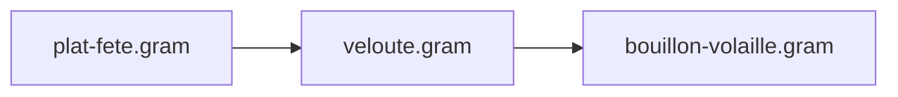
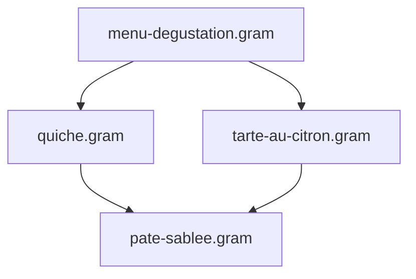

import { Tabs, TabItem, FileTree, CardGrid, Card, LinkCard } from '@astrojs/starlight/components';

À mesure que votre collection de recettes `.gram` grandit, décomposer vos préparations complexes en composants réutilisables — pâtes, sauces, bouillons, marinades — vous fait gagner un temps précieux et garantit une parfaite régularité culinaire.

Ce guide présente les bonnes pratiques pour structurer, organiser et orchestrer vos projets Gram modulaires.

---

## 1. Organiser ses dossiers et configurer ses alias

Vous êtes totalement libre d'organiser vos dossiers selon vos préférences. Une structure modulaire classique regroupe les sous-recettes dans des répertoires dédiés :

<FileTree>
- .gram/
  - config.yaml
  - ingredients.yaml
- composants/
  - bases/
    - pate-sablee.gram
    - levain-chef.gram
  - sauces/
    - bechamel.gram
    - veloute.gram
- desserts/
  - tarte-au-citron.gram
- diner.gram
</FileTree>

Gram propose trois manières complémentaires de cibler vos sous-recettes :

<Tabs>
  <TabItem label="Racine du projet (@/)">
    Utilisez `@/` pour cibler des fichiers depuis la racine du projet (l'emplacement de votre dossier `.gram/`), quel que soit le niveau d'imbrication de la recette appelante :

    ```gram
    @use "@/composants/bases/pate-sablee.gram" as &pate
    @use "@/composants/sauces/bechamel.gram" as &sauce
    ```
  </TabItem>

  <TabItem label="Alias configurés (paths:)">
    Déclarez des raccourcis personnalisés dans `.gram/config.yaml` :

    ```yaml
    # .gram/config.yaml
    paths:
      bases: ./composants/bases
      sauces: ./composants/sauces
      infusions: ./partage/infusions
    ```

    Puis importez directement avec `@alias/` :

    ```gram
    @use "@bases/pate-sablee.gram" as &pate
    @use "@sauces/bechamel.gram" as &sauce
    ```
  </TabItem>

  <TabItem label="Chemins relatifs">
    Pointez vers des fichiers situés à côté ou dans des sous-dossiers relatifs :

    ```gram
    @use "./bases/pate-sablee.gram" as &pate
    @use "../sauces/bechamel.gram" as &sauce
    ```
  </TabItem>
</Tabs>

---

## 2. Gérer les préparations multi-composants (Destructuring)

Certaines sous-recettes produisent **plusieurs préparations distinctes** au cours d'un même processus culinaire.

Par exemple, la pâte feuilletée inversée nécessite de préparer une détrempe et un beurre de tourage manié :

```gram title="composants/bases/elements-feuilletage-inverse.gram"
---
title: 'Éléments pour feuilletage inversé'
---

## Détrempe ->&detrempe
[Mélanger] la @farine{250g}, l'@eau{120ml}, le @sel{5g} et le @beurre{50g}(fondu) pendant ~{5min}. [Former] un carré et [réserver] au #frigo pour ~_{2h}.

## Beurre de tourage manié ->&beurre-manie
[Malaxer] le @beurre{300g}(froid) avec la @farine{100g} pour obtenir un bloc homogène et souple. [Étaler] en rectangle et [bloquer] au #frigo pour ~_{1h}.
```

Dans votre recette principale, l'import déstructuré vous permet de lier simultanément chaque préparation :

```gram title="galette-des-rois.gram"
@use "@/composants/bases/elements-feuilletage-inverse.gram" as { &detrempe, &beurre-manie }

## Tourage
[Enchâsser] la &detrempe au centre du &beurre-manie.
[Donner] 2 tours doubles espacés de ~_{1h} au #frigo.
```

:::tip[Renommage local]
Si les noms exportés entrent en conflit avec vos variables locales, renommez-les avec `as` :
```gram
@use "@/composants/bases/elements-feuilletage-inverse.gram" as {
  &detrempe as &base-pate,
  &beurre-manie as &beurre-tourage
}
```
:::

---

## 3. Chaînage d'imports et dépendances en diamant

### Chaînage d'imports (Transitivité)
Une recette peut importer une sous-recette qui elle-même importe une autre base :



* **Encapsulation :** `plat-fete.gram` interagit uniquement avec `&veloute`. Les variables internes du bouillon restent rigoureusement privées.
* **Liste de courses et planning unifiés :** Tous les ingrédients bruts (volaille, carottes, poireaux) et le temps de mijotage du bouillon remontent automatiquement dans la liste de courses et le diagramme de Gantt global.

### Dépendances en diamant
Lorsqu'un menu importe plusieurs plats qui partagent une même base (par exemple une entrée et un dessert qui importent tous deux `pate-sablee.gram`) :



* Le fichier de base partagé n'est lu et analysé **qu'une seule fois**.
* Le compilateur génère des instances indépendantes mises à l'échelle pour chaque sous-recette.
* Les ingrédients de base (farine, beurre) sont automatiquement consolidés sur votre liste de courses.

### Détection des cycles
Si la recette A importe B qui importe A, Gram détecte immédiatement la boucle et s'arrête avec une erreur explicite `MODULE_CYCLE` affichant la chaîne complète (`A -> B -> A`).

---

## 4. Planifier des préparations sur plusieurs jours (`~{-2d}`)

Lorsqu'une préparation doit être démarrée plusieurs jours à l'avance (comme un levain, une marinade longue ou une infusion), ancrez-la directement sur la directive `@use` :

```gram title="pain-au-levain.gram"
@use "@/composants/bases/levain-chef.gram" as &levain ~{-2d}

## Pétrissage du pain
[Pétrir] la @farine{500g}, l'@eau{350g} et le @sel{10g} avec le &levain{150g}.
```

* La fin de préparation du levain est ancrée **2 jours avant** le pétrissage de la pâte principale.
* L'ordonnanceur ALAP (As Late As Possible) positionne automatiquement les éventuelles étapes préalables du levain (ex : rafraîchi) encore plus en amont.

---

## 5. Cuisiner avec des ingrédients prêts ou en stock (`--stock`)

Si vous disposez déjà d'un composant prêt à l'emploi (acheté dans le commerce ou préparé la veille), vous n'avez pas besoin de le cuisiner à nouveau.

Indiquez-le via l'option CLI `--stock` :

```bash
# Cibler le composant en stock
gram shop diner.gram --stock @bases/pate-sablee.gram

# Passer plusieurs préparations prêtes séparées par des virgules
gram cook diner.gram --stock @bases/pate-sablee.gram,@sauces/bechamel.gram
```

<CardGrid>
  <Card title="Zéro Étape sur la Timeline" icon="seti:clock">
    Toutes les étapes de fabrication des composants en stock sont omises de l'assistant de cuisine interactif et du diagramme de Gantt.
  </Card>
  <Card title="Liste de Courses Consolidée" icon="list-format">
    L'élément apparaît sous forme d'une ligne d'achat directe (ex : `1 pâte sablée`) au lieu d'éclater ses ingrédients bruts (farine, beurre).
  </Card>
  <Card title="Exactitude Nutritionnelle" icon="heart">
    L'apport calorique et les macronutriments restent fidèles et complets, calculés à partir du profil nutritionnel réel de la sous-recette.
  </Card>
</CardGrid>

---

## Ressources Associées

<CardGrid>
  <LinkCard 
    title="Tutoriel : Découper ses recettes en modules" 
    description="Atelier pratique pas à pas pour extraire une pâte sucrée vers un fichier réutilisable." 
    href="/fr/docs/tutorials/module-imports" 
  />
  <LinkCard 
    title="Référence : Imports de Modules" 
    description="Spécification détaillée de la syntaxe, des règles de mise à l'échelle et de l'encapsulation." 
    href="/fr/docs/reference/syntax/modules" 
  />
</CardGrid>
