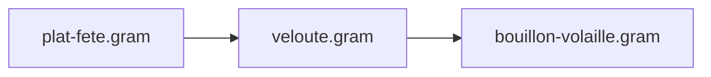
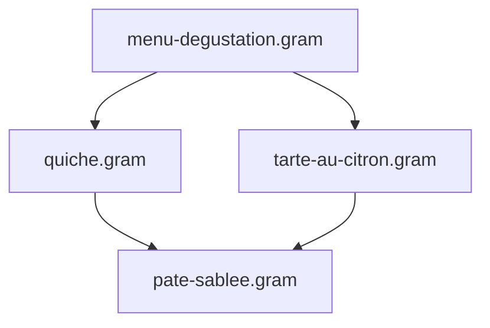

import { Steps, Tabs, TabItem, FileTree, CardGrid, LinkCard } from '@astrojs/starlight/components';

À mesure que votre collection de recettes `.gram` s'enrichit, découper vos préparations complexes en éléments réutilisables (pâtes, sauces, bouillons ou marinades) vous fait gagner un temps précieux tout en garantissant une parfaite régularité en cuisine. En isolant ces préparations de base dans leurs propres fichiers, vous évitez les copier-coller répétitifs : dès que vous peaufinez une recette (un temps de repos mieux ajusté, un dosage de farine affiné), l'ensemble de vos recettes en profite automatiquement.

Ce guide vous présente les meilleures pratiques pour structurer, découper et orchestrer vos recettes modulaires avec la directive `@use`.

## Atelier pas à pas : Extraire et importer son premier module

Si vous avez suivi le guide [Votre première recette](/fr/docs/tutorials/first-recipe), la **Tarte au citron meringuée** y était rédigée d'un seul tenant. Voyons comment extraire sa pâte sucrée dans un module réutilisable et l'importer avec `@use`.

<Steps>

1.  **Isoler la base dans son propre fichier**

    Reprenons la section consacrée à la pâte dans la recette d'origine :

    ```gram title="Section d'origine"
    ## Pâte Sucrée ->&pâte sucrée{}

    [Mixer] Dans un #robot multifonction{}, la @farine{180 g}, le @sucre glace{55 g}, et le @sel{1/4 c.à.c}.

    [Sabler] Ajouter le @beurre{115 g}(froid, coupé en petits dés) et mélanger pendant ~{1-2 min} jusqu'à obtenir un mélange sableux.

    [Incorporer] Ajouter l'@œuf{1}, l'@?extrait de vanille{1/2 c.à.c} et mélanger jusqu'à ce que la pâte forme une boule.

    [Repos] Envelopper de #film alimentaire{} et laisser reposer au réfrigérateur pendant ~_{1 h}.
    ```

    Déplaçons cette préparation dans un fichier dédié, par exemple `bases/pate-sucree.gram` :

    ```gram title="bases/pate-sucree.gram"
    ---
    title: 'Pâte Sucrée'
    ---

    ## Pâte Sucrée

    [Mixer] Dans un #robot multifonction{}, la @farine{180 g}, le @sucre glace{55 g}, et le @sel{1/4 c.à.c}.

    [Sabler] Ajouter le @beurre{115 g}(froid, coupé en petits dés) et mélanger pendant ~{1-2 min} jusqu'à obtenir un mélange sableux.

    [Incorporer] Ajouter l'@œuf{1}, l'@?extrait de vanille{1/2 c.à.c} et mélanger jusqu'à ce que la pâte forme une boule.

    [Repos] Envelopper de #film alimentaire{} et laisser reposer au réfrigérateur pendant ~_{1 h}.
    ```

    *   **Nom de variable libre à l'import** : lorsqu'un module ne produit qu'une seule préparation, l'annotation `->&pâte sucrée{}` dans le titre de section devient facultative. C'est la recette qui importe le module qui choisit librement le nom de sa variable locale via `as &pâte` (`@use "..." as &pâte`). En revanche, pour un fichier qui génère plusieurs préparations distinctes, déclarer `->&` sur chaque section reste le moyen privilégié d'exporter chaque composant sous un nom précis (voir [Ce qu'un module exporte](/fr/docs/reference/syntax/modules#ce-quun-module-exporte)).
    *   **Calcul automatique du rendement** : lorsque la recette hôte demande une quantité précise (comme `&pâte{450g}` ou `&pâte{250g}`), Gram additionne automatiquement le poids des ingrédients du fichier pour calculer le rendement total de la base, puis applique la règle de trois sur chaque proportion.

2.  **Importer la base dans la recette principale**

    Dans votre recette de tarte, remplacez la section de la pâte par une directive `@use` placée juste après le frontmatter, avant la première section :

    ```gram title="tarte-au-citron.gram"
    ---
    title: Tarte au Citron Meringuée
    portions: 8
    ---

    @use "./bases/pate-sucree.gram" as &pâte

    ## Crémeux au Citron ->&crémeux

    [Fouetter] Dans une #casserole{}, le @zeste de citron{1 c.à.s}<@citron, le @jus de citron{120 g}<@citrons{2}, le @sucre{125% @&jus de citron}, et les @œufs{3}.

    [Cuire] À ^{feu moyen} pendant ~{8 min} jusqu'à épaississement.

    ## Cuisson du Fond de Tarte ->&fond cuit{}

    [Préchauffer] Le #four à ^{180°C}.

    [Étaler] La &pâte{450g} pendant ~{5 min} et la foncer dans un #cercle à tarte{}.

    [Cuire] Pendant ~_{20 min} jusqu'à coloration dorée. Laisser refroidir.

    ## Assemblage

    [Verser] Le &crémeux dans le &fond cuit{}. Réfrigérer pendant ~_{2 h}.
    ```

    Tous les outils de l'écosystème Gram (chronologie Gantt, liste de courses, analyse nutritionnelle) continuent de fonctionner harmonieusement. Le temps de repos passif `~_{1 h}` de la pâte s'imbrique naturellement avec la cuisson du crémeux : `@use` intègre les étapes importées directement dans la planification globale.

3.  **Partager la base entre plusieurs recettes**

    Une autre recette (par exemple des tartelettes à la confiture) peut désormais importer exactement le même fichier de base :

    ```gram title="tartelettes-confiture.gram"
    ---
    title: Tartelettes à la Confiture
    ---

    @use "./bases/pate-sucree.gram" as &pâte

    ## Tartelettes

    [Répartir] La &pâte{450g} dans des #moules à tartelettes{12}.

    [Cuire] À ^{180°C} pendant ~_{15 min} jusqu'à coloration dorée.

    [Garnir] Chaque fond d'une cuillère de @confiture{15 g}.
    ```

    Dès que vous modifiez `bases/pate-sucree.gram`, toutes vos recettes en bénéficient immédiatement lors de la prochaine compilation.

</Steps>

## Organiser ses dossiers et configurer ses alias

Vous êtes totalement libre d'organiser vos dossiers selon vos préférences. Dans un projet modulaire, la structure classique consiste à regrouper les sous-recettes dans des répertoires dédiés :

<FileTree>
- .gram/
  - config.yaml
  - ingredients.yaml
- composants/
  - bases/
    - pate-sablee.gram
    - levain-chef.gram
  - sauces/
    - bechamel.gram
    - veloute.gram
- desserts/
  - tarte-au-citron.gram
- gratin.gram
</FileTree>

Gram propose trois manières complémentaires de cibler vos sous-recettes :

<Tabs>
  <TabItem label="Racine du projet (@/)">
    Le préfixe `@/` cible directement la racine du projet (l'emplacement de votre dossier `.gram/`), peu importe où se situe la recette qui effectue l'import :

    ```gram
    @use "@/composants/bases/pate-sablee.gram" as &pate
    @use "@/composants/sauces/bechamel.gram" as &sauce
    ```
  </TabItem>

  <TabItem label="Alias configurés (paths:)">
    Définissez des raccourcis pratiques dans votre fichier `.gram/config.yaml` :

    ```yaml
    # .gram/config.yaml
    paths:
      bases: ./composants/bases
      sauces: ./composants/sauces
      infusions: ./partage/infusions
    ```

    Puis importez directement vos fichiers avec le préfixe `@alias/` :

    ```gram
    @use "@bases/pate-sablee.gram" as &pâte
    @use "@sauces/bechamel.gram" as &sauce
    ```
  </TabItem>

  <TabItem label="Chemins relatifs">
    Pointez vers des fichiers situés dans le même dossier ou dans une arborescence voisine :

    ```gram
    @use "./bases/pate-sablee.gram" as &pâte
    @use "../sauces/bechamel.gram" as &sauce
    ```
  </TabItem>
</Tabs>

## Gérer les préparations multi-composants (déstructuration)

Certaines sous-recettes produisent **plusieurs préparations distinctes** au cours d'un même processus culinaire.

Par exemple, la pâte feuilletée inversée nécessite de réaliser d'un côté une détrempe et de l'autre un beurre de tourage manié :

```gram title="composants/bases/elements-feuilletage-inverse.gram"
---
title: 'Éléments pour feuilletage inversé'
---

## Détrempe ->&detrempe

[Mélanger] La @farine{250g}, l'@eau{120ml}, le @sel{5g} et le @beurre{50g}(fondu) pendant ~{5min}. [Former] un carré.

[Réserver] Au ^{frais} pour ~_{2h}.

## Beurre de tourage manié ->&beurre manié{}

[Malaxer] Le @beurre{300g}(froid) avec la @farine{100g} pour obtenir un bloc homogène et souple.

[Étaler] En rectangle et bloquer au ^{froid} pour ~_{1h}.
```

Dans votre recette principale, la syntaxe de déstructuration vous permet de récupérer et de nommer simultanément chaque préparation en une seule ligne :

```gram title="galette-des-rois.gram"
@use "@/composants/bases/elements-feuilletage-inverse.gram" as { &détrempe, &beurre manié{} }

## Tourage

[Enchâsser] la &détrempe au centre du &beurre manié{}.

[Plier] Donner 2 tours doubles espacés de ~_{1h} au #frigo.
```

:::tip[Renommage local]
Si un nom exporté entre en conflit avec une variable de votre recette, renommez-le à la volée avec le mot-clé `as` :
```gram
@use "@/composants/bases/elements-feuilletage-inverse.gram" as {
  &détrempe as &pâte de base{},
  &beurre manié{} as &beurre de tourage{}
}
```
:::

## Chaînage d'imports et dépendances en diamant

### Chaînage d'imports (transitivité)
Rien ne vous empêche d'importer une sous-recette qui s'appuie elle-même sur une autre préparation de base :



* **Encapsulation stricte :** `plat-fete.gram` manipule uniquement la variable `&velouté`. Les détails et variables internes du bouillon restent totalement isolés dans leur fichier.
* **Liste de courses et chronologie unifiées :** Tous les ingrédients bruts (volaille, carottes, poireaux) et le temps de mijotage du bouillon sont automatiquement consolidés dans votre liste de courses et sur le diagramme de Gantt global.

### Dépendances partagées (en diamant)
Lorsqu'un menu complet importe plusieurs plats qui partagent une même base (par exemple une entrée et un dessert qui utilisent tous deux `pate-sablee.gram`) :



* Le fichier de base partagé n'est lu et analysé **qu'une seule fois**.
* Le compilateur génère des instances indépendantes, dont les proportions sont adaptées aux besoins de chaque plat.
* Les ingrédients de base (farine, beurre) sont automatiquement regroupés et sommés sur votre liste de courses.

### Détection des dépendances circulaires
Si la recette A importe B et que B tente d'importer A, Gram détecte la boucle et signale une erreur `MODULE_CYCLE` affichant la chaîne en cause (`A -> B -> A`). Seule cette branche d'import est interrompue — le reste de la recette continue de se compiler — mais `gram check` (et tout run `--strict`) échoue dessus, `MODULE_CYCLE` étant de sévérité "erreur".

## Planifier des préparations sur plusieurs jours (`~{-2d}`)

Lorsqu'une préparation demande à être démarrée plusieurs jours à l'avance (comme un levain-chef, une marinade longue ou une infusion), indiquez ce décalage temporel directement sur la directive `@use` :

```gram title="pain-au-levain.gram"
@use "@/composants/bases/levain-chef.gram" as &levain ~{-2d}

## Pétrissage du pain

[Pétrir] La @farine{500g}, l'@eau{350g} et le @sel{10g} avec le &levain{150g}.
```

* La fin de préparation du levain est ainsi programmée **2 jours avant** le pétrissage de la pâte principale.
* Le moteur de rétro-planning (ALAP, *As Late As Possible*) positionne automatiquement les étapes préalables du levain (comme les rafraîchis successifs) encore plus en amont.

## Cuisiner avec des ingrédients prêts ou en stock (`--stock`)

Si vous disposez déjà d'un composant prêt à l'emploi (acheté dans le commerce ou préparé la veille), inutile de réafficher toutes les étapes de sa fabrication dans votre planning.

Indiquez-le simplement à la CLI via l'option `--stock` :

```bash
# Indiquer qu'une base est déjà en stock
gram shop diner.gram --stock @bases/pate-sablee.gram

# Indiquer plusieurs préparations prêtes (séparées par des virgules)
gram cook diner.gram --stock @bases/pate-sablee.gram,@sauces/bechamel.gram
```

* **Chronologie épurée :** les étapes de préparation des éléments en stock sont automatiquement masquées du guide pas à pas et de la frise chronologique (Gantt).
* **Liste de courses simplifiée :** le composant apparaît sous forme d'un produit fini à acheter (ex. `1 pâte sablée`) au lieu de détailler ses ingrédients bruts (farine, beurre).
* **Valeurs nutritionnelles exactes :** le calcul des calories et des macronutriments reste complet et fidèle, basé sur la composition réelle de la sous-recette.

## Encapsulation et isolation des calculs

Les quantités relatives et les liaisons entre ingrédients (`@sucre{125% @&jus de citron}` dans le crémeux) sont calculés exclusivement à l'intérieur *des sections du module concerné*. Si la recette principale manipule du sucre ou du jus de citron par ailleurs, ces ingrédients n'interfèrent jamais avec les calculs internes de la base, et réciproquement.

Cette isolation stricte par section garantit que découper vos recettes en modules ne crée aucun effet de bord indésirable. Pour découvrir tous les détails de ce mécanisme, consultez la section [Encapsulation](/fr/docs/reference/syntax/modules#encapsulation).

## Tester dans le Playground

Le [Playground](/fr/play) en ligne prend en charge l'édition de recettes multi-fichiers : ouvrez l'exemple **Tarte au Citron (multi-fichiers, @use)** dans le sélecteur pour visualiser et modifier la recette principale et sa base côte à côte dans deux onglets distincts.

## Ressources associées

<CardGrid>
  <LinkCard 
    title="Référence : Imports de modules" 
    description="Spécification détaillée de la syntaxe, de l'adaptation des proportions et de l'encapsulation." 
    href="/fr/docs/reference/syntax/modules" 
  />
  <LinkCard 
    title="Référence CLI" 
    description="Documentation exhaustive de gram build, gram shop, --stock et des options globales." 
    href="/fr/docs/reference/tooling/cli" 
  />
</CardGrid>
