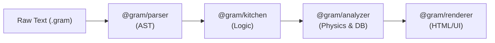

# The Gram Lifecycle

Under the hood, Gram is not a single monolith. It is composed of a series of specific packages that process a recipe step-by-step. 

Understanding this lifecycle is crucial if you want to integrate Gram deeply into your own applications or build new tools on top of it.

## The Pipeline

The compilation of a Gram recipe follows a strict, one-way pipeline:

### 1. Parsing (`@gram/parser`)
The journey begins here. The Parser takes a raw string of text (your `.gram` file) and uses an OhmJS grammar to validate the syntax. 
If the syntax is valid, it generates an **Abstract Syntax Tree (AST)**. This AST contains zero logic—it is merely a structured representation of the text.

### 2. Compilation (`@gram/kitchen`)
The AST is handed off to the Kitchen. The Kitchen is responsible for the structural logic of the recipe:
- **Scoping**: Resolving intermediate variables (e.g., matching a `&dough` reference to a `->&dough` declaration).
- **Time Metrics**: Computing `activeTime`, `cookTime`, `preparationTime`, and `totalTime` (`preparationTime + cookTime`) by mapping all timers.
- **Shopping List Generation**: Aggregating ingredients, summing quantities, and resolving composite ingredients (e.g., combining zest and juice into whole lemons).

The output is a logically sound, compiled recipe — a `CompilationResult` object.

### 3. Enrichment (`@gram/analyzer`)
The Analyzer takes the compiled recipe and cross-references it with your project's `ingredients.yaml` database. This is where the physical world meets the digital code:
- **Mass Standardization**: Converts volumes (cups, tbsp) into accurate gram weights using specific ingredient densities.
- **Yield Calculation**: Calculates purchasing weight versus edible weight.
- **Nutritional Estimation**: Computes calories and macronutrients based on the standardized masses.
- **Baker's Percentages**: Expresses every ingredient's mass as a percentage of a reference ingredient (typically flour).

Each of these feature sets can be individually enabled or disabled by the host application.

### 4. Presentation (`@gram/renderer` or custom)
Finally, the fully enriched recipe is ready to be displayed. You can use the official `@gram/renderer` to generate Markdown, a standard web view, or a self-contained print-ready HTML document — or you can consume the JSON directly in your own React, Vue, or Mobile frontend.

## Package Architecture

This separation of concerns ensures that each package is highly focused and reusable. For example, if you are building an editor extension that only needs to highlight syntax, you only need to import `@gram/parser`. You don't need to load the heavy mass-normalization logic from the Analyzer.

