# Ordonnancement ALAP

Gram ne se contente pas de lire les recettes de haut en bas ; il les réordonnance activement pour vous faire gagner du temps.

Il réalise cela en utilisant un algorithme d'ordonnancement appelé **ALAP (As Late As Possible - *Le Plus Tard Possible*)**. Cela garantit que chaque ingrédient est préparé exactement au moment où il est nécessaire, évitant ainsi que des éléments ne patientent inutilement sur le plan de travail de la cuisine.

## Le Problème : L'Ordonnancement Naïf (Forward Scheduling)

Imaginez une recette qui vous demande de préparer une pâte et de la laisser reposer pendant 1 heure, puis de préparer une sauce rapide en 10 minutes, avant de finalement cuire le plat.

```gram
[Préparer la Pâte] Mélanger la pâte et la laisser reposer ~_{1h}. ->&pâte
[Préparer la Sauce] Mélanger les ingrédients de la sauce ~{10min}.
[Cuisson] Cuire la &pâte avec la sauce pendant ~_{30min}.
```

Si nous utilisons un calendrier naïf de haut en bas (appelé *Forward Scheduling*), la ligne du temps ressemblerait à ceci :

```mermaid
gantt
    title Ordonnancement Naïf (Forward)
    dateFormat  m
    axisFormat %M
    
    section Pâte
    Mélanger la Pâte : a1, 0, 2m
    Repos de la Pâte (Passif) : a2, after a1, 60m
    
    section Sauce
    Mélanger la Sauce : a3, after a1, 10m
    Attente Inutile : a4, after a3, 50m
    
    section Cuisson
    Cuisson (Passif) : a5, after a2, 30m
```



Le problème est évident : vous terminez la sauce à la minute 12, mais la pâte ne finit de reposer qu'à la minute 62. La sauce reste sur le comptoir à refroidir (ou à se détériorer) pendant 50 minutes !

## La Solution : L'Ordonnancement ALAP

Au lieu d'ordonnancer les étapes dès que possible, le compilateur de Gram les ordonnance **le plus tard possible**.

Le moteur travaille à l'envers, en partant de la fin de la recette. Lorsqu'il voit que l'étape `[Cuisson]` a besoin de la `&pâte`, il fixe une échéance stricte pour le moment où la `&pâte` doit être prête. Il repousse ensuite l'étape `[Préparer la Pâte]` le plus tard possible afin que le temps de repos de 1 heure se termine *exactement* au moment où l'étape de cuisson commence.

Voici la chronologie réelle générée par Gram :

```mermaid
gantt
    title Ordonnancement ALAP (Gram)
    dateFormat  m
    axisFormat %M
    
    section Sauce
    Mélanger la Sauce : b1, 0, 10m
    
    section Pâte
    Mélanger la Pâte : b2, after b1, 2m
    Repos de la Pâte (Passif) : b3, after b2, 60m
    
    section Cuisson
    Cuisson (Passif) : b4, after b3, 30m
```



*(Note : Le temps actif pour l'étape de la pâte revient à la valeur par défaut de 2 minutes puisqu'elle ne spécifie qu'un minuteur passif).*

En repoussant l'étape de création de la `&pâte` vers la fin, Gram intercale automatiquement l'étape `Mélanger la Sauce` *avant* la préparation de la pâte. Vous êtes maintenu occupé efficacement, et aucun ingrédient ne reste inactif.

## Les "Named Tracks" (Minuteurs séquentiels)

Ce mécanisme de recul alimente nativement les `Named Tracks` (pistes nommées) de Gram. Lorsque vous attribuez le même nom à plusieurs minuteurs passifs (par exemple, `~_cuisson{10min}` et `~_cuisson{30min}`), Gram les force à s'exécuter séquentiellement en arrière-plan.

Grâce à l'algorithme ALAP, cette contrainte séquentielle se répercute gracieusement vers l'arrière tout au long de la chronologie. Leurs étapes de préparation respectives sont repoussées exactement aux bons moments pour garantir un flux de travail continu en arrière-plan, sans bloquer vos mains actives.

## Bonnes Pratiques pour un Diagramme de Gantt Cohérent

Pour tirer le meilleur parti de l'ordonnancement ALAP de Gram et vous assurer que votre chronologie générée est à la fois réaliste et utile, suivez ces bonnes pratiques :

1. **Utilisez des Minuteurs Passifs (`~_`) pour les Tâches de Fond**
   Si une étape implique de l'attente (cuisson au four, repos, mijotage sans surveillance), utilisez *toujours* un minuteur passif. Si vous utilisez accidentellement un minuteur actif (`~{1h}` au lieu de `~_{1h}`), Gram considère que vos mains sont occupées pendant toute l'heure. Cela bloque la ligne du temps et empêche ALAP d'intercaler d'autres tâches !

2. **Déclarez Tôt, Consommez Tard**
   Pour que la magie d'ALAP opère, vous devez délimiter clairement le moment où un ingrédient est produit et celui où il est consommé. Déclarez un intermédiaire (`->&nom`) dès que sa préparation active est terminée, et référencez-le (`&nom`) *uniquement* dans l'étape exacte où il est finalement utilisé. Gram étirera automatiquement l'écart entre les deux.

3. **Utilisez les "Named Tracks" pour les Ressources Limitées**
   Si vous n'avez qu'un seul four et que vous devez y cuire deux choses différentes, utilisez les *Named Tracks* (par exemple `~_four{10min}` et `~_four{30min}`). Si vous utilisez de simples minuteurs passifs anonymes (`~_{10min}`), Gram supposera que vous possédez une infinité de fours et les ordonnancera en parallèle.

4. **Gardez les Étapes Actives Logiques mais Réalistes**
   Les étapes sans minuteur ajoutent par défaut 2 minutes de temps actif. Ne divisez pas un seul mouvement fluide en 10 micro-étapes, sinon vous gonflerez artificiellement la ligne du temps de 20 minutes. Gardez des étapes qui ont un sens pour le flux de travail.
